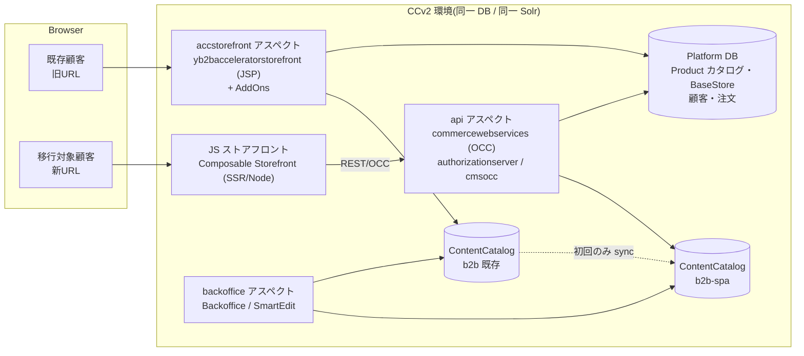
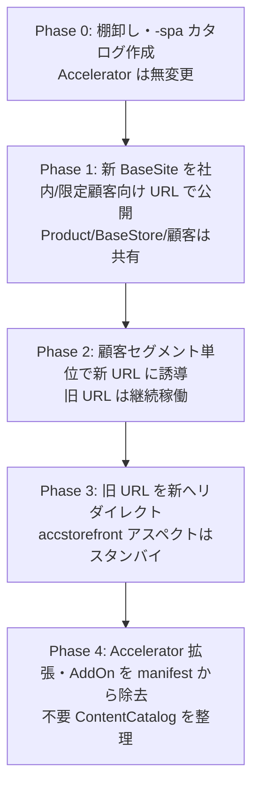

# 19. アクセラレータとの並行開発方法

> 調査ステータス: ⚠️ 一部未確認(manifest.json の `js-storefront` 書式・CCv2 でのエンドポイント/パス単位ルーティングは PDF 未収録章のため未確認。同一 BaseSite 共用時の SmartEdit 挙動は実機未検証)

## 結論(要約)

- **公式見解は「Composable Storefront と Accelerator の同時運用は複雑さのため推奨しない」**。ただし技術的に不可能とは書かれておらず、SAP 自身の 2211 セットアップ手順は `yacceleratorstorefront`(電子機器 `electronics`)と `electronics-spa` を**同一バックエンド上に共存**させている(AboutComposableStorefront p.13 / GettingStarted p.12)。
- Accelerator は **JSP テンプレート UI として非推奨(deprecated)が明文化**され、SAP は全顧客を JS ストアフロントへ移す方針(CompatibilityGuide p.21、About p.13)。「並行」はあくまで**移行期間限定の過渡構成**として設計する。
- 共存の基本形は **同一プラットフォーム(同一 DB・同一 Product カタログ・同一 BaseStore・同一ユーザー)+ 別 CMSSite(BaseSite)+ 別コンテンツカタログ(`*-spa`)+ 別デプロイ単位(accstorefront アスペクト vs JS ストアフロント)**。これは spartacussampledata が採る構成そのもの(GettingStarted p.47-53)。
- **コンテンツカタログを分ける理由**: Composable はページテンプレート差異(SiteContext/SiteLinks/BottomHeader スロット追加、`JspIncludeComponent`→`CMSFlexComponent`、ページラベルの `/` 始まり、PDP の CMS 駆動化など)を要求するため。Accelerator 側カタログを直接改変すると旧ストアが壊れる(GettingStarted p.50-53)。
- **共有できるもの**: Product カタログ、BaseStore(通貨・言語・配送国・倉庫)、顧客アカウント、注文履歴。**共有が難しいもの**: カート(Cart は BaseSite に紐づく)、ログインセッション(JSP セッション Cookie vs OAuth トークン)、CMS コンテンツ(別カタログ)。
- **URL 設計**: JSP は `/<storefront>/?site=xxx` 型、Composable は `BaseSite.urlPatterns`(正規表現)でホスト/パスからサイトを解決するので**ドメインまたはパスで完全に分離**するのが安全。同一ドメイン内でページ単位に振り分ける方式は公式手順が無く要 PoC。
- **段階リリース**: 「ページ単位切替」よりも「**サイト単位(BaseSite 単位)・顧客セグメント単位の切替**」を推奨。CCv2 側は GREEN(Blue-Green + カナリア + トラフィック%)デプロイでバックエンドを守り、JS ストアフロントは別 endpoint/ドメインで独立にリリースする(CloudPortalAPIs p.45-55, p.60)。
- SmartEdit は **CMSSite ごとに previewURL が1つ**なので、Accelerator 用サイトと Composable 用サイトを分けておけば両方編集できる。同一 BaseSite で両ストアフロントを共用するとプレビュー先が片方に固定される(Commerce8 p.100、Integrations p.127)。

## 調査内容

### 1. 公式の立場(FAQ・非推奨スケジュール)

| 論点 | 公式記述 | 出典 |
|---|---|---|
| 同時運用 | "We do not recommend running composable storefront and an Accelerator storefront at the same time, due to the complexity involved." | AboutComposableStorefront p.13 |
| 直接移行 | "there is no direct way to migrate" — ライブラリ vs テンプレート、headless vs embedded、Angular vs JSP のパラダイム転換。カスタム機能は API 化、スタイルはコピー不可、カスタム CMS コンポーネントは Angular で新規実装 | 同 p.13 |
| Accelerator の将来 | "Plans for dereleasing Accelerators have been announced"、目標は全顧客を JS ストアフロントへ | 同 p.13 |
| Industry Accelerator の UI | "The template UIs are now deprecated and we encourage the transition to the headless composable storefront solution" | CompatibilityGuide p.21 |
| ホスティング | CCv2 は JS ストアフロントのビルド・ホスティングを提供。バックエンド未変更ならバックエンドビルドをスキップし JS のみビルドして全体をデプロイ | About p.12, p.14 |
| ストアフロント選択肢 | CCv2 のストアフロントは「Accelerator テンプレート」または「OCC で通信する JavaScript ストアフロント」の 2 系統 | AboutSAPCommerceCloud p.64 |

ポイント: 「推奨しない」の理由は**運用の複雑さ**であって、プラットフォーム上の技術的排他ではない。実際に SAP の 2211-jdk21 セットアップ手順は `cx` レシピに `spartacussampledata` を足し、同一インスタンスで `https://localhost:9002/yacceleratorstorefront/?site=electronics`(Accelerator)と `electronics-spa`(Composable)を両方立ち上げる(GettingStarted p.6-7, p.12)。開発・検証環境ではこの構成が公式のリファレンスになっている。

### 2. 共存アーキテクチャの全体像



- CCv2 の環境は Kubernetes ノード上のコンテナ群で構成され、**どのコンテナがどのアプリを動かすかは manifest の aspects で決める**(AboutSAPCommerceCloud p.64)。Cloud Portal のスケーリング API には `hcs_platform_accstorefront` / `hcs_platform_api` / `hcs_platform_backoffice` / `hcs_platform_backgroundProcessing` が別サービスとして列挙されており(CloudPortalAPIs p.63)、Accelerator ストアフロントと OCC API は**別のスケーリング単位**である。
- JS ストアフロントは CCv2 の "JavaScript Storefronts" 機能で別途ビルド・ホストされる(About p.12, GettingStarted p.40)。ローカルビルドした `dist` をリポジトリにコミットしてアップロードする方式も公式に認められている(GettingStarted p.40)。
- Cloud Portal の endpoint は `domainName` + `k8sService`(例: `storefront-service` / `api-service`)+ `k8sServiceVersion`(BLUE/GREEN)で定義される(CloudPortalAPIs p.30, p.60)。つまり**ドメイン → K8s サービスの対応で、旧ストアフロント・API・JS ストアフロントに別ドメイン(または別 endpoint)を割り当てる**のが CCv2 の基本モデル。

> ⚠️ manifest.json の `js-storefront` セクションや `storefrontAddons` の正確な書式は、手元 PDF に該当章(Build Manifest Components / JavaScript Storefronts)が含まれていないため**未確認**。DOCMAP に入手先を記載済み。

### 3. データ層で「共有するもの / 分けるもの」

| データ | 共有可否 | 根拠・注意 |
|---|---|---|
| Product カタログ(Staged/Online) | **共有** | spartacussampledata の `-spa` サイトは "share the same product catalog with the default electronics, apparel, and powertools sites"(GettingStarted p.47) |
| BaseStore(通貨・言語・配送国・倉庫・税・チェックアウトフロー) | **共有** | BaseStore は複数の Website(BaseSite)を持てる。「1 BaseStore に複数 BaseSite」は標準モデル(Commerce2 p.3-4) |
| CMSSite(BaseSite) | **分ける(推奨)** | spartacussampledata は `electronics-spa` 等の新 CMSSite を作る(GettingStarted p.47)。CMSSite が contentCatalogs・previewURL・urlPatterns・startingPage を持つ(Commerce9 p.140-141) |
| ContentCatalog | **分ける** | 初回だけ `[store]ContentCatalog:Staged → [store]-spaContentCatalog:Staged` を CatalogVersionSyncJob で複製し、その後 SPA 用に改変(GettingStarted p.48-50) |
| 顧客アカウント | **共有**(データ分離サイトにしない限り) | マルチサイトの「data isolation」は**新規サイト作成時のみ有効化可**で、既存サイトは変更不可(AboutSAPCommerceCloud p.65)。並行開発では isolation を有効にしない |
| 注文 | **共有**(閲覧) | AbstractOrder に Site(BaseSite)/Store(BaseStore) を保持。どのストアフロントで発注したかはレポート/フィルタに使える(Commerce2 p.151) |
| カート | **サイト単位** | CommerceCartFactory がカートに現在の BaseSite/BaseStore を設定(Commerce2 p.151)。SaveCart の DAO も `{Cart.site}=?site` で検索(Commerce2 p.155)。BaseSite を分けると**旧ストアのカートは新ストアに見えない** |
| セッション/ログイン | **非互換** | JSP はサーバーセッション(JSESSIONID)+ フォームログイン、Composable は `authorizationserver` の OAuth2 トークン(Commerce2 p.181、Commerce8 p.102)。相互 SSO は標準では無い |

CMSSite の主要属性(Commerce9 p.140-141):

| 属性 | 並行運用での使い方 |
|---|---|
| `uid` | `b2b`(既存)/`b2b-spa`(新)のように分ける |
| `stores` | **同じ BaseStore** を指す |
| `contentCatalogs` | それぞれ専用のコンテンツカタログ |
| `urlPatterns` | Java 正規表現。Composable の BaseSite 自動判定にも使われる(後述) |
| `previewURL` | SmartEdit のプレビュー先。サイトごとに 1 つ |
| `startingPage` | ホームページ |
| `defaultCatalog` | Product カタログが複数ある場合の既定 |

### 4. コンテンツカタログを分ける理由 = spartacussampledata の差分

spartacussampledata の `SpaSampleAddOnSampleDataImportService` は初期化/更新時に「新カタログ作成 → 既存 Staged を -spa Staged へ同期 → cleaning → SPA 用 ImpEx 投入 → -spa Staged→Online 同期 → cmsmanager に同期権限付与」を行う(GettingStarted p.48)。この後 `-spa` カタログにだけ入る変更が、**Accelerator と Composable でカタログを共用しにくい理由**を示している(GettingStarted p.50-53):

| 変更 | 内容 | Accelerator への影響 |
|---|---|---|
| 不要ページ/スロット/コンポーネントの削除 | `cleaning.impex`。Composable に無いページを削除 | 削除すると旧ストアが壊れる |
| `JspIncludeComponent` → `CMSFlexComponent` | JSP パスを含める型は Angular では無意味。`CMSFlexComponent` は flexType でセレクタを解決 | 旧ストアは JspInclude が必要 |
| `CmsSiteContext` 列挙 + `CMSSiteContextComponent` | `SiteContextSlot` に `LanguageComponent`/`CurrencyComponent` を追加し**全テンプレート**に付与 | 旧テンプレートに無いスロット |
| `SiteLinks` スロット | HelpLink / ContactUsLink / SaleLink を全テンプレートのヘッダーに追加 | 同上 |
| `MiniCartSlot` | `OrderComponent` を除去 | 旧ストアで使用中 |
| Breadcrumb 移動 | `NavigationBarSlot` → `BottomHeaderSlot`(全テンプレート追加、homepage 等では除去) | レイアウト差 |
| ページラベル | ContentPage の `label` を `/login` のように **`/` 始まり**へ(Composable はラベル=URL) | 旧ストアは `login` 形式 |
| SearchBox 設定 | `minCharactersBeforeRequest=0; maxProducts=5; maxSuggestions=5; waitTime=0` | 挙動差 |
| PDP の CMS 駆動化 | `ProductSummarySlot` に ProductIntro/Images/Summary/VariantSelector/AddToCart を配置 | 旧 PDP は JSP 固定 |
| 新規ページ | sale / help / contactUs / forgotPassword / resetPassword / register + SignOut ナビノード | 追加のみなら旧に無害 |

ImpEx 例(GettingStarted p.51, p.53):

```
INSERT_UPDATE CmsSiteContext;code[unique=true];name[lang=$language]
;LANGUAGE;"language"
;CURRENCY;"currency"

INSERT_UPDATE CMSSiteContextComponent;$contentCV[unique=true];uid[unique=true];name;context(code);&componentRef
;;LanguageComponent;Site Languages;LANGUAGE;LanguageComponent
;;CurrencyComponent;Site Currencies;CURRENCY;CurrencyComponent

INSERT_UPDATE ContentSlot;$contentCV[unique=true];uid[unique=true];name;active;cmsComponents(uid,$contentCV)
;;SiteContextSlot;Site Context Slot;true;LanguageComponent,CurrencyComponent

UPDATE ContentPage;$contentCV[unique=true];uid[unique=true];label
;;login;/login
```

なお Composable は後方互換のため `JspIncludeComponent` 自体は解釈できる(GettingStarted p.50)。「同一カタログを共用し、テンプレートに SPA 用スロットを追加していく」案は理論上あり得るが、公式サンプルは採用しておらず、SPA 側で削除したいコンポーネントを旧側が使っている限り両立しない。**移植個々のコンポーネント判断は [→ 20. アクセラレータのコンポーネント移行手順書](/topics/accelerator-component-migration) を参照。**

### 5. URL 設計とサイト解決

| ストアフロント | サイト解決の仕組み | 例 |
|---|---|---|
| Accelerator(JSP) | `CMSSiteFilter` がリクエスト URL を解析してサイト/プレビュー情報を解決(`CMSSite.urlPatterns` は Java 正規表現)。実際の Accelerator は `?site=` パラメータも使う(Commerce9 p.141, p.198) | `https://<acc-host>/yb2bacceleratorstorefront/?site=b2b` |
| Composable | アプリの `context.baseSite` 設定に列挙、または OCC `/basesites` の `urlPatterns` を現在 URL に照合して自動決定(Spartacus ソース `site-context-config-initializer.ts` の `isCurrentBaseSite`。二次ソース) | `https://<spa-host>/` |
| SmartEdit プレビュー | `CMSSite.previewURL` + `/cx-preview?cmsTicketId=` | Accelerator: `.../yacceleratorstorefront/?site=apparel-uk`(Commerce8 p.100)、Composable: `https://localhost:4200`(Integrations p.127) |

推奨する URL 分離パターン:

1. **別ドメイン**(例: `www.` は旧、`shop.` は新、あるいはその逆): CCv2 endpoint を別に切れる。Cookie 名前空間・CORS・SmartEdit allow-origin が明確。CORS は DB 方式(`CorsConfigurationProperty`)で API 側に新ドメインを追加する必要がある([→ 3. バックエンド接続](/topics/backend-connection))。
2. **同一ドメイン・別パス**(`/` は旧、`/new/` は新など): Composable 側は `baseHref` と `context.urlParameters` の設計、旧側は `urlPatterns` に非重複の正規表現が必要。CCv2 の Ingress でパス単位に別 K8s サービスへ振れるかは PDF に記載が無く**未確認**。
3. **ページ単位の混在**(PLP は新・チェックアウトは旧など): セッションとカートが分断される(§3)。公式手順・サンプルとも無し。**避ける**。

### 6. セッション・認証の非互換

- Accelerator: Spring Security のフォームログイン + `JSESSIONID`(サーバーサイドセッション)。ルート Cookie によるスティッキーセッションが前提(AboutSAPCommerceCloud p.64)。
- Composable: `authorizationserver` からの OAuth2 アクセストークン/リフレッシュトークン(Commerce2 p.181)。2211-jdk21 ではカスタムログインページ用に `authserver.oauthclientdetails.loginpageuri.allowed.hosts` にホストを列挙する(GettingStarted p.6)。
- 落とし穴: `cookies.SameSite.enabled=true` + `Lax` は、別オリジンのカスタムログインから `/authorizationserver` への POST で JSESSIONID がブロックされログイン失敗を招く。回避は `cookies.null./authorizationserver.JSESSIONID.SameSite=None`(Commerce8 p.102)。**Accelerator 側で SameSite を Lax 運用しているなら、Composable 追加時に必ず見直す。**
- OCC クライアント(SSR 含む)は受領したルート Cookie を再送すべき(AboutSAPCommerceCloud p.64)。add-to-cart 直後の load-cart が別ノードに当たると古いデータが返り得る。
- 結論: 旧→新のシームレスなログイン引き継ぎは標準機能では無い。並行期間中は「同じ ID/パスワードで両方にログインできる(顧客テーブル共有)」までを保証し、セッション引き継ぎは求めない設計が現実的。

### 7. デプロイ戦略と段階リリース

CCv2 のデプロイは `databaseUpdateMode`(NONE / UPDATE / INITIALIZE)× `strategy`(ROLLING_UPDATE / RECREATE / GREEN)で指定し、GREEN では `PREPARE_CANARY` → サービス/エンドポイント単位のトラフィック%(0-100)を段階的に切替、`ACCEPT` / `REJECT` を決定する(CloudPortalAPIs p.45-55)。エンドポイントは `k8sServiceVersion: BLUE|GREEN` を持つ(p.30, p.60)。



- バックエンド側変更(OCC カスタム端点・型追加)は GREEN デプロイで安全に入れ、JS ストアフロントはバックエンドが変わらなければ**JS だけの再ビルド**で回せる(About p.12)。両者のリリースサイクルを分離できるのが並行運用の最大の利点。
- 「サイト単位」を切替単位にすると、Backoffice の `CMSSite.active` / `redirectURL` でロールバックも制御できる(Commerce9 p.141)。
- Composable 側は年 2 回以上のライブラリ更新が実質必須(Updating p.2-10、[→ 14. デプロイ](/topics/deployment))。並行期間が長引くほど 2 系統の保守コストが積み上がる。

### 8. SmartEdit で両方を編集する場合

| 項目 | Accelerator | Composable |
|---|---|---|
| コントラクト実装 | `smarteditaddon` AddOn が自動で満たす(Commerce8 p.103、Trails p.88) | `@spartacus/smartedit`(`ng add @spartacus/smartedit`)+ `webApplicationInjector.js` を assets に配置(Integrations p.126-127) |
| allow-origin | `smarteditaddon.javascript.paths.responsive=/shared/common/js/webApplicationInjector.js?allow-origin=*.mydomain.com:9002`(Commerce8 p.100) | `provideConfig({smartEdit:{allowOrigin:'...', storefrontPreviewRoute:'cx-preview'}})`(Integrations p.127) |
| previewURL | `UPDATE CMSSite;uid;previewURL` で `.../yacceleratorstorefront/?site=xxx`(Commerce8 p.100) | Backoffice WCMS > Website > WCMS Properties の Preview URL を SPA の URL に(Integrations p.127) |
| SmartEdit 側 allowlist | `whiteListedStorefronts` に旧・新両方の URL | 同左 |
| CSP | `xss.filter.header.Content-Security-Policy=frame-ancestors 'self' <smartedit host:port>`(Commerce8 p.100) | 同左(SSR サーバー側にも設定) |
| SSR | 該当なし | SmartEdit 検出時は SSR を無効化(OptimizedSsrEngine の既定、Commerce8 p.107) |
| 再描画 | 静的 HTML 方式(Ajax 再取得) | フロント描画方式 `window.smartedit.renderComponent`(Commerce8 p.106) |

- `previewURL` は CMSSite ごとに 1 つ(Commerce9 p.141)なので、**BaseSite を分けていれば「旧サイトは JSP を、新サイトは SPA をプレビュー」が自然に成立**する。同一 BaseSite で両ストアフロントを共用するとプレビュー先を都度切り替える運用になる。
- `SmartEditConfiguration;storefrontPreviewRoute` はサイト単位ではなくグローバルキー(Commerce8 p.106、Integrations p.130)。Accelerator も Composable も既定 `cx-preview` なので既定のままなら衝突しない。
- `webApplicationInjector.js` は SmartEdit 側とストアフロント側で同じバージョンを使うこと(Commerce8 p.104)。プラットフォーム更新時に SPA 側 assets の差し替えを忘れやすい。

### 9. リスク一覧

| リスク | 影響 | 緩和策 |
|---|---|---|
| コンテンツ二重管理 | 同じ告知を 2 カタログに投入 | 移行期間を短く区切る。共通部分は ImpEx で両カタログに投入する CI ジョブ |
| カート・セッション分断 | 旧で入れたカートが新に無い | サイト切替は顧客単位で一度きり。移行案内 |
| 2211-jdk21 で ImpEx エラーが初期化/更新を止める既定 | `-spa` カタログ投入 ImpEx の品質 | [→ 24. SPA 用 Backoffice 設定](/topics/spa-backoffice-settings) |
| Accelerator AddOn が OCC の応答に影響 | AddOn ベース OCC(非推奨・削除予定)が残る | OCC 拡張方式へ移行(OCCReference p.2-3) |
| CORS/CSP/SameSite の設定漏れ | 新ドメインからの API・SmartEdit が失敗 | §6、§8 のチェック |
| 二重ライブラリ保守 | Accelerator の月次パッチ + Composable の年 2 回更新 | 期間を限定、担当を分ける |

## 本案件への示唆

- 本案件は B2B・CCv2・商用版ライブラリ・SSR 必須。推奨構成は **「新 CMSSite(例 `b2b-spa`)+ 新 ContentCatalog、Product カタログ・BaseStore・顧客・注文は既存を共有」**。B2B 固有の Commerce Organization(Unit/コストセンター/承認)はプラットフォームデータなのでそのまま共有できる(実機確認は必要)。
- **BaseSite を分けることでカートは分断される**。B2B では保存カート・見積(Quote)・承認待ち注文が多いので、「切替時点で旧サイトのオープンなカート/見積をどう扱うか」を業務側と合意する。
- URL は**別ドメイン**が最もリスクが低い。同一ドメイン・パス分離は CCv2 Ingress の挙動が未確認なので採用前に SAP に確認する。
- 旧 Accelerator の JSP 側は「凍結」し、変更は OCC カスタム端点と Composable にのみ加える運用にすると、二重開発を避けられる([→ 10. バックエンド開発の必要性](/topics/backend-development-necessity))。
- SmartEdit は両サイトを同時に編集できるが、Composable の SSR は SmartEdit 検出時に CSR へ落とす既定に従う([→ 26. SmartEdit 設定](/topics/spa-smartedit-settings))。
- 「同時運用は非推奨」という公式文言は、ステアリング向け説明で必ず引用し、**移行期間の上限(例: 6〜12 か月)** を明記して合意を取る。

## 未確認事項・次のアクション

- manifest.json の `js-storefront` / `storefrontAddons` の正確な書式(Build Manifest Components 章、SAP-samples/cloud-commerce-sample-setup)。
- CCv2 Ingress で同一ドメイン・パス単位に accstorefront と JS ストアフロントを振り分けられるか(SAP サポートへ質問)。
- 同一 BaseSite を Accelerator と Composable が共用した場合の実挙動(previewURL の切替、テンプレート差異、`JspIncludeComponent` の描画)。実機 PoC で確認。
- B2B Commerce Organization データ(Unit・権限・承認)を旧サイト/新サイトで共有した際の OCC 側制約(`orgUsers` 系エンドポイント)。
- Accelerator と `authorizationserver` を同居させた際の SameSite・Cookie 設定の実値(現行 `custom.properties` と突き合わせ)。
- 旧 URL → 新 URL の 301 リダイレクトの実装箇所(CCv2 endpoint 側で可能か、アプリで行うか)。

## 出典

- `AboutComposableStorefront.pdf` p.12–14 「FAQ: How does composable storefront compare to Accelerators / Can I run composable storefront and an Accelerator storefront at the same time / migrate / hosting」
- `GettingStartedWithComposableStorefrontLibraries.pdf` p.5–7, 12 「Installing SAP Commerce Cloud 2211 for use with Composable Storefront(cx レシピ + spartacussampledata、Accelerator と -spa の同居)」
- `GettingStartedWithComposableStorefrontLibraries.pdf` p.40 「Using Composable Storefront with SAP Commerce Cloud in the Public Cloud / Manually Uploading」
- `GettingStartedWithComposableStorefrontLibraries.pdf` p.47–53 「Spartacus Sample Data Extension(CMS Changes Specific to the composable storefront Project)」
- `CompatibilityGuide.pdf` p.21 「Industry Accelerators — template UIs are now deprecated」
- `AboutSAPCommerceCloud.pdf` p.63–65 「Cloud Automation Components / Storefronts / Route Cookies / Multi-Site Support」
- `CloudPortalAPIs.pdf` p.30, 45–55, 60, 63 「EndpointDTO / Deployment strategy(ROLLING_UPDATE/RECREATE/GREEN)/ Canary・Traffic split / Endpoint 例 / services(hcs_platform_accstorefront, hcs_platform_api)」
- `Commerce2.pdf` p.2–5 「Base Store(1 BaseStore に複数 BaseSite)」、p.151–155 「Order/Cart と BaseSite・BaseStore の関係、SaveCart DAO」、p.181 「OAuth 2.0 Protocol in Commerce Web Services」
- `Commerce8.pdf` p.100–108 「Setting Up Support for Cross Origin Domains / SameSite Cookie / SmartEdit Contract / SmartEdit and SSR」
- `Commerce9.pdf` p.138–142 「cms2 Extension Basics: BaseStore / CMSSite 属性(urlPatterns, previewURL, redirectURL)」
- `Integrations.pdf` p.126–131 「SmartEdit Integration / SmartEdit Contract in Composable Storefront」
- `Trails.pdf` p.83, 88–90 「Connecting SmartEdit to a Composable Storefront / Migrating Accelerator Storefront Versions to be Edited by SmartEdit」
- 二次ソース: Spartacus ソース `core-libs/core/src/site-context/config/config-loader/site-context-config-initializer.ts`(`urlPatterns` による BaseSite 自動判定)
