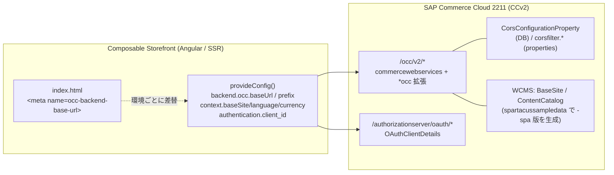

# 3. バックエンドの連携方法

> 調査ステータス: ⚠️ 一部未確認(OCC 設定・CORS・OAuth クライアント・サンプルデータ・接続確認手順は公式PDFで確認済み。CCv2 の「エンドポイント/API アスペクト」の作成手順と `manifest.json` の `js-storefront` 書式は手元PDFに章がなく未確認)

## 結論(要約)

- Composable Storefront は **OCC(Omni Commerce Connect)REST API だけ**でバックエンドと会話する。フロント側の接続設定は `provideConfig()` の **`backend.occ.baseUrl`(サーバー)/ `backend.occ.prefix`(既定 `/occ/v2/`)/ `context`(baseSite・language・currency)** の 3 点が中核(GettingStarted p38, p43 / DevGuide p96)
- 環境ごとの向き先切替は **`index.html` の `<meta name="occ-backend-base-url">`** が公式手段。`provideConfig()` の `baseUrl` が指定されていると meta より優先されるので、動的にしたいなら `provideConfig` に書かない(DevGuide p24)
- バックエンド側で必須なのは **(1) OCC 拡張群(`commercewebservices` + `cmsocc` 等)**、**(2) CORS 設定(`corsfilter.commercewebservices.*`)**、**(3) OAuth クライアント(`OAuthClientDetails`)** の 3 つ。ローカルは `cx_features_enabled` レシピ(=OCC 拡張構成)+ `spartacussampledata` で用意する(GettingStarted p5–9 / LocalInstallation p31–32)
- CORS は **DB(`CorsConfigurationProperty`)がプロパティファイルより優先**。プロパティに書いたのに効かない場合は Backoffice の `System > CORS Filter` を先に疑う。`allowCredentials=true` と `allowedOrigins=*` の組合せは不可 → `allowedOriginPatterns` を使う(SecurityGuide p34–35)
- OAuth は **2211-jdk21 では `authorizationserver` 拡張 + Authorization Code + PKCE(パブリッククライアント)** が既定。サンプルの `mobile_android_public`(`public=true`, `ROLE_CLIENT`, `basic`, `authorization_code,refresh_token`, `registeredRedirectUri`)を Backoffice(`System > OAuth > OAuth Clients`)か ImpEx で登録する(GettingStarted p7–8 / PSU3 p109–113, p127–128)
- カスタムログインページ(ストアフロント上でログイン)を使うには **`authserver.oauthclientdetails.loginpageuri.allowed.hosts`** にストアフロントのホストを列挙し、`OAuthClientDetails.loginPageUri` を設定する。ストアフロントと認可サーバーは**同一ドメインかサブドメイン**である必要がある(GettingStarted p6 / PSU3 p136–141)
- **B2B では baseSite を URL に含める運用が一般的**で、その場合 `AuthConfigInitializer` が client_id に `_<baseSite>` を付ける(`mobile_android_public_powertools-spa`)。**baseSite ごとに OAuthClientDetails が必要**(DevGuide p160–161)
- 接続確認は `curl -k https://<host>:9002/occ/v2/basesites` → `.../occ/v2/<baseSite>/cms/pages` → `authorizationserver/oauth/authorize?...` の 302 確認、の順(GettingStarted p8, p39)
- SSR ノードは **サーバー側から直接 OCC を叩く**。CCv2 は ROUTE クッキーによるセッションアフィニティを前提にしており、API クライアントは受け取った ROUTE クッキーを再送すべき(DevGuide p115 / AboutSAPCommerceCloud p64 / GettingStarted p26–27)

## 調査内容

### 1. 全体像:どこで何を設定するか



| 層 | 設定物 | 主な項目 | 出典 |
|---|---|---|---|
| FE | `spartacus-configuration.module.ts` | `backend.occ.baseUrl`, `backend.occ.prefix`, `backend.occ.endpoints`, `backend.media.*`, `context.*`, `features.level` | GettingStarted p38 / DevGuide p85, p96 |
| FE | `index.html` | `<meta name="occ-backend-base-url" content="...">` | DevGuide p24 |
| FE | `AuthConfig` | `authentication.client_id`, `customLoginPage`, `initializerOptions` | DevGuide p10–12, p160–161 |
| BE | 拡張構成(レシピ / manifest) | `commercewebservices`, `cmsocc`, `b2bocc` 等の OCC 拡張、`authorizationserver` | LocalInstallation p31 / OCCReference p22–23 |
| BE | `local.properties` / manifest / ImpEx / Backoffice | `corsfilter.commercewebservices.*` | GettingStarted p27–28 |
| BE | Backoffice / ImpEx | `OAuthClientDetails`(clientId, public, authorities, scope, grantTypes, redirectUri, loginPageUri) | PSU3 p109–113 |
| BE | `custom.properties` | `authserver.oauthclientdetails.loginpageuri.allowed.hosts`, `cookies.SameSite.enabled`, `occ.rewrite.overlapping.paths.enabled` | GettingStarted p6, p9 |

### 2. フロント側:OCC の向き先設定

#### 2.1 `backend.occ.baseUrl` / `prefix` / `endpoints`

`OccConfig`(`BackendConfig` インターフェース)が接続設定の入口。`OccEndpointsService` がこの設定を読み、エンドポイント文字列にパラメータを適用して URL を組み立てる(DevGuide p85, p96)。

```ts
// spartacus-configuration.module.ts(検証アプリ mystore と同型)
provideConfig(<OccConfig>{
  backend: {
    occ: {
      baseUrl: environment.occBaseUrl,   // 例: 'https://api.<env>.example' ※本番URLはハードコードしない
      // prefix: '/occ/v2/',             // 既定値。ライブラリの default-occ-config.ts で定義
      endpoints: {
        // 必要なら fields を絞る等の上書き(DevGuide p96)
        product: 'products/${productCode}?fields=DEFAULT,customAttribute',
      },
    },
    media: {
      // baseUrl: 'https://cdn.example', // 省略時は occ.baseUrl(DevGuide p85)
      // prefix: '/media',              // 221121.10+、enableMediaPrefix トグル必須
    },
  },
}),
```

- `prefix` の既定は `/occ/v2/`。公式PDF3冊(Getting Started / Development Guide / About)には `backend.occ.prefix` の説明が無く、`ng add` の `occPrefix` オプション説明(「OCC API prefix, such as /occ/v2/」)が唯一の記載(GettingStarted p43)。実体はライブラリ `core-libs/core/src/occ/config/default-occ-config.ts` の `prefix: '/occ/v2/'`(二次ソースで確認)
- `ng add @spartacus/schematics` の引数でも初期値を渡せる:`--base-url`, `--base-site`, `--currency`, `--language`, `--url-parameters`, `--occ-prefix`, `--use-meta-tags`(GettingStarted p43)
- 商品データの `fields` は `endpoints.product.{list,details,attributes,...}` のスコープ単位で調整可能(DevGuide p97)。**バックエンド(Spring)側で fields を変えるより FE 側で調整する方がカスタマイズが軽い**と公式が明記(DevGuide p96)
- Environment モデルには `occBaseUrl`, `occApiPrefix`, `mediaBaseUrl`, `mediaApiPrefix` の 4 つがある(DevGuide p85)

#### 2.2 環境ごとの切替:`<meta name="occ-backend-base-url">`

「1 つのビルド成果物で複数環境にデプロイしたい」場合の公式手段(DevGuide p24)。

```html
<!-- index.html -->
<meta name="occ-backend-base-url" content="https://my-custom-backend-url:8080" />
```

- **`provideConfig()` に `backend.occ.baseUrl` を書いてあると、そちらが meta より優先**される。meta で動的にしたいなら `provideConfig` 側には書かない(DevGuide p24)
- content が空文字、または `OCC_BACKEND_BASE_URL_VALUE` のプレースホルダーのままの場合は無視される(DevGuide p24)。schematics は既定でこのプレースホルダー付き meta を `index.html` に生成する(ライブラリ `schematics/src/add-spartacus/index.ts` で確認)
- CCv2 の JavaScript ストアフロントホスティングでは、pod 起動時に `OCC_BASE_URL_VALUE`(=このプレースホルダー)が **環境の API エンドポイント URL に自動置換**される(auto API injection)。副作用として PWA の `ngsw.json` ハッシュ不一致が起きるので、PWA を使うなら index.html にハードコードせよ、とある(DevGuide p50)
- 既知問題: 2211.19 / 2211.20 の SSR 構成で `OCC_BACKEND_BASE_URL_VALUE` が正しくマッピングされない(SAP Note 参照)(GettingStarted p39 / Updating p〈CXSPA-6445〉)
- 実体はライブラリ `occServerConfigFromMetaTagFactory`(`config-from-meta-tag-factory.ts`)。`media-backend-base-url` という meta も同様に存在する(二次ソース)

#### 2.3 Site Context(baseSite / language / currency)

```ts
provideConfig(<SiteContextConfig>{
  context: {
    urlParameters: ['baseSite', 'language', 'currency'], // URL に含める順序
    baseSite: ['powertools-spa'],   // 配列の先頭が既定値
    language: ['en', 'ja'],
    currency: ['USD'],
  },
}),
```

- 配列の**先頭要素が既定値**。`urlParameters` を付けると URL が `https://host/powertools-spa/en/USD/...` になる。順序を変えれば URL 構造も変わる(DevGuide p41)
- 既定では context は URL に現れない。SEO や「旧ストアフロントとの URL 互換」目的で入れる(DevGuide p41)。Accelerator からの移行では既存 URL 資産との整合を先に決める必要がある
- **自動マルチサイト設定**(推奨): `context.baseSite` を書かなければ、起動前に `/basesites` を呼び、CMS(Backoffice の Website)に定義した URL パターンと現在 URL を照合して baseSite・言語・通貨を決定する(DevGuide p38)。CMS 側の URL Encoding Attributes は `storefront` という名前を使い続けてよい(FE が `baseSite` に暗黙マップ)。パターンは Java 正規表現で書き、FE で JS 正規表現に変換される(DevGuide p38–39)
- 自動設定は初回 `/basesites` 呼び出しが遅い。**SSR で解決して TransferState でブラウザへ渡す**のが緩和策(`NgExpressEngineDecorator` が `SERVER_REQUEST_URL` を提供)(DevGuide p38)
- ローカルで `electronics.localhost:4200` のようなホスト名を使う場合は hosts ファイル追記と `ng serve --host ...` / `--disable-host-check` が必要(DevGuide p39)
- Getting Started の例: Apparel を追加するなら `baseSite: ['electronics-spa','apparel-uk-spa'], currency: ['USD','GBP']`、Powertools なら `powertools-spa` を追加(GettingStarted p38)。B2B サンプルの URL は `http://localhost:4200/powertools-spa/en/USD`(GettingStarted p39)

### 3. バックエンド側:必要な拡張とサンプルデータ

#### 3.1 OCC 拡張構成(cx レシピ)

- ローカルの標準は **`cx` レシピ**(2211.4 以降は feature toggle 有効版の `cx_features_enabled`)。`cx_old_occ` は「同じモジュール構成だが **AddOn 版 OCC**」、`cx_old_occ_v1` は「v1 OCC」であり、cx 系レシピは **OCC 拡張(Extension)方式**を採る(LocalInstallation p31–32)
- OCC 拡張は `commercewebservices` に依存し、名前が `occ` で終わる(`acceleratorocc`, `b2bocc`, `cmsocc` 等)。Web 拡張ではなく、`/resources/occ/v2/<name>/web/spring/<name>-web-spring.xml` が `commercewebservices` の Web コンテキストに自動 import される(OCCReference p22–23)
- Web ルートは `/rest/v2` や `<custom>/v2` ではなく **`/occ/v2`** に統一。Swagger UI は `https://localhost:9002/occ/v2/swagger-ui/index.html`(OCCReference p17)
- CMS ページ API(`/cms/pages` 等)は **`cmsocc`(と旧 `cmsoccaddon`)** が実装(Commerce9 p148)。AddOn 版 OCC は非推奨で削除スケジュールあり(DOCMAP: Core AddOn 2027Q1)→ 新規構築は OCC 拡張方式一択
- B2B 機能に必要な拡張の例(Unit-Level Orders の要件として明記): `b2bacceleratorfacades`, **`b2bocc`**, `b2bwebservicescommons`, `b2bcommerce`, `b2bcommercefacades`(DevGuide p182)。BOPiS では `commerceservices`, `commercefacades`, `commercewebservicescommons`, `ycommercewebservices`, `commercewebservices`(DevGuide p187)
- **`occ.rewrite.overlapping.paths.enabled=true`**(サンプル `custom.properties` に含まれる): B2B OCC の重複パスを `users` → `orgUsers` のように書き換え、B2C と B2B のストアフロントを並走可能にする(GettingStarted p9 / OCCReference p23)。B2B 商用ライブラリの `defaultB2bOccConfig` はこの前提で組まれているので、バックエンド側の値と揃える必要がある
- 2211-jdk21 では認可サーバーが `oauth2` 拡張から **`authorizationserver` 拡張**へ交代(SecurityGuide p32–33)。URL は `/authorizationserver/oauth/authorize`, `/oauth/token`(PSU3 p124–126)

#### 3.2 `spartacussampledata` の役割

- 既存サンプルストア(electronics / apparel / powertools)の**商品カタログは共有**し、**コンテンツカタログだけを Composable 向けに改変した `-spa` サイト**(`electronics-spa`, `apparel-spa`, `powertools-spa`, `electronics-spa-standalone`)を作る拡張(GettingStarted p47)
- 初期化/更新時の処理: 新カタログ作成 → `[store]ContentCatalog:Staged` を `[store]-spaContentCatalog:Staged` に同期 → クリーニング → ImpEx 取込 → Staged→Online 同期 → cmsmanager に同期権限付与 → メールデータ取込(GettingStarted p48)。HAC の Update では対象ストアフロントにチェックが必要
- 主な CMS 差分(=Accelerator コンテンツを SPA 化する際に自分でもやるべきこと): 未使用ページ/スロット/コンポーネントの削除、`JspIncludeComponent` → **`CMSFlexComponent`** 置換、`CmsSiteContext` enum に LANGUAGE/CURRENCY 追加、全テンプレートに `SiteContextSlot`(LanguageComponent / CurrencyComponent)追加、`SiteLinks` スロット追加、MiniCartSlot から OrderComponent 削除、パンくずを `BottomHeaderSlot` へ移動、**ページラベルを `/` 始まりに変更**(`login` → `/login`)、SearchBox 設定調整、PDP を CMS 駆動化(`ProductSummarySlot`)(GettingStarted p50–53)
- 「自前のサンプルデータでもよいが、`commercewebservices` のような OCC 対応拡張を含むこと」(GettingStarted p9)。**本案件では既存 B2B サイトのコンテンツカタログを spartacussampledata と同じ手順で複製・改変するのが現実的**([→ 23. コンテンツカタログ(Backoffice)](/topics/content-catalog-backoffice))

#### 3.3 ローカル環境構築の骨子(2211-jdk21)

1. `spartacussampledata/resources/installer/customconfig/custom.properties` を `installer/customconfig/` へ移動(GettingStarted p6)
2. `custom.properties` に追記(GettingStarted p6):
   ```properties
   authserver.oauthclientdetails.loginpageuri.allowed.hosts=localhost
   cookies.SameSite.enabled=true
   acceleratorservices.payment.sopmock.enabled=true   # 開発/検証のみ
   ```
3. `hybris/bin/custom/spartacussampledata` に配置、`cx_features_enabled` を複製して `cx_features_enabled_for_spa` を作り `build.gradle` の `extName 'spartacussampledata'` を有効化(GettingStarted p6)
4. `./install.sh -r cx_features_enabled_for_spa -A local_property:initialpassword.admin=<pw>` → `... initialize` → `... start`(30 分程度)(GettingStarted p7)
5. Backoffice `WCMS > Website` に `-spa` サイトがあることを確認(GettingStarted p7)
6. HAC で OAuth クライアント ImpEx を投入(次章)(GettingStarted p7–8)

サンプル `custom.properties` の主要キー(GettingStarted p9): `occ.rewrite.overlapping.paths.enabled`, `sop.post.url`, `corsfilter*`, `mockup.payment.label.billTo*`, `yacceleratorordermanagement.fraud*`, `task.polling.interval.min`, `build.parallel`。**CORS を含め本番には流用しない**と明記。

### 4. CORS 設定

#### 4.1 仕組みと優先順位

- Platform 提供の `corsFilter` を `commercewebservices` のフィルタチェーン(`filter-config-v2-spring.xml`)が組み込む。CORS プロパティを一切定義しないと**全 CORS リクエストが拒否**される(OCCReference p125 / SecurityGuide p35)
- 設定場所は 4 通り: `local.properties`(ノード単位)/ CCv2 manifest / ImpEx(`CorsConfigurationProperty`)/ Backoffice `System > CORS Filter > CorsConfigurationProperty`(GettingStarted p27 / SecurityGuide p34)
- **DB(`CorsConfigurationProperty`)はクラスタ全体に効き、同じ context+key があればプロパティファイルより優先**(SecurityGuide p34–35)。CCv2 で「manifest に書いたのに効かない」典型原因
- context 名 = 拡張名。`/occ/v2/*` → `commercewebservices`、`/authorizationserver/*`(2211 では `/authentication/*` → `oauth2` と記載)、`/assistedservicewebservices/*` → `assistedservicewebservices`(GettingStarted p30)。ASM 等の他 API を使う場合はその拡張にも設定が必要(GettingStarted p27)
- 2105 以降 **`allowCredentials=true` と `allowedOrigins=*` の併用は不可 → `allowedOriginPatterns`** を使う(GettingStarted p25 / SecurityGuide p35)

#### 4.2 設定値(公式サンプル)

`local.properties` 形式(GettingStarted p27):

```properties
corsfilter.commercewebservices.allowedOriginPatterns=*
corsfilter.commercewebservices.allowedMethods=GET HEAD OPTIONS PATCH PUT POST DELETE
corsfilter.commercewebservices.allowedHeaders=origin content-type accept authorization cache-control if-none-match x-anonymous-consents occ-personalization-id occ-personalization-time x-profile-tag-debug x-consent-reference
corsfilter.commercewebservices.exposedHeaders=x-anonymous-consents occ-personalization-id occ-personalization-time
corsfilter.commercewebservices.allowCredentials=true
```

> PDF 出力では `allowedHeaders` の右端が欠落している。上記は p25–26 のヘッダー一覧表から復元したもので、実作業では Help Portal 原典で確認すること。

ImpEx 形式(初期化・更新・HAC 手動投入で使える)(GettingStarted p28):

```impex
INSERT_UPDATE CorsConfigurationProperty;key[unique=true];value;context[default=commercewebservices,unique=true]
;allowedOriginPatterns;*
;allowedMethods;GET HEAD OPTIONS PATCH PUT POST DELETE
;allowedHeaders;origin content-type accept authorization cache-control if-none-match x-anonymous-consents occ-personalization-id occ-personalization-time x-profile-tag-debug x-consent-reference
;allowCredentials;true
;exposedHeaders;x-anonymous-consents occ-personalization-id occ-personalization-time
```

CCv2 manifest 形式は `{"key": "corsfilter.commercewebservices.allowedOriginPatterns", "value": "*"}` のような key/value オブジェクトの列挙(GettingStarted p27–28)。

| ヘッダー | 用途 | 省略可否 |
|---|---|---|
| `origin` / `content-type` / `accept` / `authorization` / `cache-control` | 標準。`authorization` はログインがある限り必須 | 不可 |
| `if-none-match` | 条件付き GET | 公式サンプルに含まれる |
| `x-anonymous-consents` | 匿名同意機能。使わないなら**機能側を無効化しないと表示不良**の可能性 | 機能次第 |
| `occ-personalization-id` / `occ-personalization-time` | Personalization。allowed と exposed の両方 | 機能次第 |
| `x-profile-tag-debug` / `x-consent-reference` | Intelligent Selling Services | 機能次第 |
| `sap-commerce-cloud-user-id` | ASM の顧客エミュレーション | ASM 使用時 |

(GettingStarted p25–26 / DevGuide p〈ASM〉)

`CorsConfigurationProperty` のキー一覧: `allowedOrigins`(既定 null)、`allowedMethods`(既定 `GET HEAD`)、`allowedHeaders`、`exposedHeaders`、`allowCredentials`、`maxAge`、`allowedOriginPatterns`(SecurityGuide p34–35)。

#### 4.3 `allowCredentials` と ROUTE クッキー

- ライブラリ 2.0 以降(1.4/1.5 にもパッチ)、**全 OCC リクエストで Cookie を送る**。目的は CCv2 の **セッションアフィニティ(sticky session)**。「add to cart → load cart」が別ノードに振られてキャッシュ無効化が間に合わず失敗する事象を避けるため(GettingStarted p26)
- CCv2 は処理ノードを示す **`ROUTE` クッキー**を返し、次リクエストに載せれば同一ノードで処理される(GettingStarted p27 / AboutSAPCommerceCloud p64)
- FE 側の対応スイッチは `backend.occ.useWithCredentials=true`(BE 側は `corsfilter.commercewebservices.allowCredentials=true`)(Integrations p〈CDS〉 / ライブラリ `occ-config.ts`)
- 2211-jdk21 の `cookies.SameSite.enabled=true` は Composable のカスタムログイン構成を壊し得るという注意が SmartEdit 章にある(DOCMAP: Commerce8 p102)。ローカル手順では追記が指示されているため、環境ごとに要検証

#### 4.4 トラブルシュート手順(GettingStarted p28–30)

1. DevTools の Network タブで再現し、Status 列に「CORS error」が出るか確認
2. Chrome の Method 列 **Preflight** リンクから OPTIONS リクエストを開き、`Access-Control-Request-*` ヘッダーを見る
3. 拒否されているヘッダー/メソッドを、リクエストを処理する拡張の `corsfilter.<ext>.allowedHeaders` / `allowedMethods` に追加(例: ASM なら `corsfilter.assistedservicewebservices.allowedHeaders` に `authorization`)
4. 「ストアフロントが部分的にしか動かない」ときは、まず全 CORS 設定を疑う(GettingStarted p10, p25)

### 5. OAuth クライアント設定

#### 5.1 認証方式の前提(2211-jdk21 × 221121.x)

- Composable Storefront の既定は **OAuth 2.1 / Authorization Code + PKCE**。次のフィーチャートグルが true であること(221121.1 以降の新規アプリは既定 true): `authorizationCodeFlowByDefault`, `incrementProcessesCountForMergeCart`, `dispatchLoginActionOnlyWhenTokenReceived`, `cdsLoginEventsToken`, `asyncAuthConfigInitializer`(221121.15+)(DevGuide p10–11)
- 2211.xx(JDK17)バックエンドを使うなら **Resource Owner Password Flow** に戻す必要があり、`authorizationCodeFlowByDefault=false` にする。この互換は 2027 年 9 月までサポート(DevGuide p12)
- 認可サーバー側: パブリッククライアントは PKCE 必須(`requireProofKey` 既定 true)、`public=true` のクライアントに secret を持たせられない、client_credentials は不可、`authserver.client.authenticationMethods=client_secret_post,client_secret_basic,none` の `none` でパブリッククライアントを許可(PSU3 p127–129)
- Authorization Code フローは **JSESSIONID クッキーでサーバーセッションを維持**する必要がある(PSU3 p124)。ロードバランサ越しでは ROUTE クッキーも同様(PSU3 p137)

#### 5.2 サンプルクライアントの登録(ImpEx)

Getting Started の手順(HAC `Console > ImpEx Import`)(GettingStarted p7–8):

```impex
# Public OAuth Client Credential
INSERT_UPDATE OAuthClientDetails; clientId[unique=true] ; public ; authorities ; scope ; authorizedGrantTypes             ; registeredRedirectUri
                                ; mobile_android_public ; true   ; ROLE_CLIENT ; basic ; authorization_code,refresh_token ; http://localhost:4200/login
```

> PDF では行の右端(`authorizedGrantTypes` 以降と `loginPageUri` 等)が欠落しており、上記の後半は DevGuide p161 の同型 ImpEx から補完した。**`loginPageUri` の有無・値は Help Portal 原典で確認すること**(DOCMAP でも「Web 突合で復元済み」と注記あり)。

Backoffice で作る場合(`System > OAuth > OAuth Clients`)(PSU3 p109–112):

| セクション | 項目 | 備考 |
|---|---|---|
| Essential | Client ID / Client Secret | パブリッククライアントは secret なし(`public=true`) |
| Basic | OAuth authorities | `ROLE_CLIENT` か `ROLE_TRUSTED_CLIENT`(OCC アクセスに必須) |
| Basic | OAuth authorized grant types | `authorization_code`, `refresh_token`(必要なら `password`, `client_credentials`) |
| Basic | OAuth resource IDs | 例 `hybris` |
| Basic | OAuth registered redirect URI | Authorization Code の戻り先。**絶対 URI 必須**(`authserver.authorizationCode.absolute.redirect.uri.check` 既定 true) |
| Scopes | Scopes / Auto Approve Scopes | `basic`(拡張権限は `extended`) |
| Token Validity | access / refresh token validity seconds | 公開クライアントは `authserver.publicClients.refreshToken.*` で追加制御 |

- 作成/更新時に `DefaultOAuthClientDetailsValidator` が検証(grant type 空でない、authority あり、authorization_code なら redirect URI あり、public は secret 無し・PKCE 有効・client_credentials 無し等)。失敗すると `InterceptorException`(PSU3 p128)
- `ROLE_TRUSTED_CLIENT` は「全ユーザーのリソースにアクセス可」の強権限。ストアフロント用は `ROLE_CLIENT`(OCCReference p21 / Commerce9 p148–149)

FE 側の対応設定:

```ts
provideConfig(<AuthConfig>{
  authentication: {
    client_id: 'mobile_android_public',   // 既定値。案件では独自 ID に変更
    // customLoginPage: undefined,       // 認可サーバーのログイン画面に戻す場合
    initializerOptions: {
      addBaseSiteToRedirectUri: 'auto',   // 既定 auto
      baseSiteSuffix: 'auto',
    },
  },
}),
```

(DevGuide p12, p160–161)

#### 5.3 マルチサイト(B2B で baseSite を URL に含める場合)

- **ドメイン分離**(`https://powertools-spa.example/en/USD`): OAuthClientDetails は 1 つでよい。redirect URI に各オリジンを登録し、`loginPageUri` は hostname プレースホルダーで動的化(DevGuide p161)
- **パス分離**(`https://example/powertools-spa/en/USD`): `loginPageUri` は 1 つしか持てずパスのプレースホルダーもないため、**baseSite ごとにクライアントが必要**。`AuthConfigInitializer` が実行時に `mobile_android_public_powertools-spa` のように `_<baseSite>` を付与するので、それに合わせて ImpEx を用意する(DevGuide p160–161):

```impex
INSERT_UPDATE OAuthClientDetails; clientId[unique=true]                 ; public ; authorities ; scope ; authorizedGrantTypes             ; registeredRedirectUri
                                ; mobile_android_public_powertools-spa  ; true   ; ROLE_CLIENT ; basic ; authorization_code,refresh_token ; http://<host>/powertools-spa/en/USD/login
```

#### 5.4 カスタムログインページ(ストアフロント上でログイン)

- 2211-jdk21.1 + 221121.1 以降で、認可サーバーのログイン画面の代わりに **ストアフロントの `/login` を使える**(DevGuide p11)。ルーティングは `/login`(loginForm)と `/sign-in`(従来 login ページ)に分かれる(DevGuide p11)
- バックエンド要件(PSU3 p136–141):
  - **ストアフロントは認可サーバーと同一ドメインかサブドメイン**(JSESSIONID / CSRF をセッション共有するため)
  - `authserver.oauthclientdetails.loginpageuri.allowed.hosts=<host1>,<host2>`(サブドメインは個別列挙。起動時のみ読込)
  - `OAuthClientDetails.loginPageUri` を相対 URL / 絶対 URL / プレースホルダー付き絶対 URL(`https://{redirectUriHost}/{lang}/...`)で設定
  - `corsfilter.authorizationserver.allowedOrigins` にログインページのホストを追加
  - ログインフォームは `/authorizationserver/login` へ `username`, `password`, `_csrf` を **通常の HTML form POST**(XHR 不可)
- ブランドドメインが多数で API を同一ドメインに置けない場合の代替が **Shared Login Page**(221121.11+、`FederatedLoginConfig`、`authserver.authorizationCode.allowed.params` に `ctx` 追加)(DevGuide p207–208)。本案件は単一 B2B サイト想定のため通常は不要
- SAML SSO を使う場合は `loginPageUri=/samlsinglesignon/saml/authorizationserver/login` とし、`samlsinglesignon` を **api アスペクト**に追加(PSU3 p138–139)

### 6. 接続確認手順

| # | 確認 | コマンド / URL | 期待 | 出典 |
|---|---|---|---|---|
| 1 | サーバー稼働 | `https://localhost:9002`(HAC)/ `.../backoffice` | 表示 | GettingStarted p7 |
| 2 | 証明書受入 & CMS API | ブラウザで `https://localhost:9002/occ/v2/electronics/cms/pages` | JSON。自己署名証明書を受け入れないとブラウザが `localhost:9002` への呼出をブロック | GettingStarted p39 |
| 3 | baseSite 一覧 | `curl -k https://localhost:9002/occ/v2/basesites?fields=baseSites(uid,defaultLanguage(isocode),urlEncodingAttributes,urlPatterns,stores(currencies(isocode),defaultCurrency(isocode),languages(isocode),defaultLanguage(isocode)))` | `-spa` サイトが含まれる。自動マルチサイト設定が最初に呼ぶ API | DevGuide p38 |
| 4 | OAuth クライアント | `curl -skIXGET 'https://localhost:9002/authorizationserver/oauth/authorize?response_type=code&client_id=mobile_android_public&redirect_uri=...&code_challenge=...&code_challenge_method=S256'` | `HTTP/1.1 302` + `Location: http://localhost:4200/login`(カスタムログインページへ) | GettingStarted p8 |
| 5 | Swagger | `https://localhost:9002/occ/v2/swagger-ui/index.html` | OCC 拡張の全エンドポイント | OCCReference p17 |
| 6 | ストアフロント | `npm start` → `http://localhost:4200/powertools-spa/en/USD` | B2B ホーム表示 | GettingStarted p39 |

> #4 の curl はページ右端が欠落しており、クエリの全文は PDF で確認できない(未確認)。JDK21 では PKCE パラメータが必要(PSU3 p124–125)。

### 7. SSR からの接続

- SSR ノードはリクエストを受けると **サーバー側から OCC API を直接呼ぶ**。公式推奨構成は CDN → リバースプロキシ → SSR ノード群 → **OCC API キャッシュ層** → OCC サーバー。SSR ノードを直接公開しない、OCC 応答(GET/HEAD)にキャッシュ層を置く、が推奨(DevGuide p114–115)
- SSR で `window`/`document` は使えない。`WindowRef` を使う。リクエスト URL/オリジンは `WindowRef.location` から取る(プロキシ環境では `SERVER_REQUEST_URL` が localhost になる旧問題は 3.0.3 で修正済み)(DevGuide p116)
- **サイト解決(`/basesites`)を SSR で行い TransferState でブラウザに渡す**ことで初回コストを削減できる(DevGuide p38)
- ROUTE クッキーの再送は「API クライアントに推奨」(AboutSAPCommerceCloud p64)。SSR の Node HTTP クライアントがどう扱うかは公式PDFに記載がなく **未確認**
- ローカルで SSR を試す際は Angular 21.2 以降 `NG_ALLOWED_HOSTS=localhost npm run serve:ssr` の許可が必要(DevGuide p114)
- SSR 自体の設定は [→ 2. SSR のセットアップ](/topics/ssr-setup)、CCv2 でのデプロイは [→ 14. デプロイ](/topics/deployment) を参照

### 8. CCv2(Public Cloud)での接続

手元PDFで確認できた範囲:

- CCv2 の JavaScript ストアフロントは Cloud Portal のホスティングでビルド/配信され、`index.html` の `occ-backend-base-url` プレースホルダーが **環境の API エンドポイント URL に自動置換**される(auto API injection)(DevGuide p50)。したがって環境ごとにビルドし直さなくてよい
- 環境は Kubernetes ノード/コンテナで構成され、**どのコンテナがどのアプリを動かすかは build manifest の aspects で定義**する(AboutSAPCommerceCloud p64)。`samlsinglesignon` を api アスペクトに載せる例で `"aspects":[{"name":"api","webapps":[{"name":"samlsinglesignon","contextPath":"/samlsinglesignon"}]}]` の書式を確認(PSU3 p139)
- CORS・OAuth 等の設定は manifest の properties か ImpEx で投入(GettingStarted p27–28)。ただし DB 優先ルールに注意(SecurityGuide p35)
- Cloud Portal API の Static File Set は `endpoints: [{code: "api", ...}]` のようにエンドポイントへ割り当てる(CloudPortalAPIs p84–85)
- **エンドポイント作成手順(API/JS ストアフロント用の endpoint 定義、IP フィルタ、証明書)と `manifest.json` の `js-storefront` / `storefrontAddons` の正確な書式は手元PDFに章がなく未確認**(DOCMAP 参照: 「Build Manifest Components」章と `SAP-samples/cloud-commerce-sample-setup` が入手先)。詳細は [→ 15. インフラ](/topics/infrastructure) / [→ 16. サーバー構成](/topics/server-configuration) 側で扱う

## 本案件への示唆

- **接続設定は 3 層で管理する**: (a) `provideConfig` は `prefix`/`endpoints`/`context` のみ、(b) `baseUrl` は `index.html` の meta(CCv2 の自動注入に乗せる)、(c) ローカル/モック環境だけ `environment.ts` 経由。現行 mystore は (c) 方式なので、CCv2 デプロイ前に (b) へ寄せる判断が必要
- **B2B は baseSite を URL に含める前提**で進めるのが無難(`powertools-spa/en/USD` 型)。その場合 OAuth クライアントは `<client_id>_<baseSite>` を baseSite ごとに ImpEx で用意し、`registeredRedirectUri` / `loginPageUri` にパスを含める。ドメイン分離にするなら 1 クライアントで済む。**この決定は URL 設計・SEO・SSR キャッシュ・SmartEdit の allowlist に波及するので早期に確定**すること
- Accelerator の既存 OAuth クライアント(`mobile_android` + secret の confidential)は流用しない。**新規にパブリッククライアント(`public=true`, PKCE)を作る**。`ROLE_TRUSTED_CLIENT` はストアフロントに付けない
- CORS は **ImpEx(`CorsConfigurationProperty`)で管理し、`allowedOriginPatterns` に本番/検証のオリジンだけを列挙**する。manifest の properties と二重管理すると DB 優先で混乱するので、どちらか一方に決める。ASM や SmartEdit を使うなら該当拡張(`assistedservicewebservices`, `authorizationserver`)にも設定
- バックエンド拡張は **OCC 拡張方式(`*occ`)** に統一し、AddOn 版 OCC(`cmsoccaddon` 等)は使わない。カスタム API も `yocc` テンプレートから `<name>occ` を作る([→ 10. バックエンド開発の要否](/topics/backend-development-necessity))。`occ.rewrite.overlapping.paths.enabled=true` は B2B ライブラリ既定と揃える
- **既存サイトのコンテンツカタログを `-spa` 版として複製・改変する**のが移行の実体。spartacussampledata の差分一覧(§3.2)がチェックリストになる。特に「ページラベルの `/` 始まり」「JspIncludeComponent → CMSFlexComponent」「SiteContextSlot 追加」は必須
- SSR 必須のため、**OCC 応答キャッシュ層と ROUTE クッキーの扱い**をインフラ設計に含める。SSR ノードから OCC への経路(同一 VNet か公開エンドポイント経由か)は CCv2 の endpoint 設計と合わせて確認
- 検証はモック(MSW)で先行しつつ、**CORS・OAuth(PKCE/カスタムログイン)・ROUTE クッキーは実バックエンドでしか検証できない**項目として明記し、「モック検証済み」と「実機検証済み」を分けて報告する

## 未確認事項・次のアクション

- [ ] `mobile_android_public` ImpEx の完全な列(`loginPageUri` の値、`registeredRedirectUri` の完全形)を Help Portal 原典で確認する(PDF 右端欠落)
- [ ] `backend.occ.prefix` の公式説明は Composable 3 冊に無い。ライブラリ `default-occ-config.ts` の `/occ/v2/` を正とし、実機で `OccEndpointsService.buildUrl()` の出力を確認する
- [ ] CCv2 の endpoint(API / JS ストアフロント)作成手順、`manifest.json`(コア)の properties と `js-storefront/manifest.json` の書式は「Build Manifest Components」章を別途取得して確認する
- [ ] SSR(Node)から OCC への呼び出しで ROUTE クッキーがどう扱われるか(ライブラリのサーバー側 HttpClient 設定)を実機で確認する
- [ ] `cookies.SameSite.enabled=true` とカスタムログインページの相性(Commerce8 p102 の注意)を 2211-jdk21 実機で検証する
- [ ] 2211-jdk21 の `authserver.*` プロパティ(`loginpageuri.allowed.hosts`, `authorizationCode.allowed.params`, `publicClients.refreshToken.*`)の本番値を決める
- [ ] 実バックエンド接続時に §6 の手順で `basesites` → `cms/pages` → `oauth/authorize` 302 を順に確認し、モック(MSW)で通っていた画面が実 API でも同じ挙動かを差分記録する
- [ ] Accelerator 側の既存 CORS / OAuth 設定を棚卸しし、Composable 用に新設するもの・廃止するものを一覧化する

## 出典

- `GettingStartedWithComposableStorefrontLibraries.pdf` p.5–10 「Installing SAP Commerce Cloud 2211-jdk21 for use with Composable Storefront」(custom.properties、レシピ、OAuth ImpEx、curl 確認、Sample Configuration Properties)
- `GettingStartedWithComposableStorefrontLibraries.pdf` p.25–30 「Cross-Origin Resource Sharing (CORS)」(ヘッダー一覧、properties/manifest/ImpEx 例、ROUTE クッキー、トラブルシュート、URL→拡張対応表)
- `GettingStartedWithComposableStorefrontLibraries.pdf` p.34–39 「Building the Composable Storefront From Libraries」(baseUrl/context 設定、証明書受入、サンプル URL)
- `GettingStartedWithComposableStorefrontLibraries.pdf` p.42–43 「Schematics」(`--base-url`, `--occ-prefix`, `--use-meta-tags` 等)
- `GettingStartedWithComposableStorefrontLibraries.pdf` p.47–53 「Spartacus Sample Data Extension」(-spa サイト生成、CMS 差分)
- `StorefrontDevelopmentGuide.pdf` p.10–12 「Authentication」「Authentication Feature Toggles」「Using Composable Storefront as a Custom Login Page」
- `StorefrontDevelopmentGuide.pdf` p.24–25 「Configuring the Base URL」(meta タグ、優先順位、プレースホルダー)
- `StorefrontDevelopmentGuide.pdf` p.38–41 「Multi-Site Configuration」「Static Multi-Site Configuration」(自動/静的 context、urlParameters、basesites API)
- `StorefrontDevelopmentGuide.pdf` p.50 「Hash Mismatch When Using Auto API Injection in SAP Commerce Cloud」
- `StorefrontDevelopmentGuide.pdf` p.85 「Configuring the Media Base URL and Media Prefix」
- `StorefrontDevelopmentGuide.pdf` p.95–99 「Component Data Binding」「Connector Logic」「Configuring Endpoints」「Loading Scopes」
- `StorefrontDevelopmentGuide.pdf` p.114–116 「Recommended Setup for Server-Side Rendering」「Server-Side Rendering Coding Guidelines」
- `StorefrontDevelopmentGuide.pdf` p.160–161 「Auth Config Initializer」(baseSite サフィックス、マルチドメイン/パスの ImpEx)
- `StorefrontDevelopmentGuide.pdf` p.182, p.187 「Unit-Level Orders / BOPiS Requirements」(必要拡張一覧)
- `StorefrontDevelopmentGuide.pdf` p.207–208 「Custom Login Page: Shared Login Page」
- `SAPCommerceCloudSecurityGuide.pdf` p.32–35 「Content Security Policy Response Headers」「Cross-Origin Resource Sharing Support」(CorsConfigurationProperty、DB 優先、allowedOriginPatterns)
- `OCCReference.pdf` p.17–25 「OCC Features」「OCC Calls Security」「OCC Extension-Based Architecture」「Creating an OCC Extension」、p.125 「Cross-Origin Resource Sharing」
- `PlatformServicesandUtilities3.pdf` p.109–114 「Configuring OAuth Clients」(Backoffice 手順、ImpEx)、p.124–129 「Authorization Code Flow + PKCE」「Client Configuration」「Client Validation」「Support for Public Clients」、p.136–141 「Custom Login Page」「Custom Login Pages Configuration」
- `LocalInstallation.pdf` p.30–32 「Available Recipes」(cx / cx_old_occ / cx_features_enabled)
- `AboutSAPCommerceCloud.pdf` p.63–64 「Build Manifests」「Route Cookies, Session Cookies, and Sticky Sessions」
- `Commerce9.pdf` p.148–150 「CMS OCC REST API Overview」(cmsocc、ロール、/cms/pages)
- `CloudPortalAPIs.pdf` p.84–85 「Static File Sets」(endpoints 割当の例)
- 二次ソース: `spartacus/core-libs/core/src/occ/config/default-occ-config.ts`, `occ-config.ts`, `config-from-meta-tag-factory.ts`, `mystore/src/app/spartacus/spartacus-configuration.module.ts`
