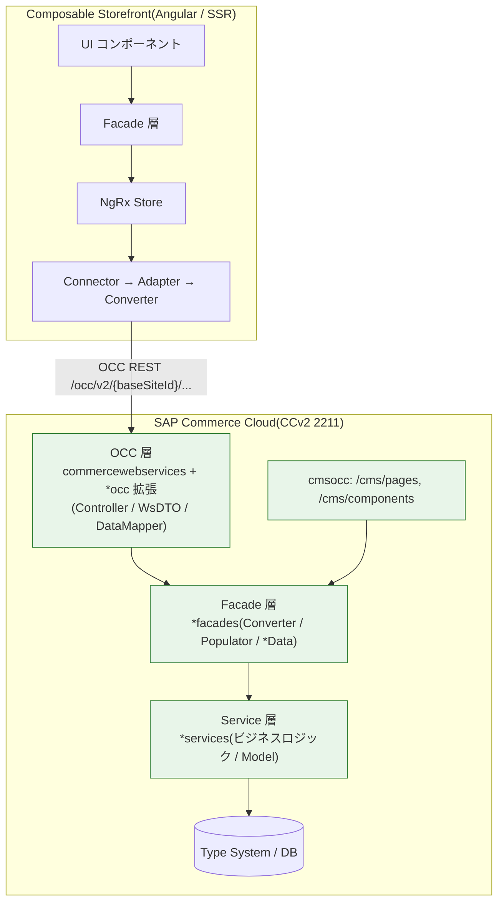
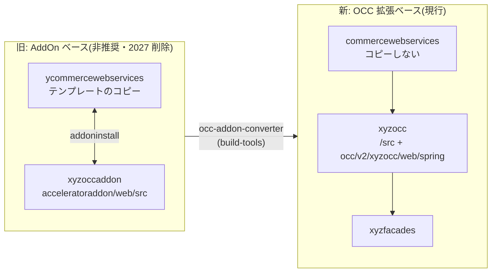

# 10. バックエンドでの開発の必要性

> 調査ステータス: ⚠️ 一部未確認(標準 OCC の守備範囲・OCC 拡張の作法・非推奨スケジュール・必要な設定は公式PDFで確認済み。cx レシピに含まれる OCC 拡張の網羅一覧、B2B Commerce Organization が要求する OCC 拡張名(b2bocc 以外)、manifest.json の `extensions` 書式の正典は手元PDFに無く未確認)

## 結論(要約)

- Composable Storefront は **100% API 駆動**で、SAP Commerce Cloud を「ヘッドレス」に使う。標準の商品/カート/注文/CMS/B2B 機能は **OCC(commercewebservices + `*occ` 拡張群)** が既に公開しており、**標準機能の範囲ではバックエンドの Java 開発は不要**(About p12 / OCCReference p4, p18)
- ただし「開発ゼロ」ではない。**設定・データ投入系の作業は必須**: (1) 必要拡張を manifest.json / localextensions.xml に追加、(2) OAuth クライアント(公開クライアント)の ImpEx、(3) CORS(`corsfilter.commercewebservices.*`)、(4) `spartacussampledata` 相当の **SPA 用 CMS コンテンツ**(-spa サイト・`/` 始まりの pageLabel・CMSFlexComponent 化)、(5) 2211-jdk21 なら `authserver.oauthclientdetails.loginpageuri.allowed.hosts` 等の custom.properties(GettingStarted p5–9, p25–28, p47–53)
- **カスタム開発が必要になるのは、Accelerator の Controller/Facade に独自ビジネスロジックを持っている場合**。公式 FAQ も「custom functionality requires APIs for composable storefront」と明言(About p13)。その場合は **`yocc` テンプレートから `xyzocc` 拡張を生成**し、`@Controller` + WsDTO(beans.xml)+ Orika DataMapper + `fields` レベル設定で REST API を追加する(OCCReference p22–24 / Commerce2 p220–226)
- 既存 OCC の挙動変更は **`@RequestMappingOverride`** で同一マッピングを上書きする(コアファイル改変不要)。優先度はプロパティ `requestMappingOverride.<class>.<method>.priority` で制御(Commerce2 p225–226)
- **AddOn ベース OCC(ycommercewebservices + `*occaddon`)は 2205 で非推奨**。削除予定: Industry OCC/テンプレート AddOn 2026Q3、**Core OCC AddOn 2027Q1**、テンプレート拡張(ycommercewebservices)2027Q3。新規開発は必ず **OCC 拡張方式(`*occ`、commercewebservices 依存)** で行う(OCCReference p2–4)
- 公式ガイドラインとして **OCC 拡張には items.xml の型定義・ImpEx・ビジネスロジックを置かない**(型は services 拡張、ロジックは facades 拡張へ)。「画面側の責務」と「API 側の責務」の分離は Composable でも同じ(OCCReference p17)
- 独自 CMS コンポーネント型(items.xml で追加)は **OCC が属性を自動で返す**ため OCC 側の追加開発は原則不要。フロント側で Angular コンポーネントを `CmsConfig` に紐付けるだけ(Commerce9 p149–150)
- Accelerator UI(テンプレート UI)は非推奨、Composable Storefront への移行が公式方針(CompatibilityGuide p21 / About p13)。バックエンド側の「Accelerator 系拡張(b2bacceleratorfacades 等)」自体は B2B 機能の前提として引き続き必要(DevGuide p161, p182)

## 調査内容

### 1. 全体像:どこまで標準で足りて、どこから作るのか



| 層 | 標準で提供されるもの | 追加開発が必要になる条件 |
|---|---|---|
| OCC(REST) | 商品・検索・カート・注文・ユーザー・CMS・B2B(Organization/Quote/Unit-Level Order 等)・Coupon・Customer Service など(OCCReference p18 / About p6–11) | Accelerator 独自 Controller のロジックを API 化する / 既存 API のレスポンス項目追加 / 既存 API の挙動変更 |
| Facade / Service | commercefacades / commerceservices / b2b 系 facades | 独自属性を `*Data` に載せる Populator、独自ビジネスロジック |
| Type System | 標準型 + CMSFlexComponent 等 | 独自 CMS コンポーネント型・独自属性(items.xml) |
| 設定・データ | 標準の OAuth クライアント・CORS 既定値 | **必ず必要**: OAuth 公開クライアント、CORS、SPA 用 CMS コンテンツ、custom.properties |

公式 FAQ の記述(About p12–13):

- 「Composable storefront is 100% API-driven; in this case, the SAP Commerce Cloud instance is run in a headless fashion.」
- 「Assuming a vanilla SAP Commerce Cloud B2C back end is up and running and configured to accept OCC API calls, a developer can get create a composable storefront-based storefront within 10 minutes.」
- 「there is no direct way to migrate from an Accelerator-based storefront … **custom functionality requires APIs** for composable storefront; styling from Accelerator cannot be copied; any custom CMS components require new custom Angular components.」

つまり「バニラ + OCC 設定済み」なら開発不要だが、Accelerator に独自機能を持っている場合、その分だけ **API(OCC 拡張)** が必要になる。

### 2. (a) 標準 OCC でカバーできる範囲

#### 2.1 OCC の構成(2211、OCC 拡張方式)

OCC Reference が定義する現行の構成(OCCReference p25–27):

| 拡張 | 役割 |
|---|---|
| `commercewebservices` | OCC 本体(Spring MVC)。Web ルートは `/occ/v2`。フィルタチェーン(CORS / baseSite / user / cart matching / Spring Security)を持つ |
| `commercewebservicescommons` | WsDTO の bean 定義(`commercewebservicescommons-beans.xml`)、Orika DataMapper、エラー定義、キャッシュ制御。**テンプレートではない**唯一の拡張 |
| `commercewebservicestests` | Groovy/Spock テストと wsTest サンプルデータ |
| `acceleratorocc` | acceleratorservices/acceleratorfacades に依存する OCC 拡張。SOP(モック決済)を含む決済系(OCCReference p25, p114–115 付近) |
| `*occ`(機能別) | `cmsocc`(CMS)、`b2bocc`(B2B)、`customercouponocc`、`customerticketingocc`、`configurablebundleocc`、`sapproductconfigocc`、`textfieldconfiguratortemplateocc`、`subscriptionocc`、`timedaccesspromotionengineocc` など。**名前が `occ` で終わり、commercewebservices に依存**する(OCCReference p22) |

> **未確認**: cx レシピが取り込む OCC 拡張の網羅リストは手元PDFに無い(LocalInstallation p30–32 はモジュール名単位)。上記は PDF 全文に登場した拡張名の集約であり、`b2bocc` は「B2B Accelerator Module」に含まれる(DevGuide p182)。実機の `hybris/bin/modules/**/extensioninfo.xml` または `ant extensionsxml` の出力で確認する。

#### 2.2 標準 OCC が公開している機能(OCCReference p18)

「Detailed product information / Cart details / Order details / Fast and optimized search / Product reviews / Points of service and stock levels / Secure user administration / Customer data / Promotions / Vouchers」に加え、Composable Storefront の各機能はそれぞれ必要な OCC 拡張・バージョンが決まっている。開発ガイドの「Requirements」節から、B2B 案件で関係の深いものを抜粋する。

| Composable 機能 | バックエンド要件(公式) | 出典 |
|---|---|---|
| B2B Commerce Organization | Organization feature library(FE)。BE 側の個別拡張名の記載なし(B2B Accelerator Module 前提と読める) | DevGuide p167 |
| B2B Account Summaries | SAP Commerce 2211+、**B2B Accelerator Module** のインストール | DevGuide p161 |
| B2B Unit-Level Orders | 2211+、`b2bacceleratorfacades` / **`b2bocc`** / `b2bwebservicescommons` | DevGuide p182 |
| B2B Commerce Quotes | Composable 2211.20+、**`b2bocc`** | DevGuide p173 |
| B2B Org User Registration(検証トークン) | 2211.37+ | DevGuide p184 |
| BOPiS | 2211+、commerceservices / commercefacades / commercewebservicescommons | DevGuide p187 |
| Cancellations and Returns | 2005+(端点がそれ以降)。Order Management の導入推奨 | DevGuide p189 |
| Customer Service(チケット) | 2211+、`customerticketingocc` | DevGuide p199 |
| Customer Coupons | `customercouponocc` | DevGuide p198 |
| Consignment Tracking | `consignmenttrackingoccaddon`(**AddOn**) | DevGuide p197 |
| Customer Interests / Stock Notification / Notification Preferences | `customerinterestoccaddon` / `notificationoccaddon`(**AddOn**) | DevGuide p198, p217, p233 |
| Selective Cart | `selectivecartaddon`(**AddOn**) | DevGuide p232 |
| Text Field Configurator | `textfieldconfiguratortemplateocc` | DevGuide p238 |
| CAPTCHA | 2211.28+、`sap-commerce-cloud-captcha-token` を CORS allowedHeaders に追加 | DevGuide p195 |
| Anonymous Consent | `x-anonymous-consents` を CORS allowedHeaders/exposedHeaders に追加、ConsentTemplate の `exposed=true` | DevGuide p140 |
| Wish List 2 | Composable 221121.13+、**2211-jdk21.9+** | DevGuide p241 |
| B2B ASM Product Categories | Composable 221121.13+、2211-jdk21.3+ | DevGuide p149 |
| Authentication / Custom Login Page | 221121.1+、**2211-jdk21.1 または 2211.44** | About p6–7 |

要点:

- 機能によっては **まだ AddOn(`*occaddon`)しか無いもの**がある(Consignment Tracking / Customer Interests / Notification / Selective Cart)。これらは 2027Q1 の Core AddOn 削除対象になりうるため、採用時は代替 OCC 拡張の提供状況を確認する(OCCReference p3)
- 「SAP Commerce Cloud Version」列が `n/a` の機能(SSR 系、Outlets、Lazy loading 等)はバックエンド不問(About p6)

### 3. (b) 必ず必要になるバックエンド作業(開発ではなく設定・データ)

#### 3.1 拡張の追加(レシピ / manifest.json)

ローカル(レシピ)の場合、公式手順は「`cx_features_enabled` を複製 → `cx_features_enabled_for_spa` を作成 → build.gradle で `extName 'spartacussampledata'` のコメントを外す」(GettingStarted p6)。CCv2 では **manifest.json が localextensions.xml / local.properties / レシピの役割を兼ねる**(AboutSAPCommerceCloud p63–64)。

```json
// manifest.json(抜粋イメージ。実例は CloudExtensions p68, p83 の "extensions" / contextPath 書式に準拠)
{
  "commerceSuiteVersion": "2211",
  "extensions": [
    "commercewebservices",
    "cmsocc",
    "b2bocc",
    "acceleratorocc",
    "spartacussampledata",
    "xyzocc"            // ← 独自 OCC 拡張を作った場合
  ],
  "aspects": [ { "name": "api", "webapps": [ { "name": "commercewebservices", "contextPath": "/occ" } ] } ]
}
```

> **未確認**: `extensions` / `aspects` / `js-storefront` の正確な書式は「Build Manifest Components」章(手元PDF未収録)が正典。上記は CloudExtensions の断片(`"extensions": [ ... ]`, `{"name":"cloudscimwebservices","contextPath":"/scim"}`)からの再構成であり、[→ 14. デプロイ](/topics/deployment) 側で確定させる。

#### 3.2 OAuth クライアント(ImpEx)

Composable Storefront は OCC を OAuth2 で呼ぶため、**公開クライアント**の登録が必須(GettingStarted p7–8)。

```impex
# Public OAuth Client Credential(GettingStarted p8。PDFは右端切れのため列名は原典で要確認)
INSERT_UPDATE OAuthClientDetails; clientId[unique=true] ; public ; authorities ; scope ; authorizedGrantTypes ; ...
                                ; mobile_android_public ; true   ; ROLE_CLIENT ; basic ; authorization_code,refresh_token,password,client_credentials ; ...
```

登録確認は `curl -skIXGET 'https://localhost:9002/authorizationserver/oauth/authorize?response_type=code&...'` で `302 Location: http://localhost:4200/login` が返ること(GettingStarted p8)。2211-jdk21 では認可サーバが `authorizationserver` 拡張(JDK17 の `oauth2` から交代)(SecurityGuide p32–33)。詳細は [→ 3. バックエンド接続](/topics/backend-connection)。

#### 3.3 CORS

CORS が不足すると「checkout や consent management が正しく動かない」「起動が部分的に止まる」(GettingStarted p9–10)。設定方法は 4 通り: local.properties / manifest.json / ImpEx / Backoffice(GettingStarted p27)。**DB(`CorsConfigurationProperty`)はクラスタ全体に効き、プロパティより優先**(SecurityGuide p34)。

```properties
# GettingStarted p27(右端は原典で補完)
corsfilter.commercewebservices.allowedOriginPatterns=*     # 本番は明示ドメインへ
corsfilter.commercewebservices.allowedMethods=GET HEAD OPTIONS PATCH PUT POST DELETE
corsfilter.commercewebservices.allowedHeaders=origin content-type accept authorization cache-control if-none-match x-anonymous-consents occ-personalization-id occ-personalization-time
corsfilter.commercewebservices.exposedHeaders=x-anonymous-consents occ-personalization-id occ-personalization-time
corsfilter.commercewebservices.allowCredentials=true
```

```impex
INSERT_UPDATE CorsConfigurationProperty;key[unique=true];value;context[default=commercewebservices,unique=true]
;allowedOriginPatterns;*
;allowedMethods;GET HEAD OPTIONS PATCH PUT POST DELETE
;allowedHeaders;origin content-type accept authorization cache-control if-none-match x-anonymous-consents occ-personalization-id occ-personalization-time
;allowCredentials;true
;exposedHeaders;x-anonymous-consents occ-personalization-id occ-personalization-time
```

- 2105 以降は `allowCredentials=true` と `allowedOrigins=*` の併用不可 → `allowedOriginPatterns` を使う(GettingStarted p25)
- Composable 2.0 以降は **全 OCC リクエストで Cookie を送る**(ROUTE Cookie によるセッションアフィニティ)ため `allowCredentials=true` が必要(GettingStarted p26–27 / AboutSAPCommerceCloud p64)
- ASM を使う場合は `corsfilter.assistedservicewebservices.*` も別途必要。URL と拡張の対応: `/authentication/*`→oauth2、`/occ/v2/*`→commercewebservices、`/assistedservicewebservices/*`→assistedservicewebservices(GettingStarted p30)
- 独自メソッド・独自ヘッダを OCC 拡張で足した場合は **CORS 側にも追記**が必要(GettingStarted p25)。詳細は [→ 25. SPA 用 HAC 設定](/topics/spa-hac-settings)

#### 3.4 custom.properties(2211-jdk21)

サンプル custom.properties の主な項目(GettingStarted p6, p9):

| プロパティ | 目的 |
|---|---|
| `authserver.oauthclientdetails.loginpageuri.allowed.hosts=localhost` | Composable 側のカスタムログインページを認可サーバの代わりに使う(Authorization Code Flow)。サブドメインは個別列挙、起動時のみ読込 |
| `cookies.SameSite.enabled=true` | Cookie SameSite。SmartEdit/カスタムログイン構成との相性は要確認(Commerce8 p102 の注意) |
| `acceleratorservices.payment.sopmock.enabled=true` | サンプルストアのチェックアウト用モック決済(本番不要) |
| `occ.rewrite.overlapping.paths.enabled=true` | B2B OCC の重複パスを `orgUsers` 等に書き換え、B2C/B2B 並行稼働を可能に |
| `corsfilter*` / `mockup.payment.label.billTo*` / `yacceleratorordermanagement.fraud*` / `task.polling.interval.min` / `build.parallel` | 開発用の緩い設定。本番では見直し |

#### 3.5 SPA 用 CMS コンテンツ(spartacussampledata が示す「やること一覧」)

`spartacussampledata` は既存サイトの **コピーを `-spa` サイトとして作り、Composable 向けに CMS を作り替える**拡張。自社サイトでも同じ変換を自前の initialdata 拡張で行う必要がある(GettingStarted p47–53)。

| 変換 | 内容 |
|---|---|
| ベースサイト・コンテンツカタログ複製 | `electronics-spa` 等を作成、`[store]ContentCatalog:Staged → [store]-spaContentCatalog:Staged` の CatalogVersionSyncJob を定義。`SpaSampleAddOnSampleDataImportService` が初期化/更新時に同期→クリーニング→ImpEx→Staged→Online 同期→email データ投入 |
| 不要ページ/スロット/コンポーネントの削除 | `cleaning.impex`。Composable に無いページを削る |
| **JspIncludeComponent → CMSFlexComponent** | JSP を差し込む型は Angular で意味が無い。`flexType` でライブラリのコンポーネントを指すよう置換(後方互換で JspIncludeComponent も動く) |
| CmsSiteContext 追加 | `LANGUAGE` / `CURRENCY` を enum に追加、`SiteContextSlot` に LanguageComponent / CurrencyComponent |
| ヘッダ再構成 | `SiteLinks` スロット(HelpLink/ContactUsLink/SaleLink)、MiniCartSlot から OrderComponent 削除 |
| 新規ページ | sale / help / contactUs / forgotPassword / resetPassword / register、404 ページの内容追加、SignOutNavNode |
| パンくず | breadcrumbComponent を NavigationBarSlot → BottomHeaderSlot へ |
| **pageLabel を `/` 始まりに** | Composable では pageLabel が URL になる(`UPDATE ContentPage;...;label` → `/login`) |
| SearchBox 設定 / PDP の CMS 駆動化 | `SearchBoxComponent` の minCharactersBeforeRequest 等、`ProductSummarySlot` に ProductIntro/Images/Summary/VariantSelector/AddToCart |

これらは Java 開発ではなく **ImpEx / initialdata 拡張の作業**。詳細は [→ 23. コンテンツカタログ(Backoffice)](/topics/content-catalog-backoffice) と [→ 22. ベースサイト(Backoffice)](/topics/basesite-backoffice)。

### 4. (c) カスタム開発が必要になるケース

#### 4.1 判断表:画面側の責務 vs API 側の責務

| Accelerator にあるもの | 移行先(画面側 = Angular) | 移行先(API 側 = OCC/Facade) | 備考 |
|---|---|---|---|
| JSP / Tag / CSS | Angular コンポーネント + SCSS で作り直し | ― | スタイルはコピー不可(About p13) |
| Controller の画面制御(リダイレクト、フォーム表示分岐、メッセージ表示) | Angular(Routing / Guard / GlobalMessage) | ― | 表示都合のロジックはフロント |
| Controller 内の入力バリデーション(形式) | Angular Reactive Forms | サーバ側でも再検証(OCC は create/update を追加検証する: OCCReference p26) | 二重化が原則 |
| Controller → Facade 呼び出し(標準 Facade のみ) | 標準 feature-lib の Facade / Connector をそのまま利用 | 不要(標準 OCC が公開済み) | `fields` パラメータで取得項目を調整(DevGuide p96) |
| **独自 Facade / Service ロジック**(価格計算、承認ルール、独自帳票、外部連携) | ― | **`xyzocc` 拡張 + 独自 Controller で REST 化**。ロジック本体は facades/services 拡張に残す | 「安易にコンポーネント側へ寄せない」 |
| 標準 `*Data` に無い属性を画面で使う | Product/UI モデルを拡張(`interface CustomProduct extends Product`)+ Converter(DevGuide p96) | Populator で `*Data` に追加 → beans.xml で WsDTO 拡張 → fieldSetLevel 追加(Commerce2 p221–223) | 両側の作業 |
| 独自 CMS コンポーネント型 | Angular コンポーネントを `CmsConfig.cmsComponents[typeCode]` に登録 | items.xml の型定義のみ。OCC は独自属性を自動返却(Commerce9 p149–150) | OCC 開発不要 |
| セッション依存の状態(Accelerator の SessionService 前提) | NgRx / State Persistence | OCC はステートレス(JSESSIONID 無視)。ユーザーは `users/{userId}` / カートは `carts/{cartId}` で識別(OCCReference p27) | 設計転換が必要 |
| 独自の認可(ロール制御) | Route Guard(UX 用) | `@Secured("ROLE_...")` を Controller に付与(Commerce2 p224)。**本当の認可は必ず API 側** | |
| 言語フォールバック | ― | OCC は既定で無効。必要なら `SessionLanguageFilter` を OCC 拡張で差し替え(OCCReference p123–124) | Accelerator は有効 |
| システム間連携(ERP 等) | ― | OCC ではなく **Integration API(Integration Object / OData v2)** を検討(IDM p3) | 画面向け=OCC、システム間=Integration API |

#### 4.2 OCC 拡張の作法(OCC Reference「Extending OCC」)

**新規 OCC 拡張の作成**(OCCReference p22–24 / Commerce2 p185–186):

1. `ant extgen` で **`yocc` テンプレート**から生成。名前は必ず `occ` で終える(例 `xyzocc`)
2. `localextensions.xml`(CCv2 は manifest.json)に `<extension name="xyzocc"/>` を追加
3. OCC 拡張は **Web 拡張ではない**(web コンテキストを持たない)。以下の規約で commercewebservices の Spring web コンテキストに自動取り込みされる:

| ディレクトリ | 内容 |
|---|---|
| `/src` | REST Controller と関連クラス。**commercewebservices の `/web/src` のクラスは継承不可**(`/src` のみ可視) |
| `/resources/occ/v2/xyzocc/web/spring/xyzocc-web-spring.xml` | Bean 定義。commercewebservices 側の `<import resource="classpath*:/occ/v2/*occ/web/spring/*-web-spring.xml"/>` で読み込まれる。`<context:component-scan base-package="de.hybris.platform.xyzocc.controllers"/>` を含める |
| `/resources/occ/v2/xyzocc/messages` | ローカライズメッセージ |
| `/resources/xyzocc-beans.xml` | WsDTO / Data の bean 定義 |
| `/resources/xyzocc-items.xml` | 型定義(ただし OCC 拡張には置かないのが推奨、後述) |
| `/resources/impex` | 自動ロードされない(convention over configuration に従う場合のみ) |
| `/lib` | ライブラリ |

4. Controller は `<xyzoccPackage>.controllers` パッケージに置けば自動登録。再ビルド後 `https://localhost:9002/occ/v2/{baseSiteId}/newResource` で呼べる

```java
// OCCReference p24 の最小例
@Controller
@RequestMapping(value = "/{baseSiteId}/newResource")
public class NewController {
    @RequestMapping(method = RequestMethod.GET)
    @ResponseBody
    public NewResourceWsDTO getNewResource() {
        return new NewResourceWsDTO("newSampleResource");
    }
}
```

**既存 API の拡張(属性追加)の定石**(Commerce2 p220–223、`xyzocc` サンプル = Customer に nickname / workOfficeAddress を追加):

```xml
<!-- xyzocc-items.xml: Model に属性追加(本来は services 拡張に置く) -->
<itemtype code="Customer" autocreate="false" generate="false">
  <attributes>
    <attribute autocreate="true" qualifier="nickname" type="java.lang.String">
      <modifiers read="true" write="true" optional="true"/>
      <persistence type="property"/>
    </attribute>
  </attributes>
</itemtype>

<!-- xyzocc-beans.xml: Facade の Data と WsDTO を拡張 -->
<bean class="de.hybris.platform.commercefacades.user.data.CustomerData">
  <property name="nickname" type="String"/>
</bean>
<bean class="de.hybris.platform.commercewebservicescommons.dto.user.UserWsDTO"
      extends="de.hybris.platform.commercewebservicescommons.dto.user.PrincipalWsDTO">
  <property name="nickname" type="String"/>
</bean>
```

```xml
<!-- xyzocc-spring.xml: Populator を既存 Converter に追加(Converter 再定義不要) -->
<bean parent="modifyPopulatorList">
  <property name="list" ref="customerConverter"/>
  <property name="add" ref="xyzoccCustomerPopulator"/>
</bean>

<!-- xyzocc-web-spring.xml: fields レベル(BASIC/DEFAULT/FULL)に新項目を追加 -->
<bean parent="fieldSetLevelMapping">
  <property name="dtoClass" value="de.hybris.platform.commercewebservicescommons.dto.user.UserWsDTO"/>
  <property name="levelMapping">
    <map>
      <entry key="BASIC" value="nickname"/>
      <entry key="DEFAULT" value="nickname"/>
      <entry key="FULL" value="nickname,workOfficeAddress(FULL)"/>
    </map>
  </property>
</bean>
```

```java
// Controller: Facade → Data → DataMapper(Orika) → WsDTO。fields で返却項目を制御
@Resource(name = "dataMapper") protected DataMapper dataMapper;

@Secured("ROLE_CUSTOMERGROUP")
@RequestMapping(value = "/nickname", method = RequestMethod.GET)
@ResponseBody
@ApiBaseSiteIdAndUserIdParam
public UserWsDTO getUser(@RequestParam(defaultValue = "BASIC") final String fields) {
    final CustomerData customerData = customerFacade.getCurrentCustomer();
    return dataMapper.map(customerData, UserWsDTO.class, fields);
}
```

- **DTO 変換は Orika ベースの DataMapper**。同名フィールドは自動マッピング、名前が違うときは `fieldMapper`、独自変換は `AbstractCustomMapper` を継承(`@WsDTOMapping` 付与済み)(OCCReference p93–94)
- WsDTO は `commercewebservicescommons-beans.xml` の bean として生成され、**Facade の Data とは切り離された安定 API 層**。新規 WsDTO を足したら `dto-level-mappings-v2-spring.xml` 相当の level mapping も足す(OCCReference p115)
- 型属性の追加後は **rebuild + initialize/update** が必要(Commerce2 p225)
- Swagger UI は `https://<host>:9002/occ/v2/swagger-ui.html`(OCCReference p19)。OCC 拡張の Web ルートは `/occ/v2` になる(`/rest/v2` ではない)(OCCReference p17)

**既存 API のオーバーライド**(Commerce2 p225–226):

```java
@Secured({ "ROLE_CUSTOMERGROUP" })
@RequestMapping(value = "/addresses/{addressId}", method = RequestMethod.PUT,
                consumes = { MediaType.APPLICATION_JSON_VALUE, MediaType.APPLICATION_XML_VALUE })
@ResponseStatus(HttpStatus.OK)
@ApiBaseSiteIdAndUserIdParam
@RequestMappingOverride   // ← 同一 @RequestMapping を優先度で上書き
public void replaceAddress(@PathVariable final String addressId, @RequestBody final AddressWsDTO address) { ... }
```

- 優先度はプロパティで決まる: `requestMappingOverride.<FQCN>.<method>.priority`(未定義なら 0)。`priorityProperty` で任意名も可
- **完全に同一の @RequestMapping でなければ効かない**(元が `{PUT, POST}` で上書きが `PUT` のみ、パス変数名違い等は「Ambiguous handler methods」エラー。起動時ではなくリクエスト時に発覚)
- OCC 拡張間で **パスの重複は禁止**。B2B 系のように衝突する場合は `occ.rewrite.overlapping.paths.enabled=true` で `users/` → `orgUsers/` のように書き換えられる(このとき `@RequestMappingOverride` は無視される)(OCCReference p17, p23)
- サイトチャネル制限: `@SiteChannelRestriction` で B2B 端点を B2C サイトから呼べないようにできる(OCCReference p17, p23)

**OCC 拡張の禁則(公式ガイドライン、OCCReference p17)**:

| 禁則 | 代替 |
|---|---|
| ImpEx を OCC 拡張に置かない | sampledata / services 拡張へ |
| 既存 bean 定義を extend しない、他拡張のパッケージ配下に bean を作らない | 衝突しうる bean は facades 拡張へ |
| **items.xml で型を追加しない** | services 拡張へ |
| 端点パスを重複させない | 一意パス、または `occ.rewrite.overlapping.paths.enabled` |
| Ehcache のカスタムキャッシュ | 「AddOn でも OCC 拡張でも壊れている」と明記。使わない |

→ 本案件の「画面側/API 側の責務分離」に加え、**API 側の中でも「OCC 拡張 = 公開層のみ、ロジックと型は facades/services」**という 3 層の分離が公式ルール。

#### 4.3 独自 CMS コンポーネント型

- CMS OCC(`cmsocc`)の `/cms/pages` `/cms/components` は「New CMS components that you add to the system are accommodated and **automatically return their unique CMS attributes**」(Commerce9 p149–150)。共通属性は `uid` `name` `typeCode` `modifiedTime`
- 制約(Restriction)は **全てサーバ側評価**で OCC は制約データを返さない(Commerce9 p150)→ フロントで再実装不要
- したがって独自型は **items.xml(services/core 拡張)+ ImpEx + Angular 側の `CmsConfig` 登録**で完結し、OCC の Java 開発は原則不要。フロント側の作り方は [→ 6. カスタムコンポーネント](/topics/custom-components)、`typeCode` の意味は [→ 21. TypeCode について](/topics/typecode)

#### 4.4 Integration API(OData)という選択肢

Integration API モジュールは Integration Object を定義するだけで OData v2 端点(inbound/outbound)を生成できるが、公式は「storefront や外部アプリ向けの標準 REST API が欲しいなら OCC を見よ」と役割を分けている(IDM p3)。**ストアフロントが叩く API は OCC、ERP/PIM 等のシステム間連携は Integration API** が原則。ストアフロントから直接 OData を叩く構成は認可モデル(ROLE_CLIENT/ROLE_CUSTOMERGROUP 等の OCC ロール体系: OCCReference p28–29)から外れるため推奨しない。

### 5. (d) AddOn 方式との違いと移行ツール



| 観点 | AddOn ベース OCC(旧) | OCC 拡張(新) |
|---|---|---|
| ベース | `ycommercewebservices`(テンプレートを **コピー**して使う) | `commercewebservices`(コピーしない) |
| 依存の向き | ycommercewebservices → addon(AddOn を"インストール") | `xyzocc` → commercewebservices(通常の依存) |
| Web ルート | `/rest/v2` | **`/occ/v2`** |
| 生成テンプレート | `yoccaddon` + `ant addoninstall` | `yocc`(追加コマンド不要) |
| ソース配置 | `acceleratoraddon/web/src` | `/src` |
| アップグレード | テンプレート更新のたびに **line-for-line で差分適用**が必要(OCCReference p4) | ライブラリ差し替えで追随 |
| ステータス | 2205 で非推奨。Core AddOn 2027Q1 削除、テンプレート拡張 2027Q3 削除、2028/9 まで延長採用期間(OCCReference p2–3) | 現行の正 |

- 既存の AddOn 資産がある場合は **`<HYBRIS_HOME>/build-tools/occ-addon-converter`**(Groovy ステップ、`--addondir` `--extdir` `--stepsdir`)で機械変換できる。変換後は commercewebservices モジュールとしか組み合わせられない(OCCReference p11–12)
- 変換時の落とし穴: カスタム packageroot、`web/src` のクラス依存(`/src` からは見えない)、ImpEx、bean/型の衝突、URL 重複、`rest_junit` → `rest_junit_occ`(OCCReference p12–17)
- 「Running ycommercewebservices and commercewebservices in Parallel」は SAP Note 参照(OCCReference p17)— 並行稼働の詳細は [→ 19. Accelerator 並行開発](/topics/accelerator-parallel-development)

### 6. (e) バージョン互換・非推奨スケジュール

| 対象 | ステータス | 出典 |
|---|---|---|
| Accelerator テンプレート UI(Industry Accelerator 含む) | 非推奨。「we encourage the transition to the headless composable storefront solution」 | CompatibilityGuide p21 |
| Accelerator 全般 | 「Plans for dereleasing Accelerators have been announced」。目標は全顧客の Composable / JS ストアフロント化 | About p13 |
| AddOn ベース OCC v2 | 2205 非推奨。IEP/Industry OCC・テンプレート AddOn: 2026Q3 削除、Chinese Accelerator・**Core OCC AddOn: 2027Q1 削除**、テンプレート拡張: 2027Q3 削除。2027/9 削除後は別ダウンロード提供・セキュリティスキャン対象外。延長採用期間 2028/9 まで | OCCReference p2–3 |
| OCC v1 | 2211.16(2023/12)で削除済み | OCCReference p3 |
| Java フレームワーク更新 | 2 年周期。2028/9 以降は旧 Java 版(非推奨 AddOn 同梱)でのビルド不可 | OCCReference p3 |
| Composable ↔ SAP Commerce | 2105 以上必須。機能ごとの最低版は Feature Compatibility Matrix。Authentication / Custom Login Page は **2211-jdk21.1 または 2211.44** | About p5–10 |
| 2211(JDK17)系 | 互換マトリクス上 2026-01-13 で失効済み(DOCMAP 参照)。本案件は 2211-jdk21 前提 | CompatibilityGuide |

## 本案件への示唆

- **見積りの骨格**: バックエンド作業は (A) 設定・データ(必須・小〜中)、(B) OCC 拡張開発(Accelerator の独自ロジック量に比例)、(C) CMS 変換(コンテンツ量に比例)の 3 本立てで積む。(A) は spartacussampledata の手順(GettingStarted p47–53)がそのままチェックリストになる
- **Gap 分析の進め方**: Accelerator の Controller / Facade を棚卸しし、上記 4.1 の判断表で「標準 OCC で代替可 / Populator+WsDTO 拡張 / 新規 Controller / フロントのみ」に分類する。判定材料は Swagger(`/occ/v2/swagger-ui.html`)と Feature Compatibility Matrix(About p6–10)+ 開発ガイド各機能の Requirements
- **B2B 前提**: `b2bocc` は Quote / Unit-Level Orders の要件として明記(DevGuide p173, p182)。B2B Accelerator Module(`b2bacceleratorfacades` 等)はバックエンドに残す。`occ.rewrite.overlapping.paths.enabled=true` を前提に、フロントの `OccEndpointsService` 設定と `orgUsers` パスを一致させる([→ 3. バックエンド接続](/topics/backend-connection))
- **AddOn を新規に作らない**: 現行 Accelerator に `*occaddon` があれば occ-addon-converter で `*occ` 化する。2027Q1 の Core AddOn 削除に間に合わせる(2027/4 詳細設計開始のスケジュールに対し、AddOn 依存の機能(Consignment Tracking / Customer Interests / Notification / Selective Cart)を採用するかは早期に判断)
- **責務分離を規約化**: OCC 拡張には Controller・WsDTO・DataMapper・fields 設定のみ。ロジックは facades/services、型は services、ImpEx は initialdata。フロント側は表示制御と UX 用ガードのみで、認可は `@Secured` を API 側に必ず置く
- **CCv2 での反映手段**: 拡張追加・プロパティは manifest.json、OAuth/CORS/CMS は ImpEx(initialdata の essential/project data)で環境間の再現性を担保。CORS は DB 優先のため Backoffice で手変更した値がプロパティを上書きする点に注意(SecurityGuide p34)
- **PowerTools 先行方針(サポート合意)との整合**: PowerTools 端点で先行開発する間は OCC 拡張開発を伴わない範囲(標準 OCC + フロント)で進め、カスタム OCC は 2211-jdk21 環境構築後に着手する。モック(MSW)で検証した範囲は「バックエンド込みで確認済み」と報告しない
- **SSR との関係**: SSR は Node 側から OCC を呼ぶため、ROUTE Cookie 再送(AboutSAPCommerceCloud p64)と CORS `allowCredentials` を SSR の HTTP クライアント設計で考慮する([→ 2. SSR セットアップ](/topics/ssr-setup))

## 未確認事項・次のアクション

- cx / cx_features_enabled レシピが取り込む **OCC 拡張の網羅一覧**(手元PDFはモジュール名単位)→ 実機で `hybris/bin/modules/**/extensioninfo.xml` を grep、または「Build Manifest Components」「B2B Commerce Module」章を Help Portal から追加取得
- B2B Commerce Organization 本体(Budget / Cost Center / Unit / User 管理)が要求する **OCC 拡張名**(`b2bocc` か別名か)→ 実機 Swagger と `b2bocc` の Controller 一覧で確認
- manifest.json の `extensions` / `aspects` / `js-storefront` の正式書式 → [→ 14. デプロイ](/topics/deployment) で確定
- OAuth 公開クライアント ImpEx の全列(PDF 右端切れ)→ Help Portal 原典で確認済みの内容が learning-site の 2211-jdk21 構築手順にあるので突合
- 独自 Controller に `@ApiBaseSiteIdAndUserIdParam` / `@Secured` を付けた場合の Swagger 表示・OAuth スコープの挙動 → 実機
- `cookies.SameSite.enabled=true` とカスタムログインページの相性(Commerce8 p102 の注意)→ 実機
- OCC 拡張で追加した独自ヘッダ/メソッドを使う場合の CORS 追記漏れの検出方法(ブラウザ preflight 確認: GettingStarted p28–30)→ 実機で手順化

## 出典

- `OCCReference.pdf` p.2–4 「OCC v2 Addons Deprecation / Deprecated AddOn-Based OCC V2 Extensions - Removal from SAP Commerce Cloud 2211 in 2027」
- `OCCReference.pdf` p.5–9 「Commerce Services Extensions / ycommercewebservices AddOns / Creating an AddOn for OCC Web Services」
- `OCCReference.pdf` p.11–17 「OCC AddOn Converter / Common Pitfalls in Transition to New OCC Extensions」
- `OCCReference.pdf` p.18–19 「OCC Features / Enabling Interactive OCC REST API Documentation」
- `OCCReference.pdf` p.20–24 「OCC Calls Security / OCC Extension-Based Architecture / Creating an OCC Extension for OCC Web Services」
- `OCCReference.pdf` p.25–29 「OCC API Implementation / RESTful Implementation / Access Control」
- `OCCReference.pdf` p.93–95 「DTO Mapping and Response Configuration / Fields Configuration」
- `OCCReference.pdf` p.114–116 「HTTP Message Converters / WsDTO Concept」
- `OCCReference.pdf` p.123–125 「Enabling Language Fallback with OCC / Cross-Origin Resource Sharing」
- `Commerce2.pdf` p.184–188 「commercewebservicestests / yocc Extension / yoccaddon Extension / yocctests Extension」
- `Commerce2.pdf` p.189 「Commerce Services Implementation(Converters and Populators / Extend Commerce Services)」
- `Commerce2.pdf` p.220–226 「Extend Commerce Services(Extending Data Objects / Extending the DTO for v2 / Extending the REST API / Overriding the REST API)」
- `Commerce9.pdf` p.148–150 「CMS OCC REST API Overview(typeCode、独自属性の自動返却、Restriction はサーバ側評価)」
- `AboutComposableStorefront.pdf` p.5–10 「Feature Compatibility Matrix」、p.12–13 「Composable Storefront FAQ」
- `GettingStartedWithComposableStorefrontLibraries.pdf` p.5–10 「Installing SAP Commerce Cloud 2211-jdk21 for use with Composable Storefront」、p.25–30 「Cross-Origin Resource Sharing (CORS)」、p.47–53 「Spartacus Sample Data Extension」
- `StorefrontDevelopmentGuide.pdf` p.95–96 「Connecting to Other Systems / Configuring Endpoints」、p.140 「Anonymous Consent – Back End Requirements」、p.149, 161, 167, 173, 182, 184, 187, 189, 195, 197–199, 210, 217, 232–233, 238, 241 各機能の「Requirements」
- `LocalInstallation.pdf` p.29–32 「Installer Recipes(cx / cx_old_occ / cx_features_enabled)」
- `AboutSAPCommerceCloud.pdf` p.13–14 「Available Extension Templates(yocc / yoccaddon)」、p.63–64 「Build Manifests / Extensions and AddOns / Route Cookies」
- `CloudExtensions.pdf` p.68, p.83 「manifest.json の extensions / contextPath 記述例」
- `SAPCommerceCloudSecurityGuide.pdf` p.32–35 「Front-End Security / Cross-Origin Resource Sharing Support(DB 設定がクラスタ全体に適用)」
- `CompatibilityGuide.pdf` p.21 「Industry Accelerators(テンプレート UI 非推奨)」
- `IntegrationsandDataManagement.pdf` p.3 「Integration API Module(OCC との使い分け Tip)」
