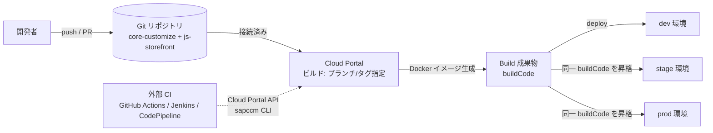

# 11. CI／CDの調査

> 調査ステータス: ⚠️ 一部未確認(Cloud Portal のビルド/デプロイ API・sapccm CLI・テクニカルユーザー・manifest の役割は公式PDFで確認済み。`core-customize/manifest.json` / `js-storefront/manifest.json` の**完全な書式**、ビルド所要時間の目安、Cloud Portal のリポジトリ接続手順(「Commerce Cloud Repository」章)は手元PDFに未収録のため実機・オンライン版で要確認)

## 結論(要約)

- CCv2 のビルドは **Cloud Portal(または Cloud Portal API / sapccm CLI)が接続済み Git リポジトリの「ブランチ/タグ」を指定して SAP 側で実行**する。自前 CI でビルドした成果物をアップロードする方式ではない。成果物は Docker イメージとして Kubernetes(Azure)上にデプロイされ、同じビルドを dev → stage → prod へ昇格させる(AboutSAPCommerceCloud p2, p63–64)
- ビルド内容は **build manifest** が定義する(Commerce のバージョン、含める extension/AddOn、どのコンテナ(aspect)が何を動かすか)。manifest は「recipes / local.properties / localextensions.xml / spring.xml / web.xml に相当する役割」(AboutSAPCommerceCloud p63–64)。フロントは `js-storefront/manifest.json` の `applications[]` に `ssr.enabled` / `ssr.path=dist/<app>/server/server.mjs` を書いて **CCv2 のホスティングサービスが Angular ビルドと SSR 稼働を担う**(Updating p141, GettingStarted p40)
- SAP は「Commerce Cloud は Jenkins 等の CI/CD の代替ではない。**既存 CI/CD を Cloud Portal 公開 API で接続せよ**」と明記(AboutSAPCommerceCloud p63)。よって **速い検証(lint / unit / build 可否)は自前 CI、成果物ビルドとデプロイは CCv2** の分担が公式方針に沿う
- Cloud Portal API: `POST /v2/subscriptions/{sub}/builds`(body: `branch`, `name`, 任意 `applicationCode`)→ `GET …/builds/{code}/progress`(percentage, buildStatus=BUILDING/SUCCESS/FAIL/…)→ `POST /v2/subscriptions/{sub}/deployments`(body: `buildCode`, `environmentCode`, `databaseUpdateMode`=NONE/UPDATE/INITIALIZE, `strategy`=ROLLING_UPDATE/RECREATE/GREEN)→ `GET …/deployments/{code}/progress`。認証は Cloud Portal の**テクニカルユーザー**(client_credentials → Bearer、ヘッダーは `x-approuter-authorization`)(CloudPortalAPIs p2, p33–36, p45, p52; onboarding p13–16)
- 同じ操作を **sapccm CLI**(`sapccm config set client-id/client-secret/token-url` → build/deploy/ログ取得)でも実行可能。CLI は SAP Software Downloads の「CX COMM CLOUD MAN CLI」(CommerceCloudCommandLineInterface p2)
- デプロイの詳細(戦略・DB モード・カナリア・キャンセル/ロールバック)は [→ 14. デプロイ](/topics/deployment) に委ねる。リポジトリ接続と CodeCommit は [→ 12. CodeCommitとの連携方法](/topics/codecommit-integration)
- 未確認: ビルド所要時間の目安、manifest の完全な書式(オンライン版「Build Manifest Components」章)、テクニカルユーザーの資格情報の有効期限の具体値

## 調査内容

### 1. CCv2 のビルド/デプロイモデル(大原則)

公式アーキテクチャ説明では次のように定義されている(AboutSAPCommerceCloud p2)。

> You manage your SAP Commerce Cloud deployments in the Cloud Portal … Builds are fully automated. They are packaged as Docker nodes, orchestrated by Kubernetes, and deployed on Microsoft Azure public cloud infrastructure. You have full control over build configuration using build manifest files, and can connect your own GitHub repository to pull in any custom code for your project at build time.

「Cloud Automation Components」の章では、自動化を支える構成要素として **Code Repository / Build Manifests / Extensions and AddOns / Storefronts / Cloud Portal / Environments** を列挙している(AboutSAPCommerceCloud p63–64)。要点は次の通り。

| 構成要素 | 公式の説明(要旨) | 出典 |
|---|---|---|
| Code Repository | リポジトリを接続すると、ビルドプロセスが manifest とカスタムコードを取得してストアフロントを作る | About p63 |
| Build Manifest | ローカルの recipes / local.properties / localextensions.xml / spring.xml / web.xml に相当。**Commerce のバージョンと extension pack、どのコンテナがどのアプリを動かすか、含める extension と AddOn** を定義 | About p63–64 |
| Configuration Reuse | manifest の extensions セクションで `localextensions.xml` を参照でき、個別列挙が不要 | About p64 |
| Storefronts | Accelerator と **JavaScript storefront(OCC 経由)** の両方をホストできる | About p64 |
| Environments | 各環境は複数の Kubernetes ノード=コンテナ群。**どのコンテナが何を動かすかは manifest の aspects で定義** | About p64 |
| Cloud Portal | セットアップとデプロイ、ユーザー管理、セキュリティ設定、ログ閲覧の自己サービス | About p64 |

そして CI/CD について明確な位置づけがある(AboutSAPCommerceCloud p63)。

> Many aspects of Commerce Cloud overlap with the capabilities of continuous integration (CI) and continuous delivery (CD) solutions, such as Jenkins. Commerce Cloud doesn't attempt to replicate the capabilities of those solutions and isn't a direct replacement. You can connect your existing CI/CD pipeline through the use of Commerce Cloud public APIs.



### 2. Composable Storefront は CCv2 でどうビルド・ホストされるか

Composable Storefront のドキュメントは、CCv2 のホスティングサービスがフロントのビルドとホストを担うことを明記している。

- 「SAP Commerce Cloud hosting service is used for both building and hosting JavaScript storefronts. As of late August 2023, the hosting service can build composable storefront 5.x, 6.x, and 2211.x (or later) using the libraries that are stored on the Repo-Based Shipment Channel (RBSC).」最新手順は「Add Applications to JavaScript Storefronts」章を参照(GettingStarted p40)
- FAQ:「SAP Commerce Cloud building and deployment are infrastructure hosting features that are separate from composable storefront itself. The hosting service can host any front end … **if you build SAP Commerce Cloud and the back end has not changed, it will skip that step and build the JS storefront only, then deploy all of it.**」また「Some customers host composable storefront using a service other than SAP hosting.」(About p12)
- 手動アップロード方式も可: ローカルで `npm run build` して生成された `dist` を **リポジトリにコミット**する(「Manually Uploading Composable Storefront to SAP Commerce Cloud in the Public Cloud」)。ただし `.npmrc` はリポジトリに含めないこと(GettingStarted p40)

`js-storefront/manifest.json` の抜粋(Angular 17 化以降の SSR エントリは `server.mjs`)(Updating p141):

```json
{
  "name": "<Your-Storefront-App-Name>",
  "path": "<Your-Storefront-App-Path>",
  "ssr": {
    "enabled": true,
    "path": "dist/<Your-Storefront-App-Name>/server/server.mjs"
  }
  ...
}
```

> 注意: 上記は PDF に載っている抜粋のみ。`applications[]` の外側の構造、`csr.webroot`、`nodeVersion`、`enabledRepositories`(RBSC レジストリ参照)などの完全な書式は手元 PDF に無い(DOCMAP でも「Build Manifest Components」章は未収録と記録)。実物は公式サンプル `SAP-samples/cloud-commerce-sample-setup` とオンライン版「Build Manifest Components」で確認する。

ビルドログについて、Security Guide は「ビルドログは膨大で `releaselog-[date].txt` としてダウンロード可能。**機密・個人情報をリポジトリに含めないこと**」と注意している(SAPCommerceCloudSecurityGuide p31)。フロント側の `.npmrc`(RBSC 資格情報)を `.gitignore` するのはこの観点でも必須(GettingStarted p36, p40)。

バックエンド側 manifest への設定例(PDF に実物あり): CORS フィルタのプロパティを manifest の `properties` に `{"key": "...", "value": "..."}` 形式で並べる(GettingStarted p27)。

```json
{ "key": "corsfilter.commercewebservices.allowedOriginPatterns", "value": "*" },
{ "key": "corsfilter.commercewebservices.allowedMethods", "value": "GET HEAD OPTIONS PATCH PUT POST DELETE" },
{ "key": "corsfilter.commercewebservices.allowedHeaders", "value": "origin content-type accept authorization cache-control if-none-match x-anonymous-consents ..." },
{ "key": "corsfilter.commercewebservices.exposedHeaders", "value": "x-anonymous-consents occ-personalization-id occ-personalization-time" }
```

Cloud Extensions 側の例でも「manifest.json に extension を追加(例: `azurecloudhotfolder`, `cloudscimwebservices`)、aspects セクションに設定を追加してビルド&デプロイ」「manifest のプロパティ変更はデプロイ後に反映」というパターンが繰り返し出てくる(CloudExtensions p4, p83, p85)。すなわち **バックエンドの構成変更=manifest 変更=再ビルド・再デプロイ** である。

### 3. Cloud Portal API(ビルド/デプロイの自動化)

#### 3-1. 認証(テクニカルユーザー)

- Cloud Portal API を CLI や REST クライアントから呼ぶには **テクニカルユーザー**を作成する。IAS(Identity Authentication Service)と統合した client_credentials 方式(onboarding p13–14)
- 手順: Cloud Portal → User Management → Technical Users → Create → Role(`CUSTOMER_SYS_ADMIN` or `CUSTOMER_DEVELOPER`)と Environment Access を選択 → 作成直後のポップアップで **Token Endpoint URL / Client ID / Client Secret / Resource** を控える(有効期限も表示される)(onboarding p14–15)
- 制約: **1 Cloud Portal ユーザーあたり最大 2 テクニカルユーザー**。テクニカルユーザーは作成者(オーナー)しか編集できず、**オーナーが削除されると紐づくテクニカルユーザーも自動削除**される。担当者異動時はオーナー移管/再作成の計画が必要。クライアントシークレットは再生成・複数発行が可能(onboarding p14–16)
- トークン取得と API 呼び出し(CloudPortalAPIs p2):

```bash
# 1) トークン取得(client_credentials。resource パラメータが必須)
curl <<token_endpoint>> -X POST \
  -H 'Content-Type: application/x-www-form-urlencoded' -H 'Accept: application/json' \
  -d "client_id=<<client_id>>" -d "client_secret=<<client_secret>>" \
  --data-urlencode 'grant_type=client_credentials' --data-urlencode 'resource=<<resource>>'
# → {"access_token":"<<your_token>>","token_type":"Bearer","expires_in":3600}

# 2) API 呼び出し(ヘッダー名は x-approuter-authorization。TLS 1.2 以上)
curl https://portalapi.commerce.ondemand.com/v2/subscriptions/{subscriptionCode}/environments \
  -H "x-approuter-authorization: Bearer <<access_token>>"
```

- OpenAPI 仕様(`SAP Commerce Cloud - Management API` 2.0.12、state: Beta)が PDF に収録されており、タグは build / certificates / deployment / databackup / environment / endpoint / scaling / scheduledActivity / serviceProperties / userroleassignments(CloudPortalAPIs p2)。ページネーションは 1 リクエスト最大 100 件(p2)。Swagger Editor では `resource` パラメータ非対応のため直接テストできない旨の注記あり(p2)
- `subscriptionCode` / `buildCode` / `environmentCode` / `deploymentCode` は Cloud Portal の URL(`subscription/…`, `builds/…`, `environments/…`, `deployments/…`)から取得できる(CloudPortalAPIs p33, p45–49)

#### 3-2. Build API

| 操作 | メソッド/パス | 要点 | 出典 |
|---|---|---|---|
| createBuild | `POST /v2/subscriptions/{sub}/builds` | body `{"applicationCode","branch","name"}`。**branch と name は必須、applicationCode は任意**。201 で `{"code"}` を返す。`Content-Type: application/json` 必須 | p33 |
| getBuild | `GET …/builds/{buildCode}` | `applicationDefinitionVersion`, `branch`, `buildStartTimestamp/EndTimestamp`, `buildVersion`, `createdBy`, `hasSnapshot`, `deployed`, `properties[]`, `status` | p33–34 |
| getBuilds | `GET …/builds` | `$top/$skip/$orderby/$count`, `statusNot[]` で絞り込み | p34 |
| getBuildProgress | `GET …/builds/{buildCode}/progress` | `percentage`, `numberOfTasks`, `startedTasks[]`, `buildStatus`(BUILDING/SUCCESS/FAIL/SCHEDULED/DELETED/UNKNOWN), `errorMessage` | p17, p36 |
| getBuildLogs | `GET …/builds/{buildCode}/logs` | `Accept: application/octet-stream` で **ZIP** をダウンロード | p35 |
| deleteBuild | `DELETE …/builds/{buildCode}` | 204 で削除開始 | p36 |

`branch` フィールドの値としてブランチ名以外(タグ・コミット)が使えるかは PDF に明記なし(未確認)。

#### 3-3. Deployment API(概要のみ。詳細は [→ 14. デプロイ](/topics/deployment))

| 操作 | メソッド/パス | 要点 | 出典 |
|---|---|---|---|
| getDeploymentModes | `GET /v2/subscriptions/{sub}/deploymentmodes` | 環境ごとに許可される `dataMigrationMode` / `deploymentMode` を返す(環境により制限あり) | p51–52 |
| createDeployment | `POST /v2/subscriptions/{sub}/deployments` | body `{"buildCode","environmentCode","databaseUpdateMode","strategy"}` **すべて必須**。`databaseUpdateMode`=NONE/UPDATE/INITIALIZE、`strategy`=ROLLING_UPDATE/RECREATE/GREEN。201 で `{"code"}` | p45 |
| getDeploymentProgress | `GET …/deployments/{code}/progress` | `deploymentStatus`(SCHEDULED/DEPLOYING/DEPLOYED/UNDEPLOYED/FAIL), `percentage`, `stages[].steps[]`(status PENDING/RUNNING/DONE/FAIL, `logLink`) | p24, p52–53 |
| getDeployment / getDeployments | `GET …/deployments[/{code}]` | `scheduledTimestamp`, `deployedTimestamp`, `failedTimestamp`, `isCanaryAvailable`, `previousDeploymentCode`, `cancelation{}` | p48–49 |
| createDeploymentCancellation | `POST …/deployments/{code}/cancellation` | body `{"rollbackDatabase": false}`。**機能を Cloud Portal 管理者に有効化してもらう必要あり**、501 は無効状態 | p46 |
| createDeploymentDecision | `POST …/deployments/{code}/decisions` | GREEN(blue/green)用。`decision`=ACCEPT/REJECT/PREPARE_CANARY | p47 |
| trafficsplit(get/put/history) | `…/deployments/{code}/trafficsplit` | green デプロイへのトラフィック % を service/endpoint 単位で設定 | p53–56 |

環境ごとの許可モードは `getDeploymentModes` で事前に取得できるため、パイプラインでは **環境×モードの組合せをハードコードせず API から取得して検証**する設計にできる。

#### 3-4. sapccm CLI

「Command Line Interface: Use a command line interface to initiate build and deploy actions in SAP Commerce Cloud outside of the Cloud Portal.」(CommerceCloudCommandLineInterface p2)

- できること: ビルドのトリガー、ビルド一覧・詳細取得、**ビルドログのダウンロード**、デプロイのトリガー、デプロイ一覧・詳細取得、デプロイキャンセルのオプション取得とキャンセル(p2)
- 入手: ZIP パッケージ。SAP Software Downloads で「CX COMM CLOUD MAN CLI」を検索。インストール手順は ZIP 内 readme、`--help` でコマンド一覧(p2)
- 認証設定(テクニカルユーザーの資格情報)(p2):

```bash
sapccm config set client-id {CLIENT_ID_VALUE}
sapccm config set client-secret {CLIENT_SECRET_VALUE}
sapccm config set token-url {TOKEN_URL_VALUE}
```

- 「You may need to update the CLI to the latest version in order to use these API commands.」(CloudPortalAPIs p2)。CLI と API は同等の機能なので、**外部 CI からは CLI をコンテナに同梱するか、REST を直接叩くか**のどちらでも実装できる。CLI の個別サブコマンド名は PDF に記載なし(readme / `--help` で確認)

### 4. 外部 CI から呼ぶパイプライン設計(案)

公式方針(「既存 CI/CD を公開 API で接続」)に沿った分担案。**CCv2 ビルドは Git 全体に対して SAP 側で走る**ため、PR 単位の高速フィードバックは自前 CI で行い、CCv2 ビルドは統合ブランチのマージ後にトリガーする。

```mermaid
flowchart TB
  subgraph pr["PR / feature ブランチ(自前 CI)"]
    fe1[FE: npm ci → ng lint → ng test → ng build<br/>成果物は捨てる]
    be1[BE: ant clean all → ant unittests / integrationtests<br/>Sonar 等]
    e2e1[任意: MSW モックで Cypress スモーク]
  end
  subgraph merge["develop / release ブランチ マージ後(自前 CI → Cloud Portal API)"]
    tok[テクニカルユーザーで Bearer 取得]
    cb[POST /builds branch=release/x name=...]
    poll1[GET /builds/{code}/progress をポーリング<br/>SUCCESS / FAIL]
    log[FAIL 時: GET /builds/{code}/logs で ZIP 取得→CI 成果物へ]
    dep1[POST /deployments env=dev mode=NONE/UPDATE strategy=ROLLING_UPDATE]
    poll2[GET /deployments/{code}/progress をポーリング]
    smoke[dev に対する Cypress / API スモーク]
  end
  subgraph promote["昇格(手動承認ゲート)"]
    s1[同一 buildCode を stage へ deploy]
    uat[UAT / 性能試験]
    p1[prod へ deploy(戦略・DB モードは運用ルール化)]
  end
  pr --> merge --> promote
  tok --> cb --> poll1 --> dep1 --> poll2 --> smoke
  poll1 -.-> log
```

FE / BE の分担(自前 CI 側):

| 領域 | 自前 CI でやること | 根拠・補足 |
|---|---|---|
| FE(js-storefront) | `npm ci`(RBSC レジストリの `.npmrc` を CI シークレットから生成)→ `ng lint` → `ng test` → `ng build`(SSR ビルドで `dist/<app>/server/server.mjs` が生成されることを確認) | 前提バージョンは Angular 21.2+ / Node 22.22+(GettingStarted p2, p34–35)。CCv2 の `nodeVersion` と CI の Node を揃える(書式は未確認) |
| BE(core-customize) | `ant clean all` → 単体/統合テスト。SAP は暗黙の extension 依存を炙り出すため **`ant clean all` を定期的に実行**するよう推奨 | AboutSAPCommerceCloud p10(build framework は extension を非決定的順序でビルドするため、`ant all` では依存漏れが隠れる) |
| 共通 | シークレット(RBSC 資格情報、テクニカルユーザーの client secret)は CI のシークレットストアで管理。ビルドログは公開範囲に注意 | SecurityGuide p31, GettingStarted p36/p40 |
| CCv2 側 | 上記が通ったコミットに対してのみ createBuild。**バックエンド変更が無ければ JS ストアフロントのみビルド**される最適化がある | About p12 |

Cloud Portal API 呼び出しの最小スクリプト例(GitHub Actions / CodePipeline のステップ内で使う想定。エンドポイントと body は PDF 記載のもの):

```bash
TOKEN=$(curl -s "$TOKEN_URL" -X POST -H 'Content-Type: application/x-www-form-urlencoded' \
  -d "client_id=$CLIENT_ID" -d "client_secret=$CLIENT_SECRET" \
  --data-urlencode 'grant_type=client_credentials' --data-urlencode "resource=$RESOURCE" | jq -r .access_token)
H="x-approuter-authorization: Bearer $TOKEN"
API=https://portalapi.commerce.ondemand.com/v2/subscriptions/$SUB

BUILD=$(curl -s -X POST "$API/builds" -H "$H" -H 'Content-Type: application/json' \
  -d "{\"branch\":\"$BRANCH\",\"name\":\"ci-$GITHUB_RUN_NUMBER\"}" | jq -r .code)
until [ "$(curl -s "$API/builds/$BUILD/progress" -H "$H" | jq -r .buildStatus)" != "BUILDING" ]; do sleep 60; done
# SUCCESS 以外なら logs を取得して失敗させる
DEP=$(curl -s -X POST "$API/deployments" -H "$H" -H 'Content-Type: application/json' \
  -d "{\"buildCode\":\"$BUILD\",\"environmentCode\":\"$ENV\",\"databaseUpdateMode\":\"NONE\",\"strategy\":\"ROLLING_UPDATE\"}" | jq -r .code)
until [ "$(curl -s "$API/deployments/$DEP/progress" -H "$H" | jq -r .deploymentStatus)" = "DEPLOYED" ]; do sleep 60; done
```

> トークンは `expires_in: 3600` なので、長時間ポーリングでは再取得が必要(CloudPortalAPIs p2)。

### 5. 環境昇格・リリース戦略の考え方

- 環境: 初期の開発環境は自動プロビジョニング、追加の development / staging / production は SAP for Me から契約範囲内でプロビジョニング(About p64, onboarding p17)。環境ごとに Kubernetes クラスタ・DB スキーマ・サービスのスケーリング情報が API から取得できる(CloudPortalAPIs p27–30)
- 昇格の単位は **buildCode**。`getBuild` の `deployed` フラグや `getDeployments?buildCode=` でそのビルドがどの環境にデプロイ済みかを追跡できる(CloudPortalAPIs p34, p49)
- 戦略の選択(詳細は [→ 14. デプロイ](/topics/deployment)):
  - **ROLLING_UPDATE**: 通常のリリース。`databaseUpdateMode=NONE` なら型システム変更なしの FE 中心リリースに向く
  - **RECREATE**: 停止を伴う。`INITIALIZE`(初期化)を伴うのは開発環境などデータ再作成が許される場面
  - **GREEN**: blue/green。`createDeploymentDecision` で ACCEPT / REJECT / PREPARE_CANARY を選び、`trafficsplit` で green への割合を制御(CloudPortalAPIs p47, p53–56)
- 環境ごとに許される組合せは `getDeploymentModes` の結果に従う(p51–52)。本番でどの戦略が許可されているかは実機で確認
- デプロイの `scheduledTimestamp`(未指定なら即時)で時刻指定デプロイができる(CloudPortalAPIs p21)。リリース時間帯の運用ルールに使える
- キャンセル/ロールバック: `cancellationoptions` で「DB をロールバックできる時点(`databaseRollbackRestoreTimestamp`)」を取得し、`cancellation` に `rollbackDatabase` を指定(p24, p46, p50)。機能自体は Cloud Portal 管理者による有効化が前提

### 6. テストの組み込み

- FE 単体: `ng test`(Spartacus 本体の CI も `unit-tests.sh` / `validate-lint.sh` を持つが、これは**ライブラリ開発用**でアプリ CI とは別物。二次ソース: `spartacus/ci-scripts/`)
- FE E2E: dev 環境デプロイ後に Cypress でスモーク。Spartacus 本体にも CCv2 環境向け E2E スクリプト(`ci-scripts/e2e-cypress.sh` 等)がある(二次ソース)。テストツールの選定は [→ 13. テストツール](/topics/test-tools)
- BE: `ant clean all` + junit(PDF は「`ant clean all` を定期的に実行して依存漏れを検出」を推奨。About p10)。テスト用 ant ターゲットの詳細は本 PDF 群に見当たらず未確認
- CCv2 ビルドが失敗した際の一次情報は `getBuildLogs` の ZIP(`releaselog-[date].txt`)。フロントの Angular ビルドエラーもここに出るため、**PR 時点でローカル/CI の `npm ci && npm run build` が通ることを保証**しておくと CCv2 側の失敗をほぼ事前に潰せる

## 本案件への示唆

- **CCv2 が唯一のビルド元**という前提で設計する。自前 CI(GitHub Actions / Jenkins / CodePipeline)は「品質ゲート+Cloud Portal API の呼び出し役」に徹し、成果物ビルドを二重に持たない。SAP 自身が「CI/CD の代替ではない。公開 API で接続せよ」と明言している(About p63)
- Accelerator(JSP)時代は BE ビルドの一部だったストアフロントが、Composable では **`js-storefront/` の Angular ビルド(SSR 前提)として同じ CCv2 ビルドに含まれる**。BE 変更が無いときは JS のみビルドされる最適化があるので、**FE のリリース頻度を上げるには BE と FE のコミットを分けて運用**する価値がある(About p12)
- 商用版ライブラリは RBSC 経由。CCv2 ビルドが RBSC を参照する仕組み(manifest の `enabledRepositories` 相当)と、自前 CI 用の `.npmrc` の両方に同じ資格情報を安全に配る運用が必要。`.npmrc` は絶対にコミットしない(GettingStarted p36, p40)
- SSR 必須のため、CI の `ng build` で **`dist/<app>/server/server.mjs` の生成まで確認**し、manifest の `ssr.path` と一致させる(Updating p141)。ブラウザ専用 API 混入は SSR 起動失敗として CCv2 デプロイ後に顕在化するので、CI の SSR ビルド+簡易 SSR 起動テストで前倒しする
- B2B かつ移行案件なので、DB を伴うリリース(型システム変更、ImpEx)は `databaseUpdateMode=UPDATE`、FE のみは `NONE` と使い分ける。2211-jdk21 では「ImpEx エラーで初期化/更新を失敗させる」プロパティが既定 true という別調査結果もあり([→ 17. データベース](/topics/database))、**UPDATE デプロイの失敗要因を CI の `ant updatesystem` 相当で先に検出**する設計を検討
- テクニカルユーザーは「1 ユーザー 2 個まで・オーナー削除で消える」制約があるため、**CI 用テクニカルユーザーのオーナーを個人ではなく運用担当の共有 S-user 等にする**、シークレットのローテーション手順を決める、といった運用設計が必要(onboarding p14–16)
- 環境数(dev/stage/prod の構成)、本番で許可される戦略(GREEN の可否)、キャンセル機能の有効化は契約・Cloud Portal 設定に依存するので、[→ 15. インフラ](/topics/infrastructure) の確認事項と合わせて早期にヒアリングする

## 未確認事項・次のアクション

- `core-customize/manifest.json` と `js-storefront/manifest.json` の**完全な書式**(`applications[]`, `csr.webroot`, `nodeVersion`, `enabledRepositories`, `storefrontAddons`, `aspects`, `properties`)。→ オンライン版「Build Manifest Components」「Add Applications to JavaScript Storefronts」「Specify Node.js Version」章と `SAP-samples/cloud-commerce-sample-setup` で確認
- Cloud Portal のリポジトリ接続手順(「Commerce Cloud Repository」章)は手元 PDF に無い → [→ 12. CodeCommitとの連携方法](/topics/codecommit-integration) で扱う
- **ビルド所要時間の目安**、同時ビルド数の制限、ビルド保持期間(`expireAtTimestamp` の意味)は PDF に記載なし → 実機で計測
- `createBuild` の `branch` にタグやコミット SHA を指定できるか、`applicationCode` の用途(複数アプリケーション時の識別?)→ 実機/オンライン版で確認
- sapccm CLI の具体的なサブコマンド名・出力形式(ZIP 内 readme / `--help`)
- テクニカルユーザーの資格情報の有効期限の既定値(作成時ポップアップに表示される、としか記載なし)
- BE のテスト用 ant ターゲット(unittests / integrationtests / yunitinit)の公式記述は本 PDF 群に見当たらず。テスト方針は [→ 13. テストツール](/topics/test-tools) と合わせて確認
- 本番環境で許可される `deploymentMode` / `dataMigrationMode` の組合せ(`getDeploymentModes` で取得)とデプロイキャンセル機能の有効化状況

## 出典

- `documents__AboutSAPCommerceCloud.pdf` p.2 「SAP Commerce Cloud Architecture」(ビルドの自動化・Docker/Kubernetes/Azure・GitHub リポジトリ接続)
- `documents__AboutSAPCommerceCloud.pdf` p.10 「Detecting an Extension Dependency」(`ant clean all` 推奨)
- `documents__AboutSAPCommerceCloud.pdf` p.63–64 「Cloud Automation Components」(Code Repository / Build Manifests / CI/CD は代替しない・公開 API で接続 / Environments と aspects)
- `documents__CloudPortalAPIs.pdf` p.2 「Cloud Portal API Documentation」(テクニカルユーザー、トークン取得、`x-approuter-authorization`、OpenAPI 仕様)
- `documents__CloudPortalAPIs.pdf` p.17–24 (BuildProgressDTO / BuildDetailDTO / DeploymentDetailDTO / DeploymentProgressStepDTO / Cancellation DTO)
- `documents__CloudPortalAPIs.pdf` p.33–36 「createBuild / getBuild / getBuilds / getBuildLogs / getBuildProgress / deleteBuild」
- `documents__CloudPortalAPIs.pdf` p.45–56 「createDeployment / createDeploymentCancellation / createDeploymentDecision / getDeployment(s) / getDeploymentCancellationOptions / getDeploymentModes / getDeploymentProgress / trafficsplit」
- `documents__CommerceCloudCommandLineInterface.pdf` p.2 「Command Line Interface」(sapccm、config set、入手先)
- `documents__onboarding.pdf` p.12–13 「Roles in the Cloud Portal」、p.13–16 「Technical Users」(作成手順・制約・オーナーシップ)、p.17 「Provisioning Environments」
- `documents__SAPCommerceCloudSecurityGuide.pdf` p.31 「Access to logs in the Cloud Portal」(ビルドログ、機密情報をリポジトリに入れない)
- `documents__CloudExtensions.pdf` p.4 「Cloud Hot Folders(manifest への extension / aspects 追記)」、p.83, p.85 「SCIM/SSO の manifest.json 設定、プロパティ変更はデプロイ後に反映」
- `docs__GettingStartedWithComposableStorefrontLibraries.pdf` p.27 「SAP Commerce Cloud Manifest Configuration」(CORS を manifest の properties で設定)、p.35–36 「.npmrc / RBSC」、p.40 「Using Composable Storefront with SAP Commerce Cloud in the Public Cloud」「Manually Uploading …」
- `docs__AboutComposableStorefront.pdf` p.12 「FAQ: How does composable storefront integrate with SAP Commerce Cloud?」(ホスティングサービス、BE 未変更時は JS のみビルド)
- `docs__UpdatingComposableStorefront.pdf` p.141 「Updating the Manifest for SAP Commerce Cloud」(`js-storefront/manifest.json` の `ssr.path` = `server.mjs`)、p.142 「serve:ssr」
- 二次ソース: `spartacus/ci-scripts/`(ライブラリ開発用 CI スクリプト)、`learning-site/content/cicd-ccv2.md`(既存整理。公式サンプル manifest へのリンク)
