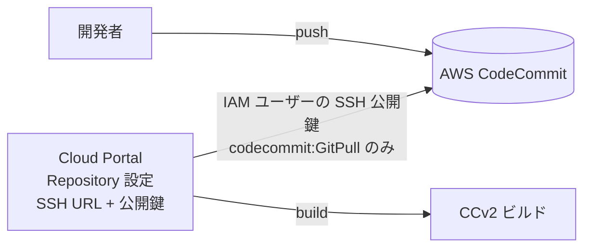
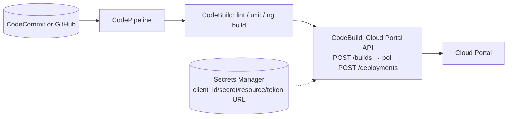

# 12. CodeCommitとの連携方法

> 調査ステータス: ⚠️ 一部未確認(手元の公式PDF 39本には CCv2 のリポジトリ接続手順「Commerce Cloud Repository」章が未収録。PDF から確認できるのは「Git リポジトリを Cloud Portal に接続し、ビルド時にコードと manifest を取得する」「GitHub リポジトリを接続できる」という枠組みまで。**AWS CodeCommit / Bitbucket / GitLab / Azure DevOps への言及は全 PDF に無し**。CodeCommit 直結の可否は一般的な Git 接続要件からの推定であり、実機・オンライン版・SAP サポートで確認が必要)

## 結論(要約)

- CCv2 のビルドは **Cloud Portal に接続した Git リポジトリのブランチ**を SAP 側が取得してビルドする。公式は「connect your own GitHub repository to pull in any custom code for your project at build time」(AboutSAPCommerceCloud p2)、「Connect your code repository to Commerce Cloud. When it's connected, the build process can access and use your build manifest and custom code」(同 p63)と述べる。**接続手順・対応ホスティング・鍵方式の記述は手元 PDF に無い**(オンライン版「Commerce Cloud Repository」章に存在する旨の参照のみ。onboarding p25)
- 全 PDF を `codecommit|bitbucket|github|gitlab|azure devops` で grep した結果、**ホスティング名で登場するのは GitHub のみ**(AboutSAPCommerceCloud p2)。CodeCommit への言及は無い → **CodeCommit を CCv2 の直接ソースにできるかは PDF から断定不可**
- 【PDF 外の一般知識】AWS CodeCommit は 2024 年 7 月 25 日以降、**新規顧客の利用受付を停止**している(既存利用アカウントは継続可)。本案件で CodeCommit を新規に採用できるかは AWS アカウント側の状態確認が先決。長期的には GitHub / GitLab / Bitbucket 等への移行、または AWS 上なら CodeConnections 経由の外部 Git 利用が現実解
- 構成案は 3 つ。**(a) CodeCommit → 別 Git(GitHub 等)へミラーリングし、CCv2 はミラー先を読む**(接続要件が明確な側に寄せる。最も堅い)/ **(b) CodeCommit を CCv2 に直接登録**(SSH 公開鍵 or IAM ユーザーの Git 認証情報。CCv2 側の対応方式が未確認のため要検証)/ **(c) CodePipeline / CodeBuild から Cloud Portal API を叩いてビルド・デプロイ**(これはリポジトリ接続とは独立に成立する。[→ 11. CI/CD](/topics/cicd))
- 認証情報の扱い: Cloud Portal API 用はテクニカルユーザー(client_id / secret / resource / token URL)。RBSC 用 `.npmrc` は**リポジトリに含めない**(GettingStarted p36, p40)。ビルドログは膨大でダウンロード可能なため、機密・個人情報をリポジトリに入れないこと(SecurityGuide p31)
- リポジトリの中身は `core-customize`(BE + manifest)と `js-storefront`(FE + manifest)。SmartEdit の pnpm lockfile や FE の `dist`(手動アップロード方式)を「コミットして CCv2 ビルドに拾わせる」例が PDF にあり、**CCv2 は接続リポジトリの内容をそのままビルド入力にする**ことがわかる(Commerce8 p97, GettingStarted p40)

## 調査内容

### 1. PDF で確認できる「リポジトリ接続」の枠組み

| 確認できたこと | 原文(要旨) | 出典 |
|---|---|---|
| 自前の Git リポジトリを接続し、ビルド時にカスタムコードを取得する | "You have full control over build configuration using build manifest files, and can connect your own **GitHub** repository to pull in any custom code for your project at build time." | AboutSAPCommerceCloud p2 |
| 接続後、ビルドプロセスが manifest とコードを読む | "Connect your code repository to Commerce Cloud. When it's connected, the build process can access and use your build manifest and custom code to create your storefront. For more information, see Commerce Cloud Repository." | AboutSAPCommerceCloud p63 |
| 接続手順は別章「Commerce Cloud Repository」 | 資料一覧に "Commerce Cloud Repository — Connect your code repository to SAP Commerce Cloud and learn about build process best practices that ensure the success of your project." | onboarding p25 |
| ビルド API はブランチ名で指定 | `CreateBuildRequestDTO`: `branch`(Branch name of the application, 必須)、`name`(必須)、`applicationCode`(任意) | CloudPortalAPIs p20, p33 |
| リポジトリに置いたファイルはそのままビルドに使われる | SmartEdit の pnpm lockfile を "Commit the lockfile and the project.properties file to your source repository. Subsequent builds, both local and on SAP Commerce Cloud, automatically copy the lockfile…" | Commerce8 p97 |
| FE の手動アップロード方式もリポジトリ経由 | "Commit the dist folder to your code repository for SAP Commerce Cloud." | GettingStarted p40 |
| 機密情報をリポジトリに入れない | "Because the content of the build log is extensive, avoid including any information in the code repository that could be considered confidential, personal, or relating to personal identity." | SecurityGuide p31 |
| `.npmrc`(RBSC 資格情報)はコミット禁止 | "Add the .npmrc file to your project's .gitignore file … ensures your .npmrc file is never included when you make a commit to GitHub." / "Ensure that the .npmrc file does not appear in your code repository." | GettingStarted p36, p40 |

PDF から**確認できないこと**(オンライン版「Commerce Cloud Repository」章および実機で確認):

- Cloud Portal の Repository 設定画面の項目(リポジトリ URL、認証方式)
- HTTPS / SSH のどちら(または両方)に対応するか、Deploy Key(SSH 公開鍵)方式かトークン方式か
- 対応ホスティングの明示リスト(GitHub 以外の名前は PDF に無い)
- 1 サブスクリプションあたりのリポジトリ数、モノレポ必須か(`core-customize` と `js-storefront` を別リポにできるか)
- ビルド元となる SAP 側インフラの送信元 IP(CodeCommit 側で IP 制限する場合に必要)

> 【PDF 外・一般知識(要裏取り)】オンライン版 Help の「Commerce Cloud Repository」では、Cloud Portal の Repository ページで **Git リポジトリの URL を登録し、Cloud Portal が生成する SSH 公開鍵をリポジトリ側の Deploy Key(読み取り)として登録する**方式が案内されているのが通例で、インターネットから到達可能な Git ホスティングであれば接続できるとされている。**この段落は手元 PDF では確認できていない**ため、実機の Cloud Portal 画面で必ず確認すること。

### 2. リポジトリ構造(CCv2 が期待する形)

PDF に散在する記述と公式サンプル(二次ソース)から、次の 2 ルート構成が前提。

```
<repo-root>/
├── core-customize/          # SAP Commerce(Java)側
│   ├── manifest.json        # Commerce バージョン / extensions / aspects / properties
│   └── hybris/bin/custom/…  # カスタム extension(Accelerator 資産・OCC 拡張)
└── js-storefront/           # Composable Storefront 側
    ├── manifest.json        # applications[] / ssr.path=dist/<app>/server/server.mjs
    └── <app-name>/          # Angular アプリ(package.json, angular.json …)
```

- BE 側 manifest は「recipes / local.properties / localextensions.xml / spring.xml / web.xml に相当」(AboutSAPCommerceCloud p63–64)
- FE 側 manifest には `name` / `path` / `ssr.enabled` / `ssr.path`(Angular 17 化以降は `server.mjs`)(Updating p141)
- 完全な書式は PDF 未収録(DOCMAP でも「Build Manifest Components」章は未選択と記録)。詳細は [→ 11. CI/CD](/topics/cicd) 2 章

CodeCommit を使う場合も、この構造をそのまま CodeCommit リポジトリに置くことになる。

### 3. AWS CodeCommit を CCv2 のソースにできるか

#### 3-1. PDF 上の根拠

- 全 39 PDF に対する `grep -in 'codecommit\|bitbucket\|github\|gitlab\|azure devops'` の結果、ヒットするホスティング名は **GitHub のみ**(AboutSAPCommerceCloud p2 の「connect your own GitHub repository」、および Composable Storefront 側の `.npmrc` を「GitHub にコミットしないように」という文脈。GettingStarted p36)。CodeCommit / Bitbucket / GitLab / Azure DevOps は **言及なし**
- したがって「CodeCommit を直接ソースにできる/できない」は PDF から断定できない。以下は**一般的な Git 接続要件に照らした推定**

#### 3-2. 一般的な Git 接続要件に照らした推定(PDF 外)

| 観点 | CodeCommit の特性(PDF 外・一般知識) | CCv2 直結への含意 |
|---|---|---|
| プロトコル | HTTPS(IAM ユーザーの Git 認証情報 or git-remote-codecommit)/ SSH(IAM ユーザーに SSH 公開鍵を登録、ユーザー名は SSH キー ID) | CCv2 が **SSH Deploy Key 方式**なら、Cloud Portal が生成した公開鍵を **IAM ユーザーの SSH 公開鍵として登録**し、`ssh://<SSH-Key-ID>@git-codecommit.<region>.amazonaws.com/v1/repos/<name>` 形式の URL を Cloud Portal に登録できる可能性がある。CCv2 が「リポジトリ単位の Deploy Key」を前提に URL を `git@…` 形式で受ける場合、ユーザー名部分に SSH キー ID を含める URL を受け付けるかが焦点(未確認) |
| Deploy Key | GitHub のような「リポジトリ単位の Deploy Key」概念は無く、鍵は **IAM ユーザーに紐づく** | 読み取り専用にするには IAM ポリシー(`codecommit:GitPull` のみ)で絞る |
| ネットワーク | パブリックエンドポイント(リージョン別)。VPC エンドポイント経由も可 | CCv2 のビルド基盤(Azure 側)からインターネット経由で到達する必要がある。VPC エンドポイント限定にはできない |
| IP 制限 | IAM 条件キー `aws:SourceIp` で送信元制限が可能 | CCv2 ビルド基盤の送信元 IP が公開されていない場合、IP 制限はかけられない(未確認) |
| サービス状況 | **2024 年 7 月 25 日以降、新規顧客は CodeCommit を利用開始できない**(既存利用者は継続可)。AWS は GitHub / GitLab / Bitbucket 等への移行を案内 | 本案件で「新規に CodeCommit を採用」できるかは AWS アカウントの利用実績次第。**採用前提そのものを AWS 側で確認**する |

結論(推定): 技術的には SSH 公開鍵方式で直結できる可能性はあるが、(1) CCv2 側が受け付ける URL/鍵形式が未確認、(2) CodeCommit の新規利用制限、(3) 障害時に SAP サポートが「対応リポジトリ」として扱ってくれるかが不明、の 3 点から **直結は検証結果が出るまで採用しない**のが安全。

### 4. 構成案

#### 案 (a) CodeCommit → ミラーリング → CCv2 が読む Git(推奨の第一候補)

```mermaid
flowchart LR
  dev[開発者] -->|push| cc[(AWS CodeCommit<br/>正のリポジトリ)]
  cc -->|EventBridge / CodeBuild<br/>git push --mirror| gh[(GitHub / GitLab 等<br/>ミラー・読み取り専用)]
  gh -->|Deploy Key(読取)| cp[Cloud Portal<br/>Repository 設定]
  cp -->|branch 指定で build| ccv2[CCv2 ビルド]
  cb[CodePipeline / CodeBuild] -.->|Cloud Portal API| cp
```

- 正(source of truth)は CodeCommit のまま、CCv2 には「GitHub リポジトリを接続できる」という PDF で確認できた枠組み(AboutSAPCommerceCloud p2)に合わせたミラー先を見せる
- ミラー同期はプッシュ契機(EventBridge → CodeBuild で `git push --mirror`)。ミラー先は書き込みを CI ロールに限定し、開発者は直接触らない
- 利点: CCv2 側の接続要件が明確な側に寄せられる/CodeCommit の将来性リスクを局所化できる(正を GitHub 等に切り替えても CCv2 側の設定は不変)
- 欠点: 二重管理。ミラー遅延の間は Cloud Portal から見えるブランチが古い。ビルド API 呼び出し前にミラー完了を待つステップが必要

#### 案 (b) CodeCommit を CCv2 に直接登録



- 手順案(いずれも実機検証が前提):
  1. Cloud Portal → Repository で SSH 公開鍵を取得(方式が SSH の場合)
  2. AWS で読み取り専用 IAM ユーザーを作成し、ポリシーを `codecommit:GitPull` に限定、上記公開鍵を「SSH 公開鍵」として登録し SSH キー ID を控える
  3. Cloud Portal に `ssh://<SSH-Key-ID>@git-codecommit.<region>.amazonaws.com/v1/repos/<repo>` を登録し、テストビルドで clone できるか確認
  4. HTTPS 方式しか使えない場合: IAM ユーザーの「HTTPS Git 認証情報」を Cloud Portal のユーザー名/パスワード欄に設定(Cloud Portal 側にそのような欄があるかは未確認)
- リスク: CCv2 側の対応方式が未確認/URL のユーザー名部分の扱い/SAP サポート範囲外の可能性/CodeCommit の新規利用制限

#### 案 (c) CodePipeline / CodeBuild から Cloud Portal API を叩く(リポジトリ接続とは独立)



- テクニカルユーザーの資格情報(Token Endpoint URL / Client ID / Client Secret / Resource)を Secrets Manager に保管し、CodeBuild から `client_credentials` でトークン取得 → `x-approuter-authorization: Bearer` で API を呼ぶ(CloudPortalAPIs p2; onboarding p14–15)
- `POST /v2/subscriptions/{sub}/builds` の `branch` は **Cloud Portal に接続されたリポジトリのブランチ名**を指す(CloudPortalAPIs p20)。よって (c) は (a) か (b) のどちらかと組み合わせる必要がある(API がソースコードを受け取るわけではない)
- パイプラインの詳細設計は [→ 11. CI/CD](/topics/cicd) 4 章

#### 比較

| 観点 | (a) ミラー | (b) 直結 | (c) API 連携 |
|---|---|---|---|
| PDF での裏付け | GitHub 接続の記述あり(About p2) | 無し(推定) | Cloud Portal API・テクニカルユーザーの記述あり(CloudPortalAPIs p2, p33, p45) |
| 実装難度 | 中(ミラー同期の作り込み) | 低〜中(検証次第) | 中(ポーリング・失敗処理) |
| リスク | 二重管理・同期遅延 | 接続不可/サポート外の可能性、CodeCommit 新規制限 | (a)/(b) が前提 |
| 推奨 | 第一候補 | PoC で可否確認のうえ判断 | (a)/(b) と併用 |

### 5. 認証情報の管理

| 資格情報 | 用途 | 保管・注意 | 出典 |
|---|---|---|---|
| Cloud Portal テクニカルユーザー(client_id / client_secret / resource / token URL) | Cloud Portal API / sapccm CLI | 1 ユーザー 2 個まで。オーナー削除で自動削除。シークレットは再生成・複数発行可 → CI 用は共有オーナーで作成しローテーション手順を用意 | onboarding p14–16 |
| Cloud Portal のロール | テクニカルユーザーに付与するのは `CUSTOMER_SYS_ADMIN` or `CUSTOMER_DEVELOPER`。環境単位でアクセスを絞れる | 最小権限で環境を限定 | onboarding p12–15 |
| RBSC の NPM Base64 資格情報(`.npmrc`) | 商用版ライブラリの取得(ローカル・CI・CCv2 ビルド) | **リポジトリに含めない**(`.gitignore`)。CI ではシークレットから生成 | GettingStarted p35–36, p40 |
| リポジトリ側の鍵(Deploy Key / IAM SSH 鍵 / Git 認証情報) | CCv2 → リポジトリの読み取り | 読み取り専用に限定。CodeCommit なら `codecommit:GitPull` のみ | PDF 外(推定) |
| リポジトリの内容全般 | — | ビルドログに出力され得るため機密・個人情報を入れない | SecurityGuide p31 |

### 6. ブランチ運用(ビルド API との関係)

- ビルドは `branch` 単位で作成されるため(CloudPortalAPIs p20, p33)、**環境=ブランチではなく、ビルド=ブランチのスナップショット、環境=ビルドを昇格させる先**という整理になる。`develop` から dev 環境用ビルド、`release/x.y` から stage/prod 用ビルドを作り、**同一 buildCode を stage → prod へ昇格**する
- タグやコミット SHA を `branch` に指定できるかは PDF 未記載。タグ固定でビルドしたい場合は「リリース用ブランチを切ってからビルド」で代替できる
- CodeCommit をミラーする場合、ミラー対象は `develop` / `release/*` / `main` など CCv2 で必要なブランチに限定してもよい(feature ブランチは自前 CI のみ)
- BE 変更が無いコミットでは JS ストアフロントのみビルドされる最適化がある(AboutComposableStorefront p12)ため、FE と BE の変更を別コミット/別 PR に分けるとビルド時間の面で有利

### 7. ネットワーク面の注意(PDF から読み取れる範囲)

- Security Guide は VPN 経由の Commerce → プライベートネットワークの**送信で 22 番ポートを除外**、23/514 番を全面遮断と記す(SecurityGuide p37)。これは稼働環境(Commerce)から顧客ネットワークへの通信に関する記述であり、**ビルド基盤がリポジトリを取得する経路とは別**の可能性が高いが、「VPN 越しに社内 Git(や VPC 内の CodeCommit エンドポイント)へ SSH で取りに行かせる」構成は成立しないと考えるべき。リポジトリは **インターネット到達可能なエンドポイント**に置く前提で設計する
- Private Link は「Commerce と顧客の Azure サブスクリプション間」の専用接続(SecurityGuide p37)。AWS 側の CodeCommit をプライベート経路で結ぶ手段は PDF に無い

## 本案件への示唆

- **CodeCommit を新規採用できるかを AWS 側で先に確認**する(2024/7 以降の新規制限。PDF 外情報)。採用できない/将来性が不安なら、初めから GitHub / GitLab 等を正とし、CodePipeline は CodeConnections 経由で接続する方が CCv2 との接続要件(GitHub 接続の記述あり)にも合う
- CodeCommit を使うなら **案 (a) ミラー**を第一候補にし、案 (b) 直結は PoC(dev 環境で 1 回ビルドが通るか)で可否を確認してから採用判断する。PoC の結果と Cloud Portal の Repository 画面の項目をこの調査ページに追記する
- Accelerator からの移行では既存の `core-customize` リポジトリに `js-storefront/` を追加してモノレポ化するのが最短。既に社内で CodeCommit に BE リポがあるなら、その同じリポに FE を追加し、ミラー先だけを CCv2 に見せる構成が変更量が少ない
- 商用版ライブラリ(RBSC)の `.npmrc` は「リポジトリに入れない」を徹底し、CCv2 ビルドが RBSC を参照する設定(manifest の該当項目、Cloud Portal 側のレジストリ登録)を [→ 11. CI/CD](/topics/cicd) の未確認事項と合わせて確認する
- SSR 必須構成では FE ビルドの失敗が CCv2 ビルド全体の失敗になるため、ミラー前(CodeBuild)で `ng build`(SSR)を必ず通す。**ミラー完了 → Cloud Portal API で build** の順序制御をパイプラインに組み込む
- テクニカルユーザーは属人化しやすい(オーナー削除で消える)ため、運用開始前にオーナー方針とローテーション手順を決める(onboarding p14–16)

## 未確認事項・次のアクション

- Cloud Portal の Repository 設定画面の項目(URL 形式、SSH/HTTPS、Deploy Key の生成有無、複数リポジトリ可否)→ オンライン版「Commerce Cloud Repository」章と実機 Cloud Portal で確認
- CCv2 が公式にサポートする Git ホスティング一覧(PDF は GitHub のみ言及)と、CodeCommit のような「ユーザー名に鍵 ID を含む SSH URL」を受け付けるか → SAP サポートに照会 or dev 環境で PoC
- CCv2 ビルド基盤の送信元 IP レンジの公開有無(CodeCommit 側で `aws:SourceIp` 制限をかけたい場合)
- `createBuild` の `branch` にタグ/コミット SHA が使えるか
- 本案件の AWS アカウントで CodeCommit が現在利用可能か(新規制限の対象か)
- `core-customize` と `js-storefront` を別リポジトリに分けられるか(Cloud Portal に複数リポジトリを登録できるか)
- ミラー方式を採る場合の同期方式(EventBridge → CodeBuild `git push --mirror` など)と、ミラー完了検知 → Cloud Portal API 呼び出しの連携方法

## 出典

- `documents__AboutSAPCommerceCloud.pdf` p.2 「SAP Commerce Cloud Architecture」(「connect your own GitHub repository to pull in any custom code … at build time」)
- `documents__AboutSAPCommerceCloud.pdf` p.63–64 「Cloud Automation Components」(Code Repository / Build Manifests / Commerce Cloud Repository 章への参照)
- `documents__onboarding.pdf` p.12–13 「Roles in the Cloud Portal」、p.13–16 「Technical Users」、p.25 「資料一覧: Commerce Cloud Repository(接続とビルドのベストプラクティス)」
- `documents__CloudPortalAPIs.pdf` p.2 「Cloud Portal API Documentation」(テクニカルユーザーとトークン)、p.20 「CreateBuildRequestDTO(branch = Branch name of the application)」、p.33 「createBuild」、p.45 「createDeployment」
- `documents__SAPCommerceCloudSecurityGuide.pdf` p.31 「Access to logs in the Cloud Portal」(リポジトリに機密情報を入れない)、p.36–37 「Network and Communication Security」(VPN 送信で 22 番ポート除外、Private Link)
- `documents__Commerce8.pdf` p.96–97 「SmartEdit lockfile: Commit the lockfile … to your source repository. Subsequent builds … on SAP Commerce Cloud」
- `docs__GettingStartedWithComposableStorefrontLibraries.pdf` p.35–36 「Installing Composable Storefront Libraries from the Repository(.npmrc を .gitignore)」、p.40 「Manually Uploading … (dist をリポジトリにコミット、.npmrc を含めない)」
- `docs__AboutComposableStorefront.pdf` p.12 「FAQ(BE 未変更時は JS のみビルド)」
- `docs__UpdatingComposableStorefront.pdf` p.141 「Updating the Manifest for SAP Commerce Cloud」
- PDF 外(一般知識・要裏取り): AWS CodeCommit の新規顧客受付停止(2024 年 7 月 25 日)、CodeCommit の SSH/HTTPS 認証方式(IAM ユーザーの SSH 公開鍵 / Git 認証情報)、オンライン版 Help「Commerce Cloud Repository」章の Deploy Key 方式
- 二次ソース: `learning-site/content/cicd-ccv2.md`(リポジトリ構成の既存整理)、公式サンプル `SAP-samples/cloud-commerce-sample-setup`
