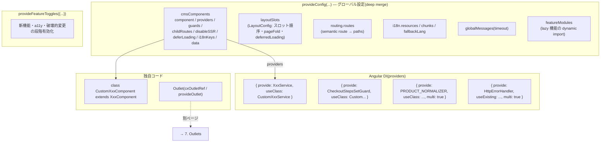

# 5. コンポーネントのカスタマイズの方法

> 調査ステータス: ⚠️ 一部未確認(CmsConfig 各キー・DI 差し替え・レイアウト・設定マージ・i18n・Feature Toggle・SSR 制御は公式PDFで確認済み。lazy 機能内の CmsConfig 上書きは公式記述と実機観察が食い違っており要再検証。`FeatureConfigService`/`features.level` の使い方の詳細はPDF未記載)

## 結論(要約)

- Composable Storefront のカスタマイズ原則は **「ライブラリコードを直接触らず、設定(Config)と DI で override / replace する」**。`node_modules` 直下の編集や fork は公式に非推奨(About p3, p13)。カスタマイズ手段は用途ごとに分かれ、本ページはその全体像を扱う
- 既存 CMS コンポーネントの見た目・振る舞いを変える一次手段は **`provideConfig({ cmsComponents: { <CMS型名>: {...} } })`**。同じ設定オブジェクトで `component`(差し替え)、`providers`(コンポーネント専用サービスの差し替え)、`guards`、`childRoutes`、`disableSSR`、`deferLoading`、`i18nKeys`、`data` を指定できる(DevGuide p61–63、ソース `cms-config.ts`)
- 差し替え先の Angular コンポーネントは **標準コンポーネントを `extends` して作る**のが定石。テンプレート・スタイルだけ差し替えてロジックは継承する。ただしメジャー更新でコンストラクタ引数や `protected` プロパティが変わり得るため、更新ノートの「Action Required」を毎回追う必要がある(Updating p77–78)
- 業務ロジック(サービス)の差し替えは **Angular DI(`{ provide: XxxService, useClass: CustomXxxService }`)**。root サービスならアプリの providers で、コンポーネント専用サービス(`SearchBoxComponentService` 等)は `cmsComponents.<型>.providers` で差し替える(DevGuide p62)
- **設定は deep merge**(オブジェクトはマージ、配列・プリミティブは上書き)。アプリ側の `provideConfig` は import 済みモジュールの既定設定を常に上書きする。ライブラリ側は `provideDefaultConfig` を使う(DevGuide p26–27)
- レイアウトは **`LayoutConfig.layoutSlots`** でページテンプレート/セクションごとのスロット順序を指定。ブレークポイント別(`xs`/`lg`)配列も可能だが **SSR では xs で描画→CSR で lg に切替わり CLS 悪化**するため非推奨。2211.43 以降は `provideConfigFactory(layoutConfigFactory)` + `unifiedDefaultHeaderSlotsAcrossBreakpoints` トグルが正(DevGuide p105–108, p255–256)
- ルーティングは `routing.routes.<semantic name>.paths` で URL を上書き。Accelerator 互換の `**/p/:productCode` / `**/c/:categoryCode` は既定でマッチする(DevGuide p13–16)
- ラベル文言は `i18n.resources` の **上書きチャンクを既定翻訳の後に同一モジュールで provide**(サブモジュールでは効かない)。カスタムキーは独自 chunk/namespace + 接頭辞にする(DevGuide p72, p76–77)
- 新機能・破壊的変更は **Feature Toggle(`provideFeatureToggles({...})`)** で段階導入される。新規作成アプリは有効、更新アプリは手動で有効化(DevGuide p10, Updating p34)
- SSR: `disableSSR: true` でコンポーネント単位のサーバー描画抑止、Deferred loading は SSR には適用されない、`BreakpointService` によるレイアウト切替は SSR で CLS を悪化させる(DevGuide p63, p101, p105)
- 表示位置の追加・置換だけなら Outlet という別手段もある → [→ 7. Outlets](/topics/outlets)。新しい CMS コンポーネント型を作る話は → [→ 6. カスタムコンポーネント](/topics/custom-components)

## 調査内容

### 1. カスタマイズ手段の全体像

公式 DevGuide は CMS コンポーネントのカスタマイズを 3 つのシナリオに整理している(DevGuide p61)。

| シナリオ | 手段 | 例 |
|---|---|---|
| スタイルを変える | 独自 CSS/SCSS ルールを追加 | LanguageSelector のスタイル変更 → [→ 9. スタイルシート](/topics/stylesheets) |
| コンポーネントを差し替える | `cmsComponents` で独自コンポーネントを設定 | 独自 `BannerComponent` |
| ロジックを変える | 独自サービスを設定(DI) | 独自 `SearchBoxComponentService` |

これに、本ページで扱う周辺の設定系(レイアウト・ルーティング・i18n・Global Message・Feature Toggle)を加えると、全体像は次のようになる。



公式の大原則(About p3, p13):ライブラリを clone/fork してビルドすることは可能だが「upgrading is not as simple」、「you never customize composable storefront code directly – rather, you override or replace styling and code」。**`node_modules/@spartacus/*` の直接編集は行わない**(npm install で消え、更新のたびに手戻りする)。

### 2. `cmsComponents` によるコンポーネント差し替え(CmsConfig)

CMS コンポーネントは実行時に動的に生成され、バックエンドが返す **CMS コンポーネント型(typeCode / flexType / uid)** が設定によって Angular コンポーネントにマッピングされる。このマッピングを上書きするのが `cmsComponents` である(DevGuide p61)。

#### 2.1 基本形:`component` の差し替え

```ts
// spartacus-configuration.module.ts などアプリ側の providers
provideConfig(<CmsConfig>{
  cmsComponents: {
    BannerComponent: {
      component: CustomBannerComponent,
    },
  },
});
```

バナーのように **複数の CMS 型が 1 つの実装に集約されている**ものは、代替実装を入れる場合「すべての CMS バナー型を新実装にマップし直す」必要がある(DevGuide p79)。既定は次の通り。

```ts
<CmsConfig>{
  cmsComponents: {
    SimpleResponsiveBannerComponent: { component: BannerComponent },
    BannerComponent:                 { component: BannerComponent },
    SimpleBannerComponent:           { component: BannerComponent },
  },
}
```

#### 2.2 `CmsComponentMapping` の全キー

`@spartacus/core` の `cms-config.ts` で定義されているマッピングの型(二次ソース: Spartacus 本体 `core-libs/core/src/cms/config/cms-config.ts`)。公式PDFでも各キーの用途が個別に説明されている。

| キー | 型 | 用途 | 出典 |
|---|---|---|---|
| `component` | クラス / `() => import(...)` / 文字列(Web Component) | 描画する Angular コンポーネント。dynamic import で lazy 化可 | DevGuide p61 |
| `providers` | `StaticProvider[]` | コンポーネントスコープの DI。コンポーネント専用サービスの差し替えに使う | DevGuide p62 |
| `guards` | Guard クラス配列 | ページの CMS コンポーネント読み込み直後に全ガードを実行。1 つでも false/UrlTree ならリダイレクト。同一ガードは 1 ページで 1 回のみ実行 | DevGuide p62 |
| `childRoutes` | `Route[]` または `{ parent, children }` | Content ページ内でネストした `<router-outlet>` の子ルート(Product/Category ページは非対応) | DevGuide p14 |
| `disableSSR` | boolean | サーバー側で描画しない(個人化・外部連携・非 SEO コンポーネント向け) | DevGuide p63 |
| `deferLoading` | `DeferLoadingStrategy.INSTANT / DEFER` | グローバル戦略と別にコンポーネント単位で遅延描画を指定 | DevGuide p101 |
| `i18nKeys` | string[] | (PDF未確認。ソース上に存在。コンポーネント描画前にロードする翻訳キー用と推測) | ソースのみ |
| `data` | `T`(CmsComponent) | (PDF未確認。ソース上に存在。CMS データが無い場合の静的データ用と推測) | ソースのみ |

例:ガードと lazy import の組み合わせ

```ts
provideConfig(<CmsConfig>{
  cmsComponents: {
    CheckoutProgress: {
      component: CheckoutProgressComponent,
      guards: [AuthGuard, CartNotEmptyGuard],
    },
    SimpleResponsiveBannerComponent: {
      component: () =>
        import('./lazy-banner/lazy-banner.component').then((m) => m.LazyBannerComponent),
    },
    SearchBoxComponent: {
      disableSSR: true,
    },
    CustomComponentName: {
      component: CustomComponent,
      childRoutes: [{ path: 'some/nested/path', component: ChildCustomComponent }],
    },
  },
});
```

注意: dynamic import による chunk 分割はビルド時に決まる。**同じ entry point から 1 つでも static import があると別 chunk にならず静的にバンドルされる**(DevGuide p33, p61)。

#### 2.3 全ページ共通のガード(BEFORE_CMS_PAGE_GUARD)

2211.24.0 で `BEFORE_CMS_PAGE_GUARD` トークンが追加され、CMS マッピング駆動のガードより前に全 CMS ページで実行されるガードを multi provider で登録できる(DevGuide p63)。ただし公式は「可能なら CMS マッピング駆動ガードを使え。グローバルガードは全ページ遷移で走り性能に影響する」としている。

```ts
providers: [
  { provide: BEFORE_CMS_PAGE_GUARD, useExisting: MyCustomGlobalGuard, multi: true },
]
```

### 3. 既存コンポーネントの継承(extends)

差し替え先コンポーネントは、標準コンポーネントを `extends` して **テンプレート/スタイル/一部メソッドだけ変える**のが最も手戻りが少ない。公式ドキュメント自体がガードの拡張でこのパターンを示している(DevGuide p66–67)。

```ts
@Injectable({ providedIn: 'root' })
export class CustomCheckoutStepsSetGuard extends CheckoutStepsSetGuard {
  constructor(
    protected checkoutStepService: CheckoutStepService,
    protected routingConfigService: RoutingConfigService,
    protected checkoutDeliveryAddressFacade: CheckoutDeliveryAddressFacade,
    protected checkoutPaymentFacade: CheckoutPaymentFacade,
    protected checkoutDeliveryModesFacade: CheckoutDeliveryModesFacade,
    protected router: Router
  ) {
    super(checkoutStepService, routingConfigService, checkoutDeliveryAddressFacade,
          checkoutPaymentFacade, checkoutDeliveryModesFacade, router);
  }
  protected isDeliveryModeSet(step: CheckoutStep): Observable<boolean | UrlTree> {
    // custom logic
  }
}

@NgModule({
  providers: [{ provide: CheckoutStepsSetGuard, useClass: CustomCheckoutStepsSetGuard }],
})
export class SomeModuleName {}
```

コンポーネントの場合(検証アプリ mystore での実装例。二次ソース `mystore/src/app/custom/overrides/mini-cart/`):

```ts
@Component({
  selector: 'cx-mini-cart',
  templateUrl: './custom-mini-cart.component.html',   // 標準テンプレートをコピーして加工
  changeDetection: ChangeDetectionStrategy.OnPush,
  imports: [NgIf, RouterLink, IconComponent, AsyncPipe, UrlPipe, TranslatePipe],
})
export class CustomMiniCartComponent extends MiniCartComponent {}
```

継承時のリスク(公式更新ノートより。Updating p77–78):

- `FeatureConfigService` が全コンポーネント/サービスで **private 化**され、`protected` アクセスに依存していたサブクラスはコンパイルエラーになる → 必要ならサブクラスで自前 inject する
- `CartProceedToCheckoutComponent` の非推奨コンストラクタ削除、`SearchBoxComponent` の `changeDetecorRef`→`changeDetectorRef` リネームなど、**`super()` 呼び出しや protected プロパティ名が更新で変わる**
- 対策: コンストラクタ引数を列挙する代わりに `inject()` を使う、標準テンプレートのコピー量を最小にする、更新ノートを毎回チェック

### 4. Angular DI によるサービス差し替え

#### 4.1 root サービス

Spartacus のサービス/ファサード/アダプタは通常 `providedIn: 'root'` で提供され、アプリ側の `providers` で `useClass` すれば差し替わる。公式は lazy 機能の場合、ラッパーモジュールで差し替えることを示している(DevGuide p37)。

```ts
// custom-rulebased-configurator.module.ts
@NgModule({
  imports: [RulebasedConfiguratorModule],          // 標準モジュールを static import
  providers: [
    { provide: ConfiguratorCartService, useClass: CustomConfiguratorCartService },
  ],
})
export class CustomRulebasedConfiguratorModule {}

// アプリ側(static モジュール)で featureModules をラッパーに向ける
provideConfig({
  featureModules: {
    [RULEBASED_PRODUCT_CONFIGURATOR_FEATURE]: {
      module: () => import('../custom-rulebased-configurator.module')
        .then((m) => m.CustomRulebasedConfiguratorModule),
    },
  },
});
```

理由: lazy モジュール内で提供されたトークンは root からは見えず、逆に **DI プロバイダーは lazy 機能のインジェクター内で差し替える必要がある**ため(DevGuide p33, p37)。

#### 4.2 コンポーネント専用サービス

`SearchBoxComponentService` のような **非シングルトンのコンポーネントスコープサービス**は、Angular DI ではコンポーネントを変えずに上書きできないため、`cmsComponents.<型>.providers` で差し替える(DevGuide p62)。

```ts
provideConfig({
  cmsComponents: {
    SearchBoxComponent: {
      providers: [{
        provide: SearchBoxComponentService,
        useClass: CustomSearchBoxComponentService,
        deps: [CmsComponentData, ProductSearchService, RoutingService],
      }],
    },
  },
});
```

#### 4.3 multi provider(Normalizer / ErrorHandler など)

- `PRODUCT_NORMALIZER` を multi で追加し、OCC レスポンスにフィールドを足す(DevGuide p14–15)
- `HttpErrorHandler` を multi + `useExisting` で追加。同じ status に複数ある場合は後から登録したものが優先されるよう実行時に逆順ソートされる(DevGuide p29)
- `OccCmsPageNormalizer` を `useExisting` で丸ごと差し替え(画像寸法補完の例。DevGuide p106–107)

lazy 機能内の multi provider(HttpInterceptor 等)は root から見えないため、**そうしたトークンは eager(静的 import)モジュールに置く**(DevGuide p33, p37)。

### 5. 設定の上書きと deep merge のルール

`provideConfig` が推奨(`ConfigModule.withConfig` は legacy、`StorefrontLib.withConfig` は非サポート)(DevGuide p26)。設定は Angular の multi provider で chunk として集められ、**deep merge** される(DevGuide p27)。

| ケース | Chunk 1 | Chunk 2 | 結果 |
|---|---|---|---|
| 単純マージ | `{site:{occPrefix:'rest-api'}}` | `{site:{baseSite:'electronics'}}` | 両方が残る |
| 上書き | `{site:{occPrefix:'rest-api'}}` | `{site:{occPrefix:'aaa'}}` | `'aaa'` |
| 配列 | `{values:['a','b']}` | `{values:['c']}` | `['c']`(**配列はマージされず上書き**) |

順序ルール(DevGuide p26–27):

- `provideConfig` で直接 provide した chunk は、import したモジュールの既定設定(`ConfigModule.forRoot()` や feature module の default config)を常に上書きし、直接 provide 同士は後勝ち
- ライブラリ側は `provideDefaultConfig` / `provideDefaultConfigFactory` を使うと、import 順に依存してアプリ設定を上書きしてしまう問題を避けられる
- 「メインアプリモジュールの設定が最優先で、他のどこで提供された設定も上書きできる」

**配列上書きの実務影響**: `checkout.steps` は「全ステップを列挙し直す必要がある(既定とマージされない)」と明記(DevGuide p68)。`routing.routes.product.paths` なども同様に配列で上書きになる。

lazy 機能の設定マージ(DevGuide p33–34):

- lazy モジュール内の設定は互換メカニズムによりグローバル設定へマージされる(`disableConfigUpdates` フラグで無効化可。将来は既定オフ予定)
- マージ順: root 既定 → lazy1 既定 → lazy2 既定 → lazy1 設定 → lazy2 設定 → **root 設定(常に優先)**
- 「lazy 機能の CMS マッピングをアプリレベルの上書きで差し替えられる」と公式は記載

⚠ 実機との食い違い: 検証アプリ mystore(2211.15.1)では、root で `cmsComponents` を上書きしても lazy 機能ロード時に標準マッピングへ戻る挙動が観測され、**ラッパーモジュール内で `provideConfig` する方式**で回避している(mystore `custom-mini-cart.module.ts` のコメント、DOCMAP 突合結果)。公式記述(p34)は「上書き可能」なので、対象バージョンでの再検証が必要。安全側の実装は「lazy 機能のコンポーネント差し替えはラッパーモジュール内で行う」に統一すること(DI 差し替えはどのみちラッパー必須なので方針を揃えやすい)。

### 6. レイアウトの変更(LayoutConfig / layoutSlots)

CMS はスロット内のコンポーネント順は返すが、スロット自体の配置情報は返さない。そのため `LayoutConfig` でページテンプレート/セクションごとにスロットの描画順を定義する(DevGuide p255)。

```ts
const defaultLayoutConfig: LayoutConfig = {
  header: { slots: ['TopHeaderSlot', 'NavigationSlot'] },
  footer: { slots: ['FooterSlot'] },
  LandingPageTemplate: { slots: ['Section1', 'Section2A', 'Section2B'] },
};
```

- 設定が不完全なページは全スロットが描画され、コンソールに設定可能なスロット一覧の警告が出る(初期セットアップ用)(DevGuide p255)
- テンプレート名・スロット名は CSS クラスとして付与されるため、**レイアウトはバックエンドの CMS データ(テンプレートコード/ポジション名)と密結合**。テンプレートやスロットを追加・置換したら CSS も直す(DevGuide p256)
- ブレークポイント別配列(`xs: [...]`)でアクセシビリティ(タブ順)や性能のためにスロット順・数を変えられる(DevGuide p256)

**SSR 前提での注意(重要)**: SSR エンジンはクライアントのビューポート不明時に **xs レイアウトで HTML を生成**し、CSR 後に lg へ切り替わるため **CLS が悪化**する。公式は「ブレークポイント別レイアウト設定は使わず、全ブレークポイント共通の 1 配列にし、レスポンシブは CSS だけで制御せよ」と明記(DevGuide p105, p256)。

- 2211.43 未満のアプリ: 既定 `layoutConfig` のヘッダー `lg` を `undefined` で潰す

  ```ts
  provideConfig({ layoutSlots: { header: { lg: undefined } } });
  ```

- 2211.43 以降: `provideConfig(layoutConfig)` を **`provideConfigFactory(layoutConfigFactory)`** に置き換え、`provideFeatureToggles({ unifiedDefaultHeaderSlotsAcrossBreakpoints: true })` を有効化(DevGuide p106, p108)。検証アプリ mystore の schematics 生成物も `provideConfigFactory(layoutConfigFactory)` になっている(二次ソース)

`pageFold` / `deferredLoading`(DevGuide p100–101, p107–108):

- `pageFold` は above-the-fold の最後のスロット名。SSR ページでも描画遅延を生み CLS を悪化させ得るため、2211.43 以降+統一ヘッダートグル有効時は既定設定から外れている。旧アプリは `pageFold: undefined` で上書き可
- `deferredLoading.strategy: DeferLoadingStrategy.DEFER` はビューポート外スロットの描画遅延。**SSR には適用されない**(クローラに全 DOM を返すため)。コンポーネント単位の例外は `cmsComponents.<型>.deferLoading: INSTANT`

### 7. ルーティング設定(Configurable Routing)

既定ルート(`default-routing-config.ts`)は `routing.routes` で拡張/上書きできる。オブジェクトは拡張、配列・プリミティブは上書き(DevGuide p16)。

```ts
provideConfig({
  routing: {
    routes: {
      product:  { paths: ['product/:name/:productCode'] },          // :productCode は必須
      category: { paths: ['category/:categoryCode'] },
      checkoutCharity: { paths: ['checkout/charity'] },             // 新規 semantic route
    },
  },
});
```

- Product/Category ページの URL は **ストアフロント側でのみ**設定可(CMS 側ではない)。Content ページの URL は CMS の page label(`/contact-us` のように `/` 始まり)がそのまま `**` ワイルドカードでマッチする(DevGuide p13)
- 既定パラメータ(`:productCode`, `:categoryCode`/`:brandCode`)を落とすとコンポーネントが壊れる(DevGuide p16)
- **Accelerator 互換**: `**/p/:productCode`, `**/c/:categoryCode` は番号付きパラメータ(`param0`, `param1`)で既定マッチする。エイリアスで意味のある名前を付けられる(DevGuide p15)
- 固定 page label の例外: `/search/:query` → `search`、`/my-account/order/:orderCode` → `/my-account/order`(DevGuide p16)
- 制限: ルートの多言語翻訳、lazy ルート設定、HashLocationStrategy、名前付き router outlet は非サポート(DevGuide p12)
- チェックアウトのステップ追加/並べ替え/統合は `routing.routes` + `checkout.steps` + `cmsComponents.<型>.guards` の 3 点セットで行う(DevGuide p65–69)。B2B チェックアウトは支払方法(アカウント/カード)ステップが追加され、`CMSFlexComponent`(flexType=`CheckoutPaymentType`)で構成される(DevGuide p71)

### 8. i18n の翻訳上書き

- 翻訳は i18next ベースだが、Spartacus は一部 API のみをサポートし「アプリでの i18next 直接利用は非サポート」(DevGuide p71)
- 個別文言の上書きは **既定翻訳の後に、同じモジュールで** provide する。サブモジュールに置いた上書きは効かない(DevGuide p72)

```ts
export const translationOverwrites = {
  en: { cart: { cartDetails: { proceedToCheckout: 'Proceed to Checkout' } } },
};
providers: [
  provideConfig({ i18n: { resources: { en: translationsEn } } }),   // 2211.35 以降は translationsEn
  provideConfig({ i18n: { resources: translationOverwrites } }),
];
```

- `fallbackLang: 'en'` で欠落キーをフォールバック。開発モードでは `[common:form.confirm]` のようにキーが表示される(DevGuide p72)
- SSR 性能のため、翻訳の lazy load は `i18n.backend.loader` に **dynamic import**(`import(\`../../public/i18n-assets/${lng}/${ns}.json\`)`)を使う。`loadPath` のローカルパス指定は SSR→Express への無駄な HTTP を生むので非推奨(DevGuide p73–74)
- 既定 JSON は `node_modules/@spartacus/assets/i18n-assets` を `public/` にコピーして配布(DevGuide p74)
- 更新容易性のため **標準 chunk/namespace にカスタムキーを足さず、独自 chunk + 接頭辞(`slCustomFeature.subKey`)**にする(DevGuide p76–77)
- セキュリティ: `interpolation.escapeValue: true`、外部翻訳は HTTPS のみ、`-` 接頭辞キー禁止(DevGuide p74, p77)

### 9. Global Message の設定

`GlobalMessageType`(CONFIRMATION / ERROR / INFO / WARNING)ごとに自動消去時間(ms)を設定。省略した型は消えない(DevGuide p28)。

```ts
export const yourGlobalMessageConfig: GlobalMessageConfig = {
  globalMessages: {
    [GlobalMessageType.MSG_TYPE_CONFIRMATION]: { timeout: 5000 },
    [GlobalMessageType.MSG_TYPE_INFO]: { timeout: 7000 },
  },
};
```

HTTP エラー→メッセージの対応は `HttpErrorHandler` の追加/差し替えで変える(400/403/404/409/502/504 + UNKNOWN が標準)(DevGuide p29)。

### 10. Feature Toggle / Feature Flag

- **Feature Toggle**(`provideFeatureToggles({...})` / `provideFeatureTogglesFactory`)は、破壊的になり得る新機能・a11y 更新・認証方式変更を「まず無効で出荷 → 後に既定有効 → 最終的に標準化」する仕組み。**新規作成アプリは有効、更新アプリは `spartacus-features.module.ts` で手動有効化**(DevGuide p10–12, Updating p34)

```ts
providers: [
  provideFeatureToggles({
    authorizationCodeFlowByDefault: true,     // 2211-jdk21 の認可サーバ利用に必須
    unifiedDefaultHeaderSlotsAcrossBreakpoints: true,
    useExtendedMediaComponentConfiguration: true,
    a11yRequiredAsterisks: true,
  }),
];
```

- 代表例: `authorizationCodeFlowByDefault` / `incrementProcessesCountForMergeCart` / `dispatchLoginActionOnlyWhenTokenReceived` / `cdsLoginEventsToken` / `asyncAuthConfigInitializer`(認可サーバ)、`useExtendedMediaComponentConfiguration`(cx-media の img/picture 制御)、`enableMediaPrefix`、`productCarouselScrolling`、`reserveSpaceForImagesOnPdpAndPlp`、`trendingSearches`(DevGuide p10, p82–85, p90, p105)
- **Feature Flag / Feature Level**(旧来の `features: { level, <flag> }` 設定)も併存: 例 `features: { showPromotionsInPDP: true }`, `features: { consignmentTracking: true }`(feature level 1.2 以上で自動有効)(DevGuide p78, p197)。検証アプリの schematics 生成設定は `features: { level: '*' }`(二次ソース)。**Feature Level の詳細仕様は手元PDFに該当節が無く未確認**
- 継承クラス内で `FeatureConfigService` を使う場合は自前で inject する(private 化のため)(Updating p77)

### 11. SSR との関係(カスタマイズ時の注意点)

| 事項 | 内容 | 出典 |
|---|---|---|
| コンポーネント単位の SSR 抑止 | `cmsComponents.<型>.disableSSR: true`。個人化・外部連携・非 SEO 向け | DevGuide p63 |
| Deferred loading | SSR には適用されない(全 DOM を返す) | DevGuide p101 |
| ブレークポイント別レイアウト | SSR は xs で描画→CSR で lg へ切替 = CLS 悪化。`BreakpointService` での動的レイアウト変更も非推奨 | DevGuide p105, p256 |
| Hydration | 2211.43 以降 Angular non-destructive hydration 対応。**カスタムコンポーネントは hydration 制約に準拠しているか要レビュー**(違反すると表示崩れ) | DevGuide p107 |
| 翻訳ロード | `i18n.backend.loader` の dynamic import が SSR で高速 | DevGuide p73–74 |
| TransferState | `state.ssrTransfer.keys` で CMS/product の NgRx 状態を転送。キーを `undefined` で無効化 | DevGuide p60 |
| ブラウザ API | `window` 等は `isPlatformBrowser` で分岐(プロジェクト規約) | — |

詳細は [→ 2. SSR セットアップ](/topics/ssr-setup)。

### 12. 手段の選び方(早見表)

| やりたいこと | 第一候補 | 備考 |
|---|---|---|
| 標準コンポーネントの見た目だけ変える | SCSS 上書き | [→ 9](/topics/stylesheets) |
| テンプレート構造を変える/項目を足す | `extends` + `cmsComponents.component` | 標準テンプレートを最小限コピー |
| ロジック(検索・カート計算表示など)を変える | DI `useClass`(root)/ `cmsComponents.providers`(コンポーネント専用) | lazy 機能はラッパーモジュール内で |
| ページ内の位置に UI を足す/差し替える | Outlet | [→ 7](/topics/outlets)。型駆動 Outlet より `cmsComponents` が推奨(DevGuide p254) |
| ページに条件付きアクセス制御 | `cmsComponents.guards` | 全ページ共通は `BEFORE_CMS_PAGE_GUARD` |
| スロット並び・表示スロット数を変える | `layoutSlots` | ブレークポイント別は SSR で非推奨 |
| URL 構造を変える | `routing.routes` | Accelerator の `/p/`, `/c/` は既定互換 |
| 文言を変える | `i18n.resources` 上書き | 同一モジュールで既定の後に |
| 新しい CMS 型を作る | → [→ 6. カスタムコンポーネント](/topics/custom-components) | |

## 本案件への示唆

- **Accelerator の「JSP/タグを直接編集する」文化からの転換が最大の論点**。移行チームに対して「`node_modules` は触らない・fork しない・設定と DI で上書きする」を開発規約として明文化し、レビュー観点に入れる(About p3, p13)
- 商用版ライブラリは **年 2 回以上の更新が実質必須**([→ 1](/topics/frontend-development))。`extends` したコンポーネントはコンストラクタ/protected メンバの変更で壊れやすいため(Updating p77–78)、(1) 継承点を最小限にする、(2) `inject()` を使い `super()` 引数列挙を避ける、(3) 差し替え一覧(型名→カスタムクラス)を台帳化して更新時に総点検する、を推奨
- **SSR 必須**の前提では、レイアウト設定をブレークポイント別にしない・`disableSSR` を個人化コンポーネント(B2B の単位別価格、承認待ち件数など)に付ける・カスタムコンポーネントの hydration 準拠を確認する、の 3 点を設計標準に含める(DevGuide p63, p105, p107)
- B2B(powertools 系)では Checkout に支払方法ステップが増え、`CMSFlexComponent` の flexType で構成される(DevGuide p71)。Accelerator 側で独自チェックアウトステップを持っている場合、`routing.routes` + `checkout.steps`(配列なので全列挙)+ `guards` を同時に設計する
- lazy 機能内のコンポーネント/サービス差し替えは、公式(root で上書き可)と実機観察(戻される)が食い違うため、**「lazy 機能はラッパーモジュール内で `provideConfig` + providers を書く」に統一**しておけばどちらでも動く。検証アプリの `custom-mini-cart.module.ts` がその雛形
- 2211-jdk21 バックエンド前提なら `authorizationCodeFlowByDefault` 系トグルが必須。新規作成アプリは既定有効なので、**「アプリを新規作成する(更新でなく)」方針と整合**する(DevGuide p10)
- 翻訳は多言語前提のため、既定 JSON を `public/i18n-assets` にコピーし `backend.loader` の dynamic import で SSR 性能を確保する。日本語リソースは商用版 assets に含まれるか実機で確認(検証アプリでは `translationsJa` が import できている。二次ソース)

## 未確認事項・次のアクション

- lazy 機能に対する root レベル `cmsComponents` 上書きが対象バージョン(221121.x)で効くか — 公式 p34 と mystore(2211.15.1)観察が矛盾。実機で再検証
- `CmsComponentMapping.i18nKeys` / `data` の公式仕様 — 手元PDFに記載なし。ソース/実機で用途確認
- Feature Level(`features.level`)の仕様節「Feature Levels and Feature Flags」— 参照はあるが本文が手元PDFに含まれていない。Help Portal 原典で確認
- `disableSSR` を付けたコンポーネントの hydration 挙動(サーバー側に無い DOM をクライアントで追加した際の非破壊 hydration との整合)— 実機確認
- `provideConfig` の standalone(`app.config.ts`)構成での配置場所 — PDF の例は NgModule ベース。schematics 生成物で確認([→ 1](/topics/frontend-development))
- 商用版 `@spartacus/assets` の日本語翻訳(`translationsJa`)の網羅性 — 実機で欠落キーを確認

## 出典

- `StorefrontDevelopmentGuide.pdf` p.13–16 「Adding and Customizing Routes」「Route Configuration」「Backwards Compatibility with Accelerators」
- `StorefrontDevelopmentGuide.pdf` p.10–12 「Authentication」「Authentication Feature Toggles」「Configurable Routing(Limitations)」
- `StorefrontDevelopmentGuide.pdf` p.25–28 「Extending Built-In Models」「Global Configuration in Composable Storefront」「Global Messages」
- `StorefrontDevelopmentGuide.pdf` p.29 「HTTP Error Handling」
- `StorefrontDevelopmentGuide.pdf` p.33–37 「Lazy Loading」「Configuration in Lazy-Loaded Modules」「Customizing Lazy Loaded Feature Modules」
- `StorefrontDevelopmentGuide.pdf` p.60–63 「SSR Transfer State」「Customizing CMS Components」「Customizing Services」「Guarding Components」「Controlling Server-Side Rendering」
- `StorefrontDevelopmentGuide.pdf` p.65–71 「Extending Checkout」「Protecting Routes」「B2B Checkout」
- `StorefrontDevelopmentGuide.pdf` p.71–77 「Internationalization (i18n)」
- `StorefrontDevelopmentGuide.pdf` p.78–79 「Configuring the PDP Page」「Banner Component」
- `StorefrontDevelopmentGuide.pdf` p.82–85, p.90 「Media Component」「Searchbox Component」(feature toggle の例)
- `StorefrontDevelopmentGuide.pdf` p.100–101 「Page Fold Configuration」「Deferred Loading」
- `StorefrontDevelopmentGuide.pdf` p.105–108 「Core Web Vitals Optimization」「Layout Configurations」「Enabling Angular Native Non-Destructive Hydration」
- `StorefrontDevelopmentGuide.pdf` p.197 「Consignment Tracking(feature flag の例)」
- `StorefrontDevelopmentGuide.pdf` p.254–256 「Available Outlet References」「Page Layout」「Choosing an Adaptive or Responsive Layout」
- `UpdatingComposableStorefront.pdf` p.6–7 「Update Policy」、p.34 「Activating Accessibility Updates」、p.77–78 「FeatureConfigService Visibility Refactor」ほか
- `AboutComposableStorefront.pdf` p.3, p.13(カスタマイズ原則。[→ 1](/topics/frontend-development) で引用済み)
- 二次ソース: Spartacus 本体 `core-libs/core/src/cms/config/cms-config.ts`(`CmsComponentMapping` 型)、検証アプリ `mystore/src/app/spartacus/spartacus-configuration.module.ts`、`mystore/src/app/custom/overrides/mini-cart/*`
