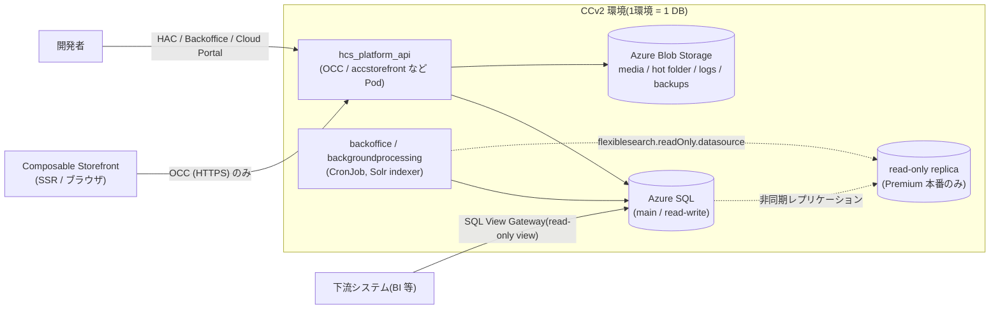
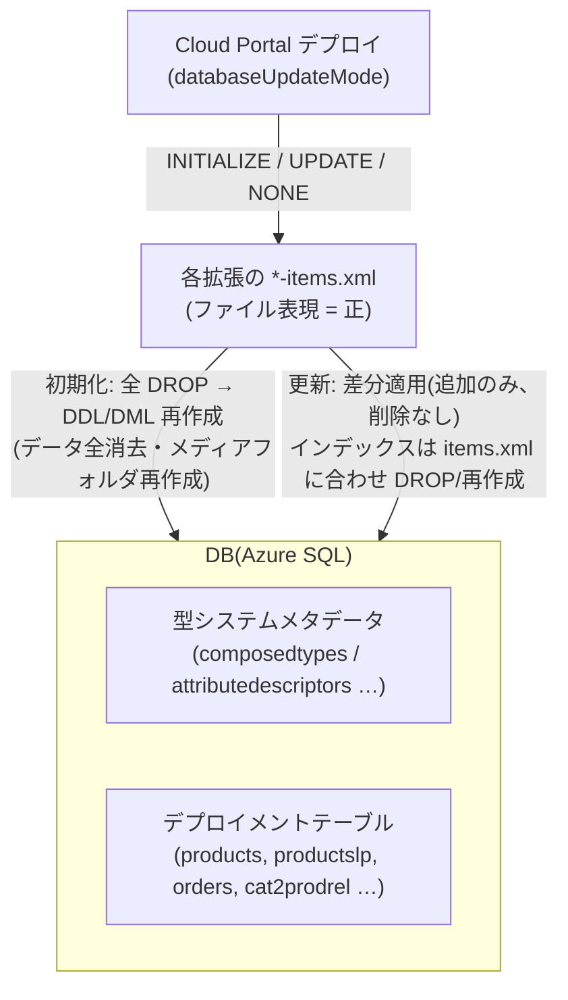

# 17. DBの種類

> 調査ステータス: ⚠️ 一部未確認(CCv2 が Azure SQL(Microsoft SQL Server 系)であること、HAC の Azure SQL タブ / FlexibleSearch・Direct SQL コンソール、読み取り専用レプリカ、Cloud Portal のバックアップ・リストア API、デプロイ時の DB 更新モード(NONE / UPDATE / INITIALIZE)、items.xml → 型システム更新の仕組み、メディアの Azure Blob 格納、SQL View Gateway は公式 PDF で確認済み。一方、**DB バージョンごとの互換マトリクス(オンプレ向け対応 DB 一覧)は手元 PDF に無く**、CCv2 での SQL Server 版数・vCore/DTU の詳細、Cloud Portal 画面上の DB 接続情報の有無、Commerce DB 移行ツール(y2ysync 以外)は未確認)

## 結論(要約)

- **CCv2(Public Cloud)の DB は Azure SQL(Microsoft SQL Server 系)**。HAC に「Azure SQL」タブが存在し、読み取り専用レプリカのドキュメントも「DTU ベースの Azure SQL」を前提に書かれ、レプリカは「標準の MSSQL ドライバを使う」と明記(BackendAdministration p3, p9–10 / PSU4 p129–130)。サンドボックスのスケーリング API では `Standard S0 10 DTU` 〜 `S3 100 DTU` 等の Azure SQL DTU 階層と `maxSizeInMb` / `haReplicaCount` が返る(CloudPortalAPIs p63, p69–70)
- **顧客が DB に JDBC で直接接続する手段は PDF 上に記載なし**。DB 参照は ①HAC の FlexibleSearch / Direct SQL コンソール(全データソース対象)、②HAC「Azure SQL」タブ(Usage / System Stats / Schema Browser / Top Long Running Queries / Execution Plan)、③Backoffice、④**SQL View Gateway**(`dataextraction` 拡張。ロール別に DB ビューを生成し、下流システムから読み取り専用で参照)の 4 経路(BackendAdministration p8–10 / CloudExtensions p60–64)
- **1 環境 = 1 DB**。「1 DB 内に複数スキーマ」も「1 環境が複数 DB に接続」も非サポート。複数ストア(BaseSite)は 1 DB で運用する。照合順序は既定 `SQL_Latin1_General_CP1_CS_AS`(AboutSAPCommerceCloud p70–71)
- **スキーマは items.xml が唯一の正**。DB には「実行時に使う型システムの写し」があり、**初期化(全 DROP → 再作成、データ全消去)** か **更新(update running system: 追加のみ・削除しない)** で items.xml と同期する。本番の初期化/更新は **Cloud Portal のデプロイ操作**(`databaseUpdateMode` = `NONE` / `UPDATE` / `INITIALIZE`)で行い、HAC からは行わない(BackendAdministration p18–22 / CloudPortalAPIs p45)
- 更新は「テーブル名・列名・列型を変えない」「テーブル・列・データを削除しない」「typeCode 変更は新型追加とみなす」「非 unique → unique 変更は無視」など保守的。インデックスだけは items.xml に合わせて DROP/再作成される(BackendAdministration p21–22)
- 型と DB テーブルの対応は `<deployment table="…" typecode="…"/>` で決まり、**typeCode は PK 生成に使われる**(0–32767、10000 以下は SAP 予約)。ローカライズ属性は `<table>LP` 表に格納。詳細は [→ 21. typeCode](/topics/typecode)(PSU3 p328–330)
- **メディア(画像・ImpEx・ログ・バックアップ)は Azure Blob Storage**(`cloudAzureBlobStorageStrategy`)。サブスクリプションで 5 TB のクラウドストレージ枠(CloudExtensions p73–76)
- ローカル開発の既定 DB は **HSQLDB**(組込み・設定不要)。ライセンスの DB コードとして SAP HANA / MS SQL Server / Oracle / MySQL(Percona) / HSQLDB が列挙される(LocalInstallation p6 / CompatibilityGuide p61)。**PostgreSQL の対応可否は手元 PDF に明文なし**(y2ysync の fetchSize 表に PostgreSQL 行はある: PSU5)
- Composable Storefront(SPA/SSR)は **DB に一切触れない**(OCC 経由のみ)。DB の判断は 100% バックエンド側(型定義・インデックス・レプリカ利用・更新モード)に閉じる → 移行案件での DB 論点は「Accelerator 時代の items.xml をどう持ち込むか」と「デプロイの更新モード運用」に集約される

## 調査内容

### 1. CCv2 の DB は何か

公式 PDF には「CCv2 の DB は Azure SQL である」という一文の宣言はないが、以下の記述群から **Azure SQL Database(SQL Server 互換、DTU 課金モデル)** であることが読み取れる。

| 根拠 | 出典 |
|---|---|
| HAC(Administration Console)に **「Azure SQL」タブ** があり、Usage / System Stats / Schema Browser / Top Long Running Queries / Execution Plan の 5 ページを持つ。「Administration Console はその環境の DB の統計のみを表示する。ステージングと本番の DB は別」「重いクエリが走るので不要なリロードは避ける」 | BackendAdministration p3, p9–10 |
| 読み取り専用レプリカの章は「**DTU ベースの Azure SQL** の read-only replica の挙動と設定を説明する」と明記。Premium 階層の本番 DB / Large・X-Large サンドボックスのみ利用可 | PSU4 p129 |
| 「読み取り専用レプリカは **out-of-the-box の MSSQL ドライバ** を使う。MSSQL 互換でないドライバに変えるな」。接続後に `SELECT DATABASEPROPERTYEX(DB_NAME(), 'Updateability')` を発行して READ_ONLY を確認する(SQL Server 固有関数) | PSU4 p130 |
| Cloud Portal API `getscaling` のレスポンス: `databaseSchemas[{code:"db", maxSizeInMb:102400, haReplicaCount:0, performance:{code:"CUSTOMIZED_20_STANDARD", name:"Standard S1 20 DTU"}}]`。選択肢として `Standard S0 10 DTU` / `S1 20 DTU` / `S2 50 DTU` / `S3 100 DTU`、サイズ 100 MB〜1 TB | CloudPortalAPIs p63, p69–70 |
| 既定の照合順序は `SQL_Latin1_General_CP1_CS_AS`(SQL Server の照合順序名)。変更は Support 依頼 | AboutSAPCommerceCloud p70 |
| Data Hub は「SAP Commerce Cloud の既定 DB は HSQLDB」で、ローカルの話。CCv2 環境は Cloud Portal でプロビジョニングされ、DB を顧客が用意することはない | LocalInstallation p25 / onboarding p9 |

**DB の制約(AboutSAPCommerceCloud p70–71)**

- 1 DB に複数スキーマ、1 環境が複数 DB に接続、はいずれも非サポート
- 「ほとんどのユースケースは、環境ごとに固有の DB を持つこと、および複数ストアが 1 DB で動くことで賄える」
- `Enable_Database_Collation_Type` フィーチャーフラグ有効時は既定照合順序で DB が作られる。バックアップをリストアするときは照合順序が一致している必要があり、不一致なら警告(続行は可能)



### 2. 顧客が DB にアクセスできる経路

#### 2.1 HAC の Console > FlexibleSearch(FlexibleSearch / Direct SQL)

- 「FlexibleSearch ページは、**すべての利用可能なデータソースに対して** FlexibleSearch クエリと **直接 SQL クエリ** をテストする FlexibleSearch コンソールを提供する」(BackendAdministration p8)
- 手順: Console タブ → FlexibleSearch → 「FlexibleSearch query」または「Direct SQL query」欄に入力 → Execute(PSU4 p108)
- 読み取り専用レプリカが構成されていれば、**HAC 上でデータソースを切り替えて**クエリできる(PSU4 p132)
- ロール: `ROLE_HAC_CONSOLE_FLEXIBLESEARCH`(`/console/flexsearch/**`)。HAC の各タブは `ROLE_HAC_*` ロール(= `hac_*` UserGroup)で制御され、`admingroup` は全タブにアクセス可(BackendAdministration p12–15)

FlexibleSearch → SQL の変換例(PSU4 p126):

```sql
-- FlexibleSearch
SELECT {PK} FROM {Language}
-- 実際に発行される SQL(MAXDOP ヒント付き)
SELECT item_t0.PK FROM junit_languages item_t0 WHERE (item_t0.TypePkString=?) OPTION (MAXDOP 4)
```

`OPTION (MAXDOP n)` は SQL Server 固有のクエリヒントであり、この点からもバックエンド DB が SQL Server 系であることが分かる。

#### 2.2 HAC の Azure SQL タブ(BackendAdministration p9–10)

| ページ | 内容 |
|---|---|
| Usage | メインおよび読み取り専用データソースの使用統計 |
| System Stats | システム統計とリソース待ち時間 |
| Schema Browser | DB テーブルとインデックスの詳細・統計 |
| Top Long Running Queries | 実行時間の長いクエリ Top 10 |
| Execution Plan | 任意クエリの実行計画分析 |

注意書き(p9): 「HAC はシステム管理者向けのセルフサービスツールで、アーキテクチャと技術の知識を要する。**DB への重要な変更はすべて事前にテストせよ**」。詳細ページ(Usage 等の個別説明)は手元 PDF に含まれていない。

#### 2.3 HAC の Monitoring > Database(BackendAdministration p5)

- **Data Sources**: 構成済みデータソースとステータス
- **Table Size**: 全テーブルの現在サイズ
- **JDBC Logging**: 発行 SQL のログ開始/ダウンロード。トレース有効時は各文にスタックトレースがコメント付与
- **JDBC Log Analysis**: 「非常に頻繁に実行される」「特に時間のかかる」JDBC 文の特定
- 「ログは不要になったら必ず停止し、ログファイルもクリアせよ(性能問題回避)」
- ロール: `ROLE_HAC_MONITORING_DATABASE`(ログ開始/停止/DL/クリア可)、`_LIMITED`(閲覧のみ)(p14)

#### 2.4 HAC の Monitoring > Performance > SQL(BackendAdministration p6)

- DB ラウンドトリップ時間の計測用。**任意の DML/DDL は実行不可**。既定は `SELECT * FROM metainformations`
- 追加したい文は `hac.performanceTest.statement.<name>=SELECT * FROM products` を `local.properties` に書き **再起動**(実行時追加は不可)。「主に DB サーバーへのネットワークレイテンシのテストに使うべき」

#### 2.5 SQL View Gateway(`dataextraction` 拡張。CloudExtensions p60–64)

下流システム(BI・データレイク等)向けに、**型ごとの DB ビューをロール単位で生成**し、読み取り専用で公開する仕組み。

- 設定は拡張の `resources/data-extraction-configuration/*.properties`(ディレクトリは `dataextraction.configuration.base.path` で変更可)

```properties
data-extraction.role-based-config.SalesManager.types=Order,OrderEntry,ReturnRequest,Discount,DeliveryMode,PaymentMode
data-extraction.role-based-config.SalesManager.Order.attributes=PK,versionID,guid,code,name,user,creationtime,modifiedtime,currency,date,deliveryAddress
data-extraction.role-based-config.ContentManager.types=Product,Catalog,CatalogVersion,Category
data-extraction.role-based-config.role1.Product.attributes=code,name[en],name[pl],description[en]   # → 列 name_en, name_pl, description_en
data-extraction.view.localized.default-language=en   # 言語修飾子なしの localized 属性の既定言語(local.properties に置く)
```

- 「Types は typeCode。**DB に永続化される型のみ**公開できる。各型は DB のビューに対応」「属性は列。省略時は全属性」「ローカライズ属性は言語別テーブルに格納されている」
- 適用は **manifest.json に拡張を追加 → ビルド → 「update オプション有効」でデプロイ**。初回は `Platform Update Mode: Migrate Data`、`Deployment Mode: Recreate` を推奨(p63–64)
- ビュー/ロールの作成は既定で **essential data フェーズ**。essential data を流さない運用では `dataextraction_dataType=project` + `dataextraction_sample=true` で project data フェーズに移せる(p64)
- 「公開されるデータは DB から **無加工** で出る。PII 規制・サニタイズは顧客の責任」(p63)
- 資格情報の作成(Creating Credentials for SQL View Gateway)は手元 PDF に含まれず **未確認**

#### 2.6 Cloud Portal のバックアップ / リストア(CloudPortalAPIs p39–40, p82 / CloudExtensions p74–75)

- `POST /v2/subscriptions/{sub}/environments/{env}/databackups`
  - `databackupContent.databasesBackup.included` / `storagesBackup.included`(DB とストレージを個別に含める)
  - `databackupType`: `QUICK` / `STANDARD`(Quick Data Backup 有効時)
- `POST /v2/subscriptions/{sub}/environments/{env}/datarestores`
  - `databackupCode` + `sourceEnvironmentCode`(**別環境のバックアップを別環境へ**リストア可)、または `restorePointTime`(Time Point / Quick Data Backup 由来のポイントインタイム復元)
- デプロイキャンセル時 `rollbackDatabase: true` で DB を巻き戻せる(GREEN/カナリア。`databaseRollbackRestoreTimestamp` が返る)(p46, p50)
- Disaster Recovery は Standard / Premium の 2 パッケージ(`UPGRADE_PREMIUM_DR` / `DOWNGRADE_TO_STANDARD_DR`)。環境のハイバネーションは「DB とストレージをダウングレード」し、Wake up で「DB と関連メディアを復元」(p82)
- バックアップは **メディアストレージアカウント内**に置かれ、5 TB 枠を消費する。Cloud Portal > Environments > Data Backups > Manage から削除(要 CSA / CD / AA ロール)(CloudExtensions p74–75)

> **PDF で確認できなかったこと**: JDBC 接続文字列を顧客に開示する機能、SSMS 等での直接接続、DB ダンプ(.bacpac 等)のダウンロード。PDF 上は「HAC / Backoffice / SQL View Gateway / バックアップ API」以外の経路は記載がなく、**直接接続は前提にしない**のが安全。

### 3. スキーマ管理 — items.xml と DB の関係(BackendAdministration p18–29)

型システムには 2 つの表現がある(p18–19):

1. **ファイル表現**: 各拡張の `*-items.xml`。実行時には使われず、変更は初期化または更新後に初めて反映
2. **DB 表現**: 実行時に使われる。「最後に更新/初期化した時点の状態」を反映

「2 つは同じシステムを反映すべきで、DB スキーマと `*-items.xml` の間にギャップがあってはならない。性能のためインデックスを DB に足したら、`*-items.xml` にも足すこと」(p19)



#### 3.1 初期化(Initialize)で起きること(p19–20)

順に: 実行中の CronJob を中断 → **`DROP TABLE` で業務データも型メタデータも削除** → DDL/DML スクリプトを生成・実行 → キャッシュクリア → メディアフォルダ作成 → ライセンス読み込み → essential data / project data(既定で全拡張有効)投入 → 型のローカライズ。CLI は `ant initialize [-Dtenant=…]`。

- HAC の Initialization / Update ページは **Lock ボタンで無効化**でき、誤操作によるデータ喪失を防げる(p4, p19)
- HAC 上の初期化オプションの変更はメモリ上のみ。永続化は `local.properties`(p3)
- 「**本番環境の初期化・更新は Cloud Portal のデプロイの一部として実行される**。この節はローカル環境向け」(p18)

#### 3.2 更新(Update / update running system)で起きること(p20–22)

1. 全拡張の items.xml を読む
2. DB の型システムを修正: 新型を追加、変更型を更新、必要なら DDL/DML を生成
3. 選択されていれば essential / project data を投入

**保存される(変えない)もの**: 型→テーブル名、属性→列名、列型(items.xml で変えても無視)。テーブル・列は落とさない。アイテムデータ・型インスタンス・composed type は消さない。
**変わるもの**: インデックス(items.xml に無いものを DROP、追加/変更を再作成)。
**無視される変更**(p22): typeCode 変更(新型追加とみなす)、deployment 名変更(旧名で保存継続)、`dontOptimize="true"` 属性の変更(props テーブルに残る)、非 unique → unique。

インデックス関連プロパティ(p21–22):

```properties
bootstrap.init.type.system.ignore.indices=true                       # 初期化/更新でインデックスを一切触らない(初期化性能は悪化)
bootstrap.init.type.system.custom.index.ignore.names.starting.with=custom_,db_index_cust_   # DB 側で足したインデックスの保護(idx_*dba のようなワイルドカード可)
bootstrap.init.type.system.custom.indices.use.items.definitions=false
bootstrap.init.type.system.model.index.ignore.names.1=name_of_index_1;name_of_index2
bootstrap.init.type.system.model.index.ignore.regex.1=^.*regexForIndexName.*$
bootstrap.init.type.system.model.ignored.indices.drop.from.db=false  # 上記で無視指定した既存インデックスが DROP されるのを防ぐ
allow.duplicate.indexes.with.different.column.order=true             # 列順違いの重複インデックスを許可(既定 false)
```

**Orphaned type**: items.xml から消えた型・属性は DB に残り続ける(データ保護)。HAC > Maintenance > Cleanup > Type System で削除可(p7, p26)。

#### 3.3 更新オプションと dryRun(p25–27)

| オプション | 説明 |
|---|---|
| Update running system | items.xml から全型定義を再構築 |
| Create essential data | 拡張の essential data(国・通貨・ステータス・ユーザーグループ等)を投入。Duplicate Identifiers レポート用クエリもここで作られる |
| Localize types | 型システムのローカライズ |
| Project Data | 拡張ごとにサンプル/プロジェクトデータの投入可否を選ぶ |

- `ant updatesystem -DdryRun=true` / `ant initialize -DdryRun=true` で **SQL を生成のみ**(`<HYBRIS_TEMP_DIR>/update_<TENANT>_schema.sql`, `update_<TENANT>_data.sql`)。HAC の Update ページ「Sql scripts」ボタンでも生成・DL 可(ロール `ROLE_HAC_PLATFORM_SQLSCRIPTS`)
- HAC の「Dump configuration」で更新設定 JSON を出力し、`ant updatesystem -DconfigFile=path/to/config.json` で再現できる(p22–24)
- 更新/初期化完了後は `task.engine.loadonstartup=true`(既定)により CronJob/Task が再開(p26)

#### 3.4 CCv2 のデプロイ時 DB 更新モード

Cloud Portal API `createDeployment`(CloudPortalAPIs p45):

```json
{ "buildCode": "string", "databaseUpdateMode": "NONE", "environmentCode": "string", "strategy": "ROLLING_UPDATE" }
```

- `databaseUpdateMode`: **`NONE` / `UPDATE` / `INITIALIZE`**(全パラメータ必須)
- `strategy`: `ROLLING_UPDATE` / `RECREATE` / `GREEN` → [→ 14. デプロイ](/topics/deployment)
- Cloud Portal 画面上の表記は「Platform Update Mode: **No migration required** / **Migrate Data**」(Commerce9 p416, CloudExtensions p64, PSU2 p237)。初期化に相当する表記名は PDF 上に直接は無いが、onboarding p9 に「Initialize the database when deploying a build … Initializing the database removes all data」とある
- 使い分けの公式ヒント: 監査テーブル追加や SQL View Gateway ロール追加など **スキーマ変更を伴う変更は Migrate Data で**(PSU2 p237 / CloudExtensions p64)。プロパティのみの変更は No migration required + Rolling Update(Commerce9 p416)
- **2211-jdk21 では ImpEx エラーで初期化/更新が失敗するプロパティが既定 true**(DOCMAP 発見事項 1、PSU2 p145–146)。UPDATE デプロイが essential/project data の不備で落ち得る点に注意

### 4. typeCode / deployment と DB テーブル(PSU3 p327–330)

- `<deployment table="mytype_deployment" typecode="12345"/>` を items.xml の型定義に付ける。**GenericItem 直下の型には deployment 必須**(`build.development.mode=true` の既定ではビルド失敗 `[ycheckdeployments] No deployment defined …`)。Product のサブタイプ等、既に deployment を持つ型の子には別 deployment を **推奨しない**(JOIN 増で性能劣化)
- **typecode は 0–32767 の一意な正整数で、PK 生成に使われる**。0–10000 は SAP 予約。10000 超も例外多数(commons 132xx、processing 327xx、b2bcommerce 100xx 等。全一覧は `platform/ext/core/resources/core/unittest/reservedTypecodes.txt`)。重複はビルドエラー
- テーブル名は **24 文字以内**(Oracle の 30 文字制限にプレフィックス込みで収める要件から)
- m:n リレーションには deployment 必須(旧来の `links` テーブル共用は不可)。**既存 deployment の変更は拒否される**(データ保護)
- 1 テーブルには、その型と(独自 deployment を持たない)全サブタイプの属性が列として集約される。列数が DB 上限(≈1000)に達し得る。ローカライズ属性は `PRODUCTSLP` のような **LP テーブル**に別格納(p330)
- HAC > Maintenance > Deployment で「次に使える typecode」「deployment を持つ型/持たない型/型のない deployment」を確認できる(BackendAdministration p7)。HAC > Platform > PK Analyzer で PK に埋め込まれた情報(typeCode 等)を表示(p4)

→ 番号採番規約・PK 構造の詳細は [→ 21. typeCode](/topics/typecode)

### 5. 読み取り専用レプリカ(PSU4 p129–132)

- 「SAP は **本番環境に 1 つの読み取り専用レプリカ**を既定で提供。サンドボックスで必要なら Consumption Credits で購入」
- 目的: プライマリ DB の負荷軽減、バッチ/分析ワークロードの性能改善。「レイテンシ重視・ユーザー対話型リクエストには意図していない」。適するもの: **CronJob / バッチ、Solr インデクシング、Backoffice 操作、監視・分析、非同期統合**
- サポート上の推奨: 「リアルタイムのストアフロント/API 呼び出しはプライマリ DB、レプリカはリトライと遅延を許容できるバックグラウンド処理のみ」。トランザクション内クエリは常にメイン DB
- 利用可能条件(DTU ベース Azure SQL): Premium 階層の本番 / Large・X-Large サンドボックス / Consumption Credits で HA Secondary Replica を有効化した Scalable サンドボックス。**Standard 階層と Small/Medium サンドボックスは不可**

```properties
# プラットフォームのレプリカサポートと ApplicationIntent
db.azure.checkReadOnlyReplica.datasources=readonlyslave
datasource.readOnly.db.connectionparam.applicationIntent=ReadOnly
# FlexibleSearch をレプリカで実行(空にすると無効)
flexiblesearch.readOnly.datasource=readonly
# キャッシュドメイン分離と TTL(秒)。メイン DB のキャッシュは「変更で失効」、レプリカは「TTL で失効」
flexiblesearch.datasource.readonly.cacheDomain=readOnlyCacheDomain
flexiblesearch.cacheDomain.readOnlyCacheDomain.ttl=60
# クエリ分類ごとにレプリカ利用を切替
flexiblesearch.categorizedQuery.MyCategory1.useReadOnlyDataSource=true
flexiblesearch.categorizedQuery.MyCategory1.ttl=30
# データソース別コネクションプール(PSU3 p240)
db.pool.readonly.maxIdle=30
db.pool.readonly.minIdle=2
db.pool.maxActive=90
```

- セッション単位: `sessionService.executeInLocalViewWithParams(Map.of(CTX_ENABLE_FS_ON_READ_REPLICA, true), …)`(`ctx.enable.fs.on.read-replica`)。`flexibleSearchService.isReadOnlyDataSourceEnabled(ctx)` で判定可
- 無効化: `generic.search.read-replica.enabled=false`

### 6. メディア・ファイルストレージ(Azure Blob)(CloudExtensions p3, p73–76 / AboutSAPCommerceCloud p68)

- 環境プロビジョニング時に **Azure Blob Storage が自動作成**され、Cloud Portal の Environments > Cloud Storage にアカウント名・URL・キーが表示される(Hot Folder 用)
- メディア格納戦略: `media.folder.<qualifier>.storage.strategy=cloudAzureBlobStorageStrategy`。secured / unsecured メディアは **別コンテナに分ける**べき(`containerAddress` を分ける)
- サブスクリプションの **クラウドストレージ 5 TB** に含まれるもの: Media Storage Account(商品画像・文書)、Data Backup Storage、Hot Folder Storage、Logging Storage
- 削除メディアは `mediadeletions` テーブルに積まれ `purgeDeletedFilesCronJob`(毎時 `0 0 * * * ?`)が Blob から物理削除。このジョブが止まるとテーブルと Blob が肥大化。復旧 ImpEx:

```impex
INSERT_UPDATE CronJob;code[unique=true];job(code);sessionLanguage(isocode)
;purgeDeletedFilesCronJob;purgeDeletedFilesJob;en
INSERT_UPDATE Trigger;cronJob(code)[unique=true]; cronExpression
;purgeDeletedFilesCronJob;0 0 * * * ?
```

- HAC > Maintenance > Cleanup > Orphaned Media Files で孤立メディアの検出・削除(BackendAdministration p7)

### 7. ローカル / オンプレで使える DB(LocalInstallation p6, p25 / CompatibilityGuide p61)

| DB | ライセンス DB コード(`SWPRODUCTNAME=CPS_<code>`) | 備考 |
|---|---|---|
| HSQLDB(Single Node) | `CPS_SQL` | 同梱・設定不要の既定。「一次テストには十分」 |
| SAP HANA | `CPS_HDB` | |
| Microsoft SQL Server(Single Node, Active/Passive) | `CPS_MSS` | CCv2(Azure SQL)と同系 |
| Oracle(Single Node, A/P, A/A) | `CPS_ORA` | テーブル名 30 文字制限が deployment 24 文字ルールの根拠(PSU3 p328) |
| MySQL(Single Node, A/P) / Percona XtraDB Cluster | `CPS_MYS` | コネクタは配布物に含まれない(ライセンス上の理由。LocalInstallation p52) |
| PostgreSQL | 記載なし | y2ysync の fetchSize 表(PSU5)に行があるのみ。**対応状況は未確認** |

MySQL 接続例(Commerce2 p217):

```properties
db.url=jdbc:mysql://localhost/<database_name>?useConfigs=maxPerformance&characterEncoding=utf8
db.driver=com.mysql.jdbc.Driver
db.username=<username>
db.password=<password>
db.tableprefix=
mysql.optional.tabledefs=CHARSET=utf8 COLLATE=utf8_bin
mysql.tabletype=InnoDB
```

- CCv2 では `db.*` は SAP 側で注入され顧客は設定しない。HAC の Configuration タブでは `db.password` 等を `configuration.view.blacklist.*` / `configuration.view.regex.rule.*` で伏せられる(`y_db_password` 環境変数経由でも同様)(BackendAdministration p15–16)
- 「**バージョン別の DB 互換マトリクス**」は手元の CompatibilityGuide には無く、「Release Notes for 2211 Updates の third-party compatibility を参照」とだけ書かれている(p61)

### 8. DB 間のデータ移行・同期

- **y2ysync**: Commerce 間の同期フレームワーク(`Y2YStreamConfigurationContainer` → Data Hub → ターゲット)。ただし PDF 上に「**deprecated software**」の Caution が付く(PSU5 p3–4)。新規案件の DB 移行手段には向かない
- **Cloud Hot Folders**: Blob 経由の ImpEx/CSV バッチ投入(CloudExtensions p2–3)。マスタ移行の実務的な入口
- **Data Backup / Restore**: 環境間のバックアップ移送(上記 2.6)
- **Commerce Migration Toolkit / commerce-db-sync 等のオンプレ→CCv2 DB 移行ツールは手元 PDF に記載なし**(未確認)

### 9. セキュリティ関連(SecurityGuide p30, p36–37)

- **TAE(Transparent Attribute Encryption)** で機微属性を AES で暗号化して DB 保存。鍵は `symmetric.key.file.<n>` / `symmetric.key.file.default` / `symmetric.key.master.password`。**鍵ローテーションは年 1 回**、CCv2 では鍵を Cloud Portal にアップロードしローカルには残さない。ローテーションは環境ごとに短時間のダウンタイムを伴う
- 鍵の生成・移行は HAC > Maintenance > Encryption Keys(BackendAdministration p7)
- CORS 設定・その他プロパティは「**DB の値がプロパティファイルより優先**」(SecurityGuide p34–35)→ [→ 3. バックエンド接続](/topics/backend-connection)
- 通信: port 80 は 443 にリダイレクト。「安全でないエンドポイントからのデータが十分な暗号化層を経て Commerce DB に届くことを保証」(p37)

## 本案件への示唆

1. **SPA 側に DB 論点はない**。Composable Storefront は OCC 経由でしかバックエンドに触れないため、DB の種類・レプリカ・更新モードは SSR にも影響しない。ただし SSR ノードは OCC を高頻度で叩くので、**OCC 側の FlexibleSearch 性能(インデックス設計)が SSR の TTFB に直結**する。HAC の Azure SQL タブ / JDBC Log Analysis を SSR 負荷試験時に併用する運用を組む([→ 18. モニタリング](/topics/monitoring))
2. **Accelerator 由来の items.xml はそのまま持ち込む前提で更新モードを設計**する。UPDATE(Migrate Data)はテーブル・列を消さない保守的な挙動なので、旧 Accelerator 専用型(yacceleratorstorefront 系の CMS コンポーネント型など)を items.xml から外しても DB に orphaned type として残る。移行完了後に HAC > Maintenance > Cleanup で整理する計画を立てる
3. **typeCode の重複回避を先に棚卸し**する。B2B(`b2bcommerce` 100xx)や商用版の追加拡張が予約している番号帯と、自社カスタム型の typeCode が衝突するとビルドが失敗する。`reservedTypecodes.txt` と自社 items.xml を突合しておく([→ 21. typeCode](/topics/typecode))
4. **本番の INITIALIZE は事実上禁止**(全データ消去)。開発初期のサンドボックスでのみ使い、以降は UPDATE / NONE のみ。デプロイ手順書に `databaseUpdateMode` の判断基準(スキーマ変更・essential data 変更 → UPDATE、プロパティ・JS のみ → NONE)を明記する([→ 14. デプロイ](/topics/deployment))
5. **2211-jdk21 の「ImpEx エラーで更新失敗」既定**を踏まえ、UPDATE デプロイ前にローカル(HSQLDB または SQL Server 系)で `ant updatesystem -DdryRun=true` と実 update を必ず通す。HSQLDB と Azure SQL の差(照合順序・列型・インデックス上限)で挙動が変わり得るため、**ローカル検証も可能なら SQL Server 系で行う**のが安全(PDF での推奨明文はなし)
6. **DB 直結を前提とした Accelerator 時代の運用(SQL クライアントでの直接参照・手修正)は成立しない**。代替は HAC FlexibleSearch / Direct SQL、Backoffice、SQL View Gateway、Cloud Hot Folders(ImpEx)。BI 連携要件があれば SQL View Gateway のロール定義を初期段階で設計する
7. **読み取り専用レプリカは B2B の重いバッチ(組織階層の再計算・Solr フルインデックス・注文集計)向けに検討**。ただし本番 Premium 階層限定。SSR/OCC の対話リクエストには使わない。契約 DB 階層(DTU/vCore、HA レプリカ数)は Cloud Portal `getscaling` で確認できる
8. **メディア(商品画像)は Azure Blob**。Accelerator の `media` フォルダ移送は Cloud Hot Folders 経由。`purgeDeletedFilesCronJob` が動いているかを移行後の運用チェックリストに入れる
9. **バックアップは 5 TB 枠を消費**。移行検証で頻繁にバックアップ/リストアするなら古いバックアップの削除ルールを決めておく

## 未確認事項・次のアクション

- [ ] CCv2 の DB の正確なサービス種別(Azure SQL Database 単一 DB / Managed Instance / SQL Server 版数)と、DTU 以外(vCore)モデルの有無 → Cloud Portal の環境詳細と `getscaling` API 実行で確認
- [ ] Cloud Portal 画面上の「Platform Update Mode」の 3 択の正確なラベル(No migration required / Migrate Data / Initialize database?) → 実機で確認
- [ ] SQL View Gateway の資格情報作成手順(Creating Credentials for SQL View Gateway)と接続方式(エンドポイント・認証)→ Help Portal 原典 / Cloud Portal で確認
- [ ] オンプレ/ローカル向け DB バージョン互換マトリクス(SQL Server・Oracle・HANA・MySQL の対応版数、PostgreSQL の可否)→ Release Notes 2211 Updates の third-party compatibility 章を PDF 化
- [ ] Commerce Migration Toolkit(commerce-db-sync 等)による既存 DB → CCv2 移行の可否・手順 → SAP Note / Help Portal で確認
- [ ] HAC Azure SQL タブの各ページ(Usage / System Stats / Schema Browser / Top Long Running Queries / Execution Plan)の詳細ページ → Help Portal 原典
- [ ] ローカル検証環境の DB を HSQLDB のままにするか SQL Server 系にするか(照合順序 `SQL_Latin1_General_CP1_CS_AS` の大文字小文字区別がクエリ結果に影響する可能性)→ サンドボックスで実測
- [ ] Accelerator 由来 items.xml の typeCode と予約番号帯(`reservedTypecodes.txt`)の突合 → 現行ソース入手後

## 出典

- `BackendAdministration.pdf` p.2–10 「Administration Console(Platform / Monitoring / Maintenance / Console / Azure SQL タブ)」
- `BackendAdministration.pdf` p.12–16 「Securing Administration Console Using Roles / Predefined Roles / Configuration Data Visibility」
- `BackendAdministration.pdf` p.18–29 「Initializing and Updating SAP Commerce Cloud / Type System Modifications / Update Scenarios」
- `PlatformServicesandUtilities3.pdf` p.240 「Connection Pool Configuration by Data Source」
- `PlatformServicesandUtilities3.pdf` p.327–330 「Specifying a Deployment for Platform Types / Type Hierarchy Restrictions in Deployments」
- `PlatformServicesandUtilities4.pdf` p.108 「Testing FlexibleSearch Queries Using the Administration Console」、p.126 「MAXDOP」、p.129–132 「Read-only Replica / Querying the Read-only Replica」
- `PlatformServicesandUtilities5.pdf` p.2–4 「Synchronization Between SAP Commerce Cloud Installations(y2ysync)」
- `PlatformServicesandUtilities2.pdf` p.237 「Auditing Configuration(Migrate Data での監査テーブル生成)」
- `AboutSAPCommerceCloud.pdf` p.70–71 「Compatibility — Databases」
- `CloudPortalAPIs.pdf` p.39–40 「createDatabackup / createDatarestore」、p.45–46 「createDeployment / createDeploymentCancellation」、p.50 「databaseRollbackRestoreTimestamp」、p.63, p.69–70 「getscaling(databaseSchemas)」、p.82 「Activity Types(DR / Hibernation)」
- `CloudExtensions.pdf` p.2–3 「Cloud Hot Folders」、p.60–64 「SQL View Gateway Access Management / Data Extraction Configuration」、p.73–76 「Media Storage / Managing Cloud Storage / Managing Data Backups / Log Storage」
- `LocalInstallation.pdf` p.6 「SAP Commerce License Attributes(DB コード表)」、p.25 「HSQLDB 既定」、p.52 「mysql コネクタ非同梱」
- `CompatibilityGuide.pdf` p.61 「Test, Demonstration, and Development Requirements — Database / Third-Party Compatibility」
- `Commerce2.pdf` p.217 「Installing SAP Commerce Cloud(MySQL 設定例)」
- `Commerce9.pdf` p.416 「No migration required + Rolling Update での再デプロイ」
- `SAPCommerceCloudSecurityGuide.pdf` p.30 「Transparent Attribute Encryption(TAE)」、p.34–35 「CORS(DB 優先)」、p.36–37 「Network and Communication Security」
- `onboarding.pdf` p.9 「Password Update(Initialize the database when deploying a build)」
