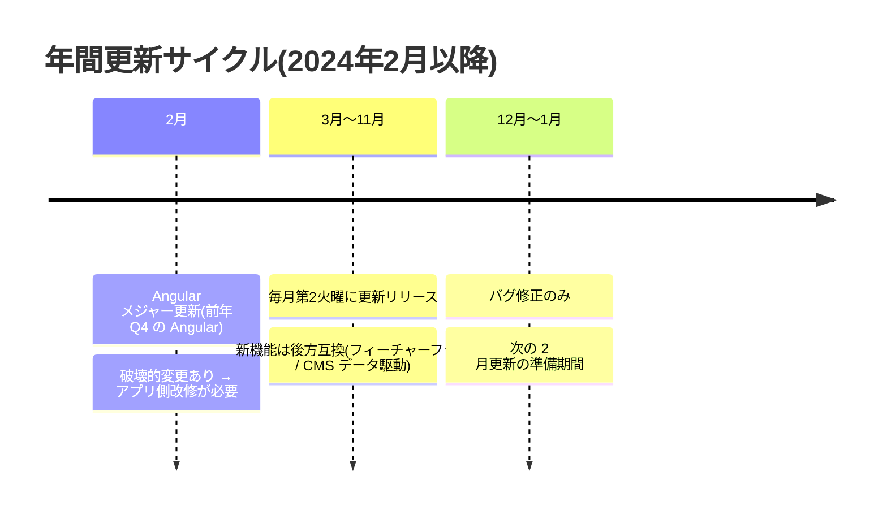

# 1. フロントエンドの開発方法

> 調査ステータス: ⚠️ 一部未確認(公式PDFで開発モデル・前提・手順・更新ポリシーは確認済み。`ng add` の `--no-interactive` 時の既定機能セット、および現行 schematics が生成する standalone 構成の詳細ファイル一覧はPDF未記載のため実機確認が必要)

## 結論(要約)

- Composable Storefront は **Angular ライブラリ集(@spartacus/*)** であり、Accelerator のような「テンプレートをコピーして直接改変」ではなく、**自前の Angular アプリからライブラリを import して使う**開発モデル。ソースを clone/fork してビルドすることも可能だが「アップグレードが簡単でなくなる」と公式が明記(About p3)
- カスタマイズは「ライブラリのコードを直接触らず、スタイルとコードを override / replace する」方式。これがアップグレード容易性の根拠(About p13)
- 前提バージョン(221121.x 系): **Angular 21.2.0+ / Angular CLI 21.2.0+ / Node.js 22.22.0+ / npm 10.9.2+**。バックエンドは SAP Commerce Cloud 2105 以降で最新パッチ必須(GettingStarted p2, p34–35)
- 商用版ライブラリの入手は **Repository Based Shipment Channel(RBSC)**。S-user → テクニカルユーザー作成 → `.npmrc` に registry と Base64 資格情報を記載(`.gitignore` 必須)。リポジトリ番号は `73554900100900004337`(About p4 / GettingStarted p35–36)
- プロジェクト作成は `ng new my-spartacus-app --style=scss --ssr=false ...` → `ng add @spartacus/schematics@~<version>`(SSR は `--ssr`)。schematics が **Reference App 構造**(`app/spartacus/spartacus.module.ts` / `spartacus-features.module.ts` / `spartacus-configuration.module.ts` / `features/*`)を生成する(GettingStarted p35–37, p44)
- 機能は **feature-libs(@spartacus/cart, /checkout, /order, /organization, /user 等)** として提供され、既定で **CMS 駆動の lazy loading**(`featureModules` 設定に dynamic import)で組み込まれる。dynamic import はアプリ側でしか書けない(DevGuide p33–34)
- **B2C と B2B は 1 アプリに同居不可**。B2B 系機能(Checkout B2B / Organization 等)を 1 つでも選ぶと自動的に B2B ストアフロントになる(GettingStarted p37)
- 更新ポリシーは **roll-forward(最新のみ修正提供)・各リリースのサポート 6 ヶ月・毎月第 2 火曜リリース・2 月に Angular 更新集約**。実質「年 2 回以上の更新」が前提で、バックエンドと同じ番号への同時更新が推奨(Updating p2, p6–11)
- 2211.19 以降は semver を廃止。`package.json` の `@spartacus/*` は **`~` 固定**が必須(`^` 禁止)(GettingStarted p38, p46)

## 調査内容

### 1. 開発モデル:Accelerator との違い

公式 FAQ は Accelerator と Composable Storefront を次のように対比している(About p12–13)。

| 観点 | Accelerator | Composable Storefront |
|---|---|---|
| 提供形態 | テンプレート(スターター実装をコピーして改変) | **ライブラリ**(自前アプリが import) |
| 描画 | JSP(サーバーサイド、Platform と密結合) | Angular SPA(+SSR)、OCC REST API 経由の完全ヘッドレス |
| アップグレード | 「拡張可能だが容易にアップグレードできない」 | ライブラリ差し替えで追随。「vastly more upgradable」 |
| カスタマイズ方法 | 生成コードを直接編集 | **ライブラリコードは直接触らず、override / replace**(About p13) |
| 移行 | ― | 「直接の移行手段はない(paradigm shift)」。カスタム機能には API が必要、スタイルはコピー不可、カスタム CMS コンポーネントは Angular コンポーネントとして作り直し(About p13) |

重要な公式見解:

- 「To get up and running… the recommended approach is to build your storefront application from ready-made libraries. You can also clone and build from source, but upgrading is not as simple.」(About p3)→ **fork 前提の開発は非推奨**
- 「To maintain our promise of upgradability, the design pattern for composable storefront is for non-core features to be built as feature libraries that add to or change the provided functionality.」(About p3–4)
- 「you never customize composable storefront code directly – rather, you override or replace styling and code.」(About p13)
- Accelerator と Composable Storefront の同時稼働は「複雑さのため推奨しない」(About p13)。ただし [→ 19. Accelerator並行開発](/topics/accelerator-parallel-development) で扱う通り、サンプルデータの `occ.rewrite.overlapping.paths.enabled` は「B2C と B2B のストアフロントを並行稼働させるため」に既定 true(GettingStarted p9)

```mermaid
flowchart LR
  subgraph app["自社リポジトリ(自前 Angular アプリ)"]
    A[AppModule / app.config.ts] --> S[SpartacusModule]
    S --> F[SpartacusFeaturesModule<br/>features/*-feature.module.ts]
    S --> C[SpartacusConfigurationModule<br/>baseUrl / context / i18n / features.level]
    S --> B[BaseStorefrontModule<br/>@spartacus/storefront]
    A --> X[custom/ 独自コンポーネント・override]
  end
  subgraph rbsc["RBSC(npm registry)"]
    L1[@spartacus/core]
    L2[@spartacus/storefront]
    L3[@spartacus/cart, checkout, order, user, organization ...]
    L4[@spartacus/schematics]
  end
  rbsc -. npm install(.npmrc 認証) .-> app
  app -- OCC REST /occ/v2 --> BE[(SAP Commerce Cloud<br/>2211-jdk21 / 2211.x)]
```

### 2. 前提条件

#### 2.1 フロントエンド開発環境(GettingStarted p2, p34, p42 / About p3)

| 項目 | 要件(221121.x 系) |
|---|---|
| Angular | 21.2.0 以上(最新 21.x を強く推奨) |
| Angular CLI | 21.2.0 以上 |
| Node.js | 22.22.0 以上(最新 22.x を強く推奨) |
| npm | 10.9.2 以上 |
| エディタ | VS Code 推奨。拡張: Angular Language Service / ESLint / Prettier / Stylelint(`.vscode/extensions.json` で共有)(GettingStarted p3) |
| フォーマッタ | Prettier(`.prettierrc`: printWidth 120, singleQuote, tabWidth 2, semi, trailingComma es5)。Lint は `ng lint`(GettingStarted p4) |

依存マトリクス(About p5):

| Composable Storefront | Angular(LTS EOL) | Node.js(EOL) |
|---|---|---|
| 221121.7 以降 | 21(2027-05-19) | 22.22.0 または最新 22.x(2027-04-30)。**2027-01-01 以降 Node 22 は非サポート** |
| 2211.36 以降 | 19(2026-05-19) | 22.14.0+ |
| 2211.19〜2211.32 | 17(2025-05-15) | 20.9.0+(2026-01-01 以降非サポート) |

Node.js ポリシー: 2024 年 2 月以降の更新リリースは「SAP Commerce Cloud ホスティングで利用可能な最新 Node.js のみ」をサポート(Updating p11)。CCv2 の JS ストアフロントビルド環境と Node バージョンを揃える必要がある。

#### 2.2 バックエンド要件(GettingStarted p34–35 / About p3)

- SAP Commerce Cloud **2105 以降**。「No matter the version, the latest patch is required」
- 機能ごとに必要なバックエンド版が異なる(Feature Compatibility Matrix, About p6–11)。B2B 関連の例:
  - B2B Commerce Organization: 3.0 / 2105
  - B2B Unit-Level Orders / Account Summaries / Payment Controls / Org User Registration: 5.1 / 2211
  - B2B Commerce Quotes: 2211.20 / 2211.20
  - B2B PunchOut Integration: 2211.41 / 2211.41
  - Authentication(OAuth 2.1 Authorization Code Flow): 221121.1 / **2211-jdk21.1 または 2211.44**
- ローカルバックエンドの構築手順(2211-jdk21 レシピ `cx_features_enabled_for_spa`、`spartacussampledata`、OAuth クライアント ImpEx)は GettingStarted p5–9。詳細は [→ 3. バックエンド接続](/topics/backend-connection)

#### 2.3 商用版ライブラリの入手:RBSC(GettingStarted p35–36 / About p4 / Updating p6)

- ライブラリは「SAP の Repo-Based Shipment Channel 経由で配布。**クラウド顧客のみ**利用可。それ以外は OSS 版 project "Spartacus" を使う」(Updating p6)
- Composable Storefront 5.0 以降のリポジトリ番号: **`73554900100900004337`**(About p4)
- 手順(GettingStarted p35–36):
  1. 適切なライセンスを持つ S-user を用意(ライセンス一覧に "Composable Storefront License" が見えることを確認。見えなければダウンロード時にエラー)
  2. `https://ui.repositories.cloud.sap/www/webapp/users/` にログインし、Add User で **テクニカルユーザー**を作成
  3. プロジェクトルートに `.npmrc` を作成
  4. **`.npmrc` を `.gitignore` に追加**(「This step is very important」)
  5. User Management タブでテクニカルユーザーの「NPM Base64 Credentials」をコピーし `<npmcredentialsfromrbsc>` を置換

```ini
# .npmrc(GettingStarted p36)
@spartacus:registry=https://73554900100900004337.npmsrv.base.repositories.cloud.sap/
//73554900100900004337.npmsrv.base.repositories.cloud.sap/:_auth=<npmcredentialsfromrbsc>
always-auth=true
```

※ 2 行目の先頭 `//` は必須(GettingStarted p36)。ライセンスがない場合は GitHub の OSS ソースから自分でライブラリを publish する手段も公式に案内されている(GettingStarted p35)が、本案件は商用版前提。

### 3. プロジェクト作成手順

#### 3.1 `ng new` → `ng add @spartacus/schematics`(GettingStarted p35–38)

```bash
# 1) Angular アプリ生成(SSR は後から schematics で入れるため --ssr=false)
ng new my-spartacus-app --style=scss --ssr=false --zoneless=false --file-name-style-guide=201
cd my-spartacus-app

# 2) .npmrc を配置(前節)

# 3) Composable Storefront を追加(バージョンは ~ 指定)
ng add @spartacus/schematics@~221121.17.0
#   SSR 込みなら
ng add @spartacus/schematics@221121.17.0 --ssr

# 4) 依存インストール → 起動
npm install
npm start          # http://localhost:4200
```

- `ng new` のオプションはPDF上 `--file-name-style-guide=201` で右端が切れている(原典は `2016` と推測されるが**未確認**)。`--zoneless=false` が明示されている点に注意(Composable Storefront は zone.js 前提)
- `ng add` 実行時に**インストールする機能を対話選択**する。既定選択は「提案」に過ぎないが、**User - Account は必ず入れることを強く推奨**(GettingStarted p36)
- `--no-interactive` で対話を省略し既定セットを入れられる。どの機能が入るかは schematics の `schema.json` を参照(GettingStarted p37, p43)
- 起動後の確認 URL 例: `http://localhost:4200/powertools-spa/en/USD`(GettingStarted p39)

#### 3.2 `ng add @spartacus/schematics` の主なオプション(GettingStarted p43)

| オプション | 内容 |
|---|---|
| `--base-url` | OCC バックエンドの baseUrl |
| `--base-site` | baseSite のカンマ区切り(例 `powertools-spa`) |
| `--currency` / `--language` | 通貨・言語のカンマ区切り |
| `--url-parameters` | サイトコンテキストの URL 順序(例 `baseSite,language,currency`) |
| `--occ-prefix` | OCC API プレフィックス(例 `/occ/v2/`) |
| `--use-meta-tags` | index.html の meta タグで baseUrl / mediaUrl を設定するか |
| `--feature-level` | 機能レベル。既定はインストールするパッケージのバージョン |
| `--overwrite-app-component` | app.component.html を上書き(既定 true) |
| `--pwa` | PWA 機能を含める |
| `--ssr` | SSR 設定を含める |
| `--lazy` | 各 feature module を lazy loading 構成で入れる(**既定 true**) |
| `--project` | 対象プロジェクト(ワークスペース既定) |
| `--interactive` | 対話をスキップして既定セットを入れる(`--no-interactive`) |
| `--theme` | 組み込みテーマ(例 `santorini`)。未指定は Sparta |

schematics が行うこと(GettingStarted p44):依存追加 → Reference App 構造のモジュール生成と既定設定 → `main.scss` へスタイル import → `app.component` に `cx-storefront` 追加 → (任意)index.html の meta タグ更新 → `--ssr` 時は SSR 依存と追加ファイル。

追加コマンド(GettingStarted p44–45):

- `ng g @spartacus/schematics:add-ssr` — SSR 設定の後付け([→ 2. SSRセットアップ](/topics/ssr-setup))
- `ng g @spartacus/schematics:add-pwa`
- `ng g @spartacus/schematics:add-cms-component <name> --cms-model=<Model> [--declare-cms-module=<path>] [--module=app]` — CMS コンポーネントの雛形と CMS マッピング登録([→ 6. カスタムコンポーネント](/topics/custom-components))
- 後から機能ライブラリを追加: `ng add @spartacus/asm`、`ng add @spartacus/tracking --no-lazy` 等。**Reference App 構造に従っていることが前提**(GettingStarted p45–46)

#### 3.3 生成物:Reference App 構造(GettingStarted p30–33)

「3.1 で導入された推奨構造。これに従うことで各メジャーリリースの**自動マイグレーション(schematics)の恩恵を最大化**しつつカスタマイズの余地を残す」(GettingStarted p31)。

```
src/app/
├─ app.module.ts (または app.config.ts)      … Angular Router / NgRx(StoreModule, EffectsModule)はここ
├─ app.component.*                            … <cx-storefront>
└─ spartacus/
   ├─ spartacus.module.ts                    … BaseStorefrontModule + Features + Configuration を束ねるだけ。通常変更しない
   ├─ spartacus-features.module.ts           … 非コア機能の入口(静的 import と lazy 両方)
   ├─ spartacus-configuration.module.ts      … グローバル設定(backend.occ.baseUrl / context / features.level / i18n / layout / media)
   └─ features/
      ├─ user-feature.module.ts              … 機能ごとのラッパー(RootModule を静的 import + featureModules で lazy 指定 + i18n)
      ├─ cart-base-feature.module.ts
      ├─ checkout-feature.module.ts
      └─ order-feature.module.ts …
```

`SpartacusModule` の例(GettingStarted p32):

```ts
@NgModule({
  imports: [BaseStorefrontModule, SpartacusFeaturesModule, SpartacusConfigurationModule],
  exports: [BaseStorefrontModule],
})
export class SpartacusModule {}
```

`SpartacusConfigurationModule` の例(GettingStarted p32、baseUrl は例示値):

```ts
@NgModule({
  providers: [
    provideConfig(layoutConfig),
    provideConfig(mediaConfig),
    provideConfig({
      backend: { occ: { baseUrl: 'https://<occ-host>' } },
      context: { urlParameters: ['baseSite', 'language', 'currency'], baseSite: ['electronics-spa'] },
      pwa: { enabled: true, addToHomeScreen: true },
    }),
  ],
})
export class SpartacusConfigurationModule {}
```

生成後に確認すべき設定(GettingStarted p38): `baseUrl`(バックエンド)、`features.level`(互換レベル)、`context`(baseSite / language / currency)。Powertools を使うなら `baseSite` に `powertools-spa` を追加。

機能ラッパーモジュールの例(GettingStarted p33–34、Store Finder):

```ts
@NgModule({
  imports: [StoreFinderRootModule],                     // root エントリは静的 import(eager)
  providers: [
    provideConfig({
      featureModules: {
        storeFinder: {
          module: () => import('@spartacus/storefinder').then((m) => m.StoreFinderModule), // 本体は lazy
        },
      },
      i18n: {
        resources: { en: storeFinderTranslationsEn },   // 2211.35 以降。2211.32.1 以前は storeFinderTranslations
        chunks: storeFinderTranslationChunksConfig,
      },
    }),
  ],
})
export class StorefinderFeatureModule {}
```

- 機能固有設定は feature module 側に置くのが推奨(関心の分離)。ただし env フラグで切り替えたい等の理由があれば `SpartacusConfigurationModule` に置いてもよい(GettingStarted p33)
- Router と NgRx はアプリ全体に影響するため `SpartacusModule` の外(AppModule)に置く(GettingStarted p31)
- 二次ソース(検証アプリ `mystore`、221121.15.1)でも同じ構造(`spartacus/spartacus.module.ts`, `spartacus-features.module.ts`, `spartacus-configuration.module.ts`, `features/{cart-base,checkout,order,user}-feature.module.ts`)が生成されており、`checkout-feature.module.ts` は `CheckoutRootModule` 静的 import + `featureModules[CHECKOUT_FEATURE].module` の dynamic import + i18n という上記パターンそのものだった

#### 3.4 standalone 構成(221121.7 以降)

221121.7(Angular 21)から全ライブラリコンポーネントが standalone 化され、アプリ側も `bootstrapApplication()` へ「モダナイズ」する手順が公式化された(Updating p67, p70–71)。

- `ng g @spartacus/schematics:modernize-app-to-standalone-bootstrap-application` で `AppComponent` を standalone 化し `app.config.ts` を生成(Updating p70)
- 手動フォールバック(Updating p87–89): `app.config.ts` に `provideBrowserGlobalErrorListeners()` / `provideZoneChangeDetection({ eventCoalescing: true })` / `provideHttpClient(withFetch(), withInterceptorsFromDi())` / `importProvidersFrom(AppModule)` を置き、`main.ts` を `bootstrapApplication(AppComponent, appConfig)` に変更。SSR は `app.config.server.ts` に `importProvidersFrom(AppServerModule)`
- **NgModule は引き続き「機能をまとめる単位」として使われる**(コンポーネント宣言には使わない)(Updating p71)。つまり Reference App 構造の `spartacus/*.module.ts` はそのまま残る
- SSR 利用時は `provideClientHydration(withEventReplay(), withNoHttpTransferCache())` が必須(Composable Storefront 独自の state transfer と衝突するため `withNoHttpTransferCache` が必要)(Updating p71–72)
- ⚠️ 新規に `ng add` した場合に schematics が最初から `app.config.ts` 形式で生成するかは PDF に明記なし(**未確認**)。手元の `mystore`(221121.15.1)は `app-module.ts` + `SpartacusModule` 形式で生成されていた

### 4. 機能ライブラリ(feature-libs)と lazy loading

#### 4.1 主な feature-libs(GettingStarted p45–46)

| パッケージ | 含まれる機能 |
|---|---|
| `@spartacus/user` | Account(ログインフォーム、ユーザー詳細取得) / Profile(登録、パスワード・メール変更、退会)。**両方の導入を強く推奨** |
| `@spartacus/cart` | Saved Cart、Quick Order、Cart Import/Export |
| `@spartacus/checkout` | 基本チェックアウト、**B2B チェックアウト**、B2B Scheduled Replenishment |
| `@spartacus/order` | 注文履歴、Replenishment 注文履歴、キャンセル/返品、注文確定ロジック |
| `@spartacus/organization` | **Organization Administration + Order Approval(B2B Commerce Organization に両方必須)**、Unit-Level Orders |
| `@spartacus/product` | Bulk Pricing、Variants、Image Zoom |
| `@spartacus/product-configurator` | Configurable Products |
| `@spartacus/quote` / `@spartacus/cpq-quote` | B2B Commerce Quotes / Display Discount Percentage |
| `@spartacus/asm` | Assisted Service Module |
| `@spartacus/smartedit` | SmartEdit 連携 |
| `@spartacus/storefinder` / `@spartacus/pickup-in-store` | 店舗検索 / BOPiS |
| `@spartacus/tracking` | Tag Management、Personalization 連携 |
| `@spartacus/cdc` / `@spartacus/cds` / `@spartacus/qualtrics` | 各種 SAP 統合 |

「各リリースごとに既存機能はコアライブラリから専用の feature library へ切り出され、コアは縮小していく」(GettingStarted p37)。`VideoModule` / `PDFModule` のように schematics では入らず手動で `spartacus-features.module.ts` に追加するものもある(GettingStarted p39)。

#### 4.2 なぜ CMS 駆動 lazy loading なのか(DevGuide p32–33)

- Angular 標準のコード分割はルート単位だが、Composable Storefront は **CMS 駆動**でページ構成がビルド時に決まらない(業務ユーザーがコンポーネントを追加/削除する)。そのため「CMS コンポーネントの lazy loading」と「CMS 駆動の feature module lazy loading」の 2 方式を提供
- **dynamic import はメインアプリでしか定義できない**(prebuilt ライブラリ内では不可)。よってアプリ側に最小限のコード(= `features/*-feature.module.ts`)が必要(DevGuide p33)
- 同じライブラリエントリポイントを静的 import と dynamic import で混在させると lazy loading と tree shaking が壊れる → ライブラリは `root` エントリ(eager)と本体(lazy)を分ける規約。`@spartacus/<feature>/root` は常に静的 import(DevGuide p33, p37)

#### 4.3 featureModules 設定の要点(DevGuide p34–36)

```ts
// CMS コンポーネント単位の lazy(CmsConfig)
{ cmsComponents: { SimpleResponsiveBannerComponent: {
    component: () => import('./lazy/lazy.component').then(m => m.LazyComponent) } } }

// feature module 単位の lazy(CMS がそのコンポーネントを要求したときに初回ロード)
{ featureModules: { organization: {
    module: () => import('@spartacus/organization/administration').then(m => m.AdministrationModule),
    cmsComponents: ['ManageBudgetsListComponent', 'ManageUnitsListComponent', /* ... */],
    dependencies: [ () => import('...').then(m => m.SharedModule) ],   // 共有依存(1 回だけ初期化)
} } }

// エイリアス: core を components と同じチャンクに同梱(既定)/ 分離も設定だけで可能
{ featureModules: { [USER_ACCOUNT_CORE_FEATURE]: USER_ACCOUNT_FEATURE } }
```

- lazy モジュール内の設定はグローバル設定にマージされる(互換機構、`disableConfigUpdates` フラグで無効化可)。マージ順は「default root → lazy default → lazy actual → **root 設定が常に最優先**」(DevGuide p33)
- lazy モジュール内で提供された **DI トークン(特に multi-provider: HttpInterceptor, ハンドラ等)は root から見えない**。`PageMetaService` や `ConverterService` は unified injector 経由で lazy トークンも拾うが、それ以外は eager に置くこと。`HttpClientModule` を lazy モジュールで import しない(DevGuide p33–34)
- lazy モジュールの初期化には `APP_INITIALIZER` ではなく **`MODULE_INITIALIZER`** を使う(DevGuide p36)
- lazy な標準機能をカスタマイズするときは、標準モジュールを静的 import した**ラッパーモジュール**を作り、`featureModules[<FEATURE>].module` の dynamic import 先をラッパーに差し替える(DevGuide p37)。詳細は [→ 5. コンポーネントカスタマイズ](/topics/component-customization)
- ⚠️ 既知の食い違い: 公式は「lazy 機能の CmsConfig はアプリレベル(root)から上書き可能」とするが、手元の検証アプリ(2211.15.1)では root 上書きが戻される挙動を観測している。実機で再検証が必要(DOCMAP 記載)

#### 4.4 Feature Levels / Feature Flags(GettingStarted p41–42)

```ts
provideConfig({ features: { level: '*' } });                    // 常に最新の挙動
provideConfig({ features: { level: '1.1', feature1: false, feature2: true } });
```
```html
<newComponent *cxFeatureLevel="'!1.1'"></newComponent>          <!-- 1.1 未満のときだけ表示 -->
```

- 既定の feature level はインストール時のパッケージ版。`'*'` で常に最新。`!` で除外
- 「フラグと level の全組み合わせで動作保証はしない。選択的に有効化する場合はテストを厚く」(GettingStarted p42)
- 2211.20 以降は「破壊的変更になりうる機能更新」を **段階的ロールアウト**(初期は無効 → 約 6 ヶ月後に既定有効(設定可) → 最終的にトグル削除)で提供。`spartacus-features.module.ts` の `provideFeatureToggles({...})` で制御(Updating p12, p64–66)

### 5. B2B 向け構成(GettingStarted p37, p45–46 / DevGuide p167)

- **B2C と B2B のストアフロントは 1 アプリに同居できない**。B2B 機能を入れると B2C ストアは「ロードはするが正しく動かない」(GettingStarted p37)
- 次の機能のいずれかを選ぶと schematics が必要な B2B 設定を自動追加し **B2B ストアフロントになる**(GettingStarted p37): Customer Data Cloud Integration - B2B / **Checkout B2B** / Checkout Scheduled Replenishment / **Organization - Administration** / **Organization - Order Approval** / Organization - User Registration / Organization - Unit Order / Organization - Account Summary / Product - Bulk Pricing / Product - Future Stock / CPQ Configurator / S/4HANA Order Management / CPQ Quote Integration / S/4HANA Service Integration
- B2B Commerce Organization には `@spartacus/organization` の Administration と Order Approval の**両方**が必要(GettingStarted p45)。ルート上書きは `B2bStorefrontModule.withConfig({ routing: { routes: { orgBudgetCreate: { paths: [...] } } } })` の形(DevGuide p167)
- サンプルは Powertools(`powertools-spa`)。`context.baseSite` に `powertools-spa` を追加し `http://localhost:4200/powertools-spa/en/USD` で確認(GettingStarted p38–39)
- B2B の業務仕様・チュートリアルは `UsingtheComposableStorefront` p16–52。B2B 用 OCC は `occ.rewrite.overlapping.paths.enabled`(users→orgUsers 等のパス置換)に依存([→ 3. バックエンド接続](/topics/backend-connection))

### 6. 開発サーバー・ビルド・ホスティング

| 用途 | コマンド | 出典 |
|---|---|---|
| 開発サーバー(CSR) | `npm start`(= `ng serve`)→ `http://localhost:4200` | GettingStarted p38–39 |
| 本番ビルド | `npm run build` → `dist/` 生成 | GettingStarted p40 |
| Lint / Format | `ng lint` / `npm run prettier` | GettingStarted p4 |
| SSR | `ng add ... --ssr` または `ng g @spartacus/schematics:add-ssr` | GettingStarted p37, p44 |

- SAP Commerce Cloud(Public Cloud)のホスティングサービスは **RBSC のライブラリを使って 5.x / 6.x / 2211.x 以降をビルド可能**(2023 年 8 月末以降)。最新手順は「Add Applications to JavaScript Storefronts」を参照(GettingStarted p40)
- ローカルでビルドして `dist/` をコミットしアップロードする方式も可。その際も `.npmrc` をリポジトリに含めないこと(GettingStarted p40)
- FAQ: ホスティングは自前でも SAP でも可。オンプレの場合はビルド/デプロイ/スケールを自分で決める(About p14)。詳細は [→ 14. デプロイ](/topics/deployment) / [→ 11. CI/CD](/topics/cicd)
- 既知問題(GettingStarted p39–40): 2211.19/2211.20 + SSR の `build:ssr` スクリプト欠落、`OCC_BACKEND_BASE_URL_VALUE` マッピング不備、SSR dev server / prerendering 不動作(SAP Note 参照)、2211.25.0 はインストール不可バグ(2211.25.1 で修正)、2211.36 以降の `isolatedModules` と const enum 問題(2211.38 で解消)

### 7. 更新ポリシー(Updating p2–12)



| 項目 | 内容 | 出典 |
|---|---|---|
| リリース頻度 | 通常**毎月 1 回、第 2 火曜**(SAP Commerce Cloud と同時)。緊急修正は `2211.19.1` のような 3 桁目 | Updating p6, p9 |
| 番号体系 | 2024/2 から `6.x` → **`2211.x`**(同月の SAP Commerce Cloud 番号に一致)。2025/9 から JDK21 系に合わせ **`221121.x`**(2211-jdk21.x と 2211.44+ の両方をサポート) | Updating p2, p8–9 |
| 更新方式 | **roll-forward**: 最新の更新リリースのみがバグ修正・新機能を受ける | Updating p2, p6–7 |
| サポート期間 | 各更新リリースは公開から **6 ヶ月間** current。例: 221121.17(2026-08-11)→ 2027-02-11 まで | Updating p2 |
| テスト範囲 | 新リリースは最新+過去 5 ヶ月分の SAP Commerce Cloud でテスト | Updating p11 |
| 推奨 | バックエンド更新時に**同じ番号**の Composable Storefront へ同時更新。「最低年 2 回(6 ヶ月ごと)の更新を計画」 | Updating p2, p9, p11 |
| 未更新のリスク | 欠陥・性能・セキュリティ問題、**非 current 版での新規ビルドがエラーになりデプロイ不能になりうる**、サポート依頼時に最新版への更新を求められる | Updating p7 |
| semver | 廃止。破壊的変更はドキュメントで告知。`package.json` は **`~`** 固定 | Updating p9 / GettingStarted p38 |
| フィーチャーフラグ | 12 ヶ月ポリシー: リリース時無効(6 ヶ月)→ 既定有効(無効化可)→ 12 ヶ月でフラグ削除 | Updating p10 |
| Node.js | CCv2 ホスティングでサポートされる最新 Node.js のみ | Updating p11 |

更新手順の実例(221121.5 → 221121.7、Angular 19 → 21)(Updating p67–72):

1. `ng update @angular/core@20 @angular/cli@20 @ngrx/store@20 angular-oauth2-oidc@20 @ng-select/ng-select@20 ...`(段階更新。`use-application-builder` 移行を実行)
2. `ng generate @angular/core:control-flow`(制御フロー構文移行)
3. `ng update @angular/core@21 @angular/cli@21 @ngrx/store@21 ...`
4. `ng update @spartacus/schematics@221121.7` → コード中の `// TODO:Spartacus` コメントを確認
5. `ng g @spartacus/schematics:modernize-app-to-standalone-bootstrap-application`
6. (推奨)`ng g @angular/core:standalone` でカスタムコンポーネントを standalone 化。**NgModule 削除ステップは実行しない**
7. SSR なら `provideClientHydration(withEventReplay(), withNoHttpTransferCache())`

マイナー更新(例 221121.9)の手順(Updating p64–65): Angular を最低 21.2.0 へ → `package.json` の `@spartacus/*` を `~221121.9.0` に → `spartacus-features.module.ts` から「Activated (non-configurable)」になったトグルを削除 → `node_modules` 削除 → `npm install`。2211-jdk21 環境では `authorizationCodeFlowByDefault` 等 4 フラグを true にし、`public=true` の OAuth クライアントを ImpEx で登録([→ 3. バックエンド接続](/topics/backend-connection))。

### 8. 商用版の機能スコープ(FeatureScope p2–4)

`Feature Scope Description`(2026-07-14 版)は GTC 上の製品ドキュメントであり、商用版で提供される機能の一覧。B2B 関連として明記されているのは: B2B Account Summaries / B2B Organization Management / B2B Commerce Quotes / B2B Order Attachments / B2B Order Document Flow / B2B Reorder / B2B Unit-Level Orders / B2B User Registration / Bulk Pricing / Future Stock / Quick Order / Scheduled Replenishment / Checkout(B2B バリエーション含む)。Gap 分析の「標準で提供される線」はこの文書と Feature Compatibility Matrix(About p6–11)を根拠にする。

## 本案件への示唆

- **開発の基本形は「ng new + ng add @spartacus/schematics(RBSC)」で自前アプリを作り、標準機能はライブラリ import、拡張は override/replace**。Spartacus 本体の fork や `projects/storefrontapp` 直接改変は「アップグレードが簡単でなくなる」と公式が明言しており、CLAUDE.md の方針(fork 不使用)と整合。手元の Spartacus clone は参照用にとどめる
- **B2B 専用アプリとして構成する**。B2C と同居不可のため、将来 B2C サイトも要る場合は別アプリ。`ng add` 時に Checkout B2B / Organization - Administration / Order Approval を選択し、`context.baseSite` を B2B サイト(検証は `powertools-spa`)にする
- Accelerator からの移行は「直接の移行手段なし」。**カスタム CMS コンポーネントは Angular コンポーネントとして作り直し、独自ロジックは OCC カスタムエンドポイント側へ**という責務分離を前提に見積もる([→ 20. Acceleratorコンポーネント移行](/topics/accelerator-component-migration)、[→ 10. バックエンド開発の要否](/topics/backend-development-necessity))
- **年 2 回以上のライブラリ更新を運用計画に組み込む**(2 月の Angular 更新は改修工数を確保。3〜11 月は毎月の追随を推奨)。CCv2 のバックエンド更新と同番号で揃える運用にする。「非 current 版ではビルドが通らなくなる可能性」があるため、更新を止めるとリリースブロッカーになる
- `package.json` の `@spartacus/*` は **`~`** 固定。CI での `npm install` は `.npmrc` を秘匿変数から生成し、リポジトリにコミットしない([→ 11. CI/CD](/topics/cicd))
- Reference App 構造(`spartacus/` 配下 + `features/*-feature.module.ts`)を崩さない。**後から `ng add @spartacus/<lib>` する条件**であり、`ng update` の自動マイグレーションの前提でもある。カスタムコードは `custom/` 等の別ディレクトリに置く
- lazy loading の制約(dynamic import はアプリ側のみ / lazy モジュール内の multi-provider は root から不可視 / 標準機能の差し替えはラッパーモジュール経由)を設計ルール化する。SSR 必須のため、standalone 化後は `withNoHttpTransferCache()` を必ず付ける
- Node.js は CCv2 ホスティングがサポートするバージョンに縛られる(現行 22.x、2027-01-01 以降非サポート予告)。ローカル/CI/CCv2 のバージョンを揃える
- 2027/4 の詳細設計時点では 2 月の Angular 更新(次期メジャー)を跨ぐ見込み。設計着手時に「どの 221121.x/次期番号を基準にするか」を決め、PoC の版と揃える

## 未確認事項・次のアクション

- `ng add @spartacus/schematics --no-interactive` で入る既定機能セット(schema.json 参照とだけ記載)→ 実機で `ng add` して `package.json` と `spartacus-features.module.ts` を確認
- 現行 schematics が新規プロジェクトで `app.config.ts`(standalone bootstrap)を生成するか、`AppModule` 形式か → 実機確認(手元 221121.15.1 は `app-module.ts` 形式)
- `ng new` の `--file-name-style-guide=201…` の正確な値(PDF 右端欠落)→ Help Portal 原典で確認
- lazy 機能の CmsConfig を root から上書きできるかの公式記述と実機観測の食い違い → 221121.17 で再検証
- RBSC のテクニカルユーザー発行・ライセンス表示は S-user が必要 → 顧客側の S-user / ライセンス確認を早期に依頼
- 商用版 feature-libs の一覧は GettingStarted p45–46 に基づくが、`@spartacus/opf`、`@spartacus/pdf-invoices` 等 PDF の一覧に無いパッケージが実在する(手元 mystore に `@spartacus/pdf-invoices` あり)→ RBSC 上の実パッケージ一覧を確認
- CCv2 ホスティングでの JS ストアフロントビルド手順「Add Applications to JavaScript Storefronts」は手元 PDF に含まれない → 別途取得([→ 14. デプロイ](/topics/deployment))

## 出典

- `GettingStartedWithComposableStorefrontLibraries.pdf` p.2–4 「Recommended Development Environment / Versions / Project Setup」
- `GettingStartedWithComposableStorefrontLibraries.pdf` p.5–9 「Installing SAP Commerce Cloud 2211-jdk21 for use with Composable Storefront」
- `GettingStartedWithComposableStorefrontLibraries.pdf` p.30–34 「Reference App Structure」
- `GettingStartedWithComposableStorefrontLibraries.pdf` p.34–40 「Building the Composable Storefront From Libraries / Installing from RBSC / Project Setup Using Schematics / Public Cloud」
- `GettingStartedWithComposableStorefrontLibraries.pdf` p.41–42 「Feature Levels and Feature Flags」
- `GettingStartedWithComposableStorefrontLibraries.pdf` p.42–46 「Schematics / Integration Libraries and Feature Libraries」
- `AboutComposableStorefront.pdf` p.2–5 「About Composable Storefront / Repository Number / Dependencies Matrix」
- `AboutComposableStorefront.pdf` p.6–11 「Feature Compatibility Matrix」
- `AboutComposableStorefront.pdf` p.11–14 「Composable Storefront FAQ」
- `StorefrontDevelopmentGuide.pdf` p.32–37 「Lazy Loading」
- `StorefrontDevelopmentGuide.pdf` p.167 「B2B Commerce Organization(Customizing Routes)」
- `UpdatingComposableStorefront.pdf` p.2–12 「Update Release Policy and Publication Frequency / Changes to Release Numbering and Update Policies / Feature Update Rollout Phases」
- `UpdatingComposableStorefront.pdf` p.64–66 「Update Release 221121.9」
- `UpdatingComposableStorefront.pdf` p.67–72 「Update Release 221121.7 / Updating Your Angular Libraries / Modernizing to Standalone / Non-Destructive Hydration」
- `UpdatingComposableStorefront.pdf` p.87–89 「Modernizing Your Storefront (Manual Fallback Steps Only)」
- `FeatureScopeDescription.pdf` p.2–4 「Key Features」
- 二次ソース: `/Users/kazu/e-mint/mendan/sap-angular/mystore/src/app/spartacus/*`(221121.15.1 で生成された Reference App 構造の実物)
