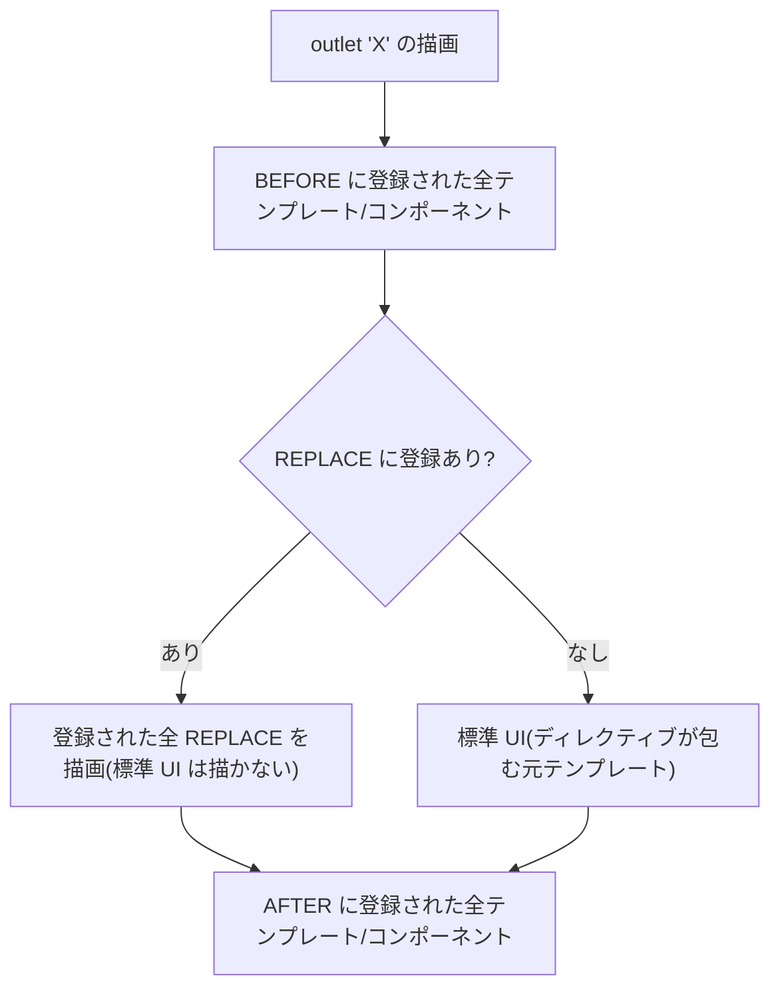

# 7. Outlet

> 調査ステータス: ⚠️ 一部未確認(Outlet の概念・2 種類の登録方法・位置・名前解決・コンテキスト・Page Layout との関係・SSR/遅延ロードとの関係は公式PDFで確認済み。`provideOutlet` の position 既定値の PDF 記述とライブラリ実装の差異、component uid 単位の outlet の有無、lazy 領域での登録経路の詳細は PDF に明記がなく、ライブラリソースでの裏取り・実機確認が必要)

## 結論(要約)

- Outlet は「**標準の Composable Storefront DOM の名前付き位置に、独自 UI を差し込む**」仕組み。CMS コンポーネントで駆動されていない UI や、部品の一部だけを細かく変えたい場合に有効(StorefrontDevelopmentGuide p253)
- 差し込み方は 2 通り。**テンプレート駆動**(`<ng-template cxOutletRef="…">`、`OutletRefModule` を import)と **コンポーネント駆動**(`provideOutlet({ id, component, position })` を providers に登録)(DevGuide p253–254)
- 位置は `cxOutletPos` / `position` で **before / after / replace** を指定。既定は **replace(標準 UI を置き換え)**(DevGuide p253, p256)。同じ参照名に複数登録すると **スタック**され、すべて描画される(Stacked Outlets、1.4 で追加。DevGuide p254 / About p10)
- 名前解決は 2 系統。**CMS 駆動**=①ページテンプレート名 ②スロット位置名 ③コンポーネント型名(typeCode/flexType)、**ソフトウェア駆動**=`cx-storefront` / `cx-header` / `header` / `navigation` / `cx-footer` / `footer`、PDP の `PDP.INTRO` / `PDP.PRICE` / `PDP.SHARE` / `PDP.SUMMARY`、テーブルセルの `table.<type>.header|data.<cell>` など(DevGuide p254, p94)
- Outlet には **コンテキスト**が注入される(`let-model` / `OutletContextData`)。ページテンプレート outlet は `templateName$ / slots$ / sections$`、スロット outlet は `components$`、コンポーネント outlet は `component`(DevGuide p255–256)
- **スロット位置名は CMS 構造内で一意でない**ため、同名スロットが別ページにあると意図しない場所にも差し込まれる。「特定ページ・位置に限定する標準手段は現状ない」と公式が明記(DevGuide p254, p256 Note)
- コンポーネント型 outlet は使えるが、**独自コンポーネント UI の導入は CmsConfig(Customizing CMS Components)が推奨**。Outlet は「CMS 外の UI」「粒度の細かい差し込み」「既存部品の前後追加」に使う(DevGuide p254)
- Outlet は遅延ロード(Deferred Loading)機構の上に載っている。**SSR では Deferred Loading は適用されず全 DOM が描画される**(クローラ対応)(DevGuide p255, p101)
- 本案件では、Accelerator の JSP 断片(`<cms:pageSlot>` 周辺のカスタム HTML)を移す際、**「CMS コンポーネント化するか / Outlet で差し込むか」の判定基準**を先に決めることが重要 → [→ 5. コンポーネントのカスタマイズ](/topics/component-customization)、[→ 20. Accelerator コンポーネント移行](/topics/accelerator-component-migration)

## 調査内容

### 1. Outlet の概念

公式ガイドの定義(StorefrontDevelopmentGuide p253):

> You can use outlets to customize the composable storefront UI by plugging custom UI into the standard composable storefront DOM. … This is particularly helpful if the UI is not driven by CMS components, or if you wish to change a granular piece in the UI.

- Outlet は **文字列で参照される名前付きの差し込み口**。名前は「ライブラリ内にハードコードされたもの」と「コンテンツ(CMS 構造)から生成されるもの」の 2 種類(DevGuide p253)
- Accelerator の JSP における「タグファイルの中に直接 HTML を書き足す」「`<cms:pageSlot>` の前後に断片を置く」という改変に相当する要求を、**ライブラリを改変せずに**満たすための機構と位置づけられる([→ 1. フロントエンドの開発方法](/topics/frontend-development) の「override / replace」原則の具体化の 1 つ)

```mermaid
flowchart LR
  subgraph lib["@spartacus/storefront(改変しない)"]
    SF["cx-storefront outlet"] --> H["cx-header outlet"]
    SF --> F["cx-footer outlet"]
    H --> PL["cx-page-layout(section=header)<br/>= outlet 'header'"]
    PL --> PS["cx-page-slot<br/>= outlet '&lt;スロット位置名&gt;'"]
    PS --> CW["outlet '&lt;コンポーネント型名&gt;'<br/>→ cxComponentWrapper"]
  end
  subgraph app["自社アプリ"]
    T["&lt;ng-template cxOutletRef='…' cxOutletPos='…'&gt;"]
    P["provideOutlet({ id, component, position })"]
  end
  T -. OutletService.add .-> SF
  P -. OutletService.add .-> PS
```

### 2. テンプレート駆動 Outlet(`cxOutletRef`)

`ng-template` に `cxOutletRef` ディレクティブを付けて TemplateRef を登録する(DevGuide p253)。

```html
<!-- header outlet の標準 UI を置き換える(既定 = replace) -->
<ng-template cxOutletRef="header">
  Custom UI replacing the header
</ng-template>

<!-- 標準 UI の前に追加する -->
<ng-template cxOutletRef="header" cxOutletPos="before">
  Custom UI added before the UI.
</ng-template>
```

- `cxOutletRef` は **`OutletRefModule`** からエクスポートされている。使うモジュールで import が必要(DevGuide p253)
- `cxOutletPos` は文字列 `"before"` / `"after"` のほか、`OutletPosition.BEFORE` / `OutletPosition.AFTER` を使ってもよい(DevGuide p253)
- 既定動作は **標準 UI の置き換え(replace)**(DevGuide p253, p256「If no value is specified the code will be replaced」)
- 制約:TemplateRef が取れる場所(= 何らかのコンポーネントテンプレート内)にしか書けない。ライブラリソース上は `OutletRefDirective` が `ngOnInit` で `OutletService.add(ref, tpl, pos)`、`ngOnDestroy` で `remove` を呼ぶ実装で、**そのテンプレートを持つコンポーネントが生存している間だけ有効**(ソース: `core-libs/storefront/cms-structure/outlet/outlet-ref/outlet-ref.directive.ts`)。したがって全画面共通で差し込みたい場合は AppComponent など常駐コンポーネントのテンプレートに置く必要がある(この点は PDF に明記なし・ソースからの読み取り)

### 3. コンポーネント駆動 Outlet(`provideOutlet`)

TemplateRef が無い場合や、TypeScript から動的に追加したい場合は、**`provideOutlet` プロバイダ**でコンポーネントを登録する(DevGuide p253–254)。

```ts
import { OutletPosition, provideOutlet } from '@spartacus/storefront';

@NgModule({
  providers: [
    provideOutlet({
      id: 'header',
      position: OutletPosition.REPLACE,
      component: CustomHeaderComponent,
    }),
  ],
})
export class CustomHeaderModule {}
```

- 「optional な `position` は `cxOutletPos` と同じ振る舞い」と PDF は説明(DevGuide p254)。ただしライブラリソースの `provideOutlet` の JSDoc と `OutletModule.registerOutletsFactory` は **既定を `OutletPosition.AFTER`** としている(`outlet.providers.ts` / `outlet.module.ts`)。**テンプレート駆動の既定(REPLACE)とコンポーネント駆動の既定(AFTER)が異なる**可能性があるため、**必ず `position` を明示する**ことを推奨(要実機確認)
- 登録経路(ソース確認、PDF 未記載): `OutletModule.forRoot()` は `APP_INITIALIZER`、`OutletModule.forChild()` は **`MODULE_INITIALIZER`** で `PROVIDE_OUTLET_OPTIONS`(multi provider)を集めて `OutletService.add` する。`MODULE_INITIALIZER` は Composable Storefront の lazy loading 機構専用の初期化トークンで、Angular 標準のルートベース lazy loading では動かない(DevGuide p36)→ lazy 機能モジュール内で outlet を登録するなら `OutletModule.forChild()` を経由するか、root 側モジュールで登録する
- 差し込まれるコンポーネント側は普通の Angular コンポーネント。自分がどの outlet に居るか・コンテキストは **`OutletContextData`** を inject して取得(下記 5.)

検証アプリ(mystore)では、`provideOutlet({ id: 'cx-header', position: BEFORE })`(デモバー)、`{ id: 'EmptyCartMiddleContent', position: AFTER }`(スロット名)、`{ id: 'MiniCartComponent', position: AFTER }`(コンポーネント型名)の 3 パターンを実装済み(`mystore/src/app/custom/*`。モック OCC 前提で動作確認、バックエンド込みでは未検証)。

### 4. 位置(OutletPosition)とスタック

| 値 | 意味 | 備考 |
|---|---|---|
| `before` / `OutletPosition.BEFORE` | 標準 UI の**前**に追加 | 標準 UI は残る |
| `replace` / `OutletPosition.REPLACE` | 標準 UI を**置き換え** | `cxOutletPos` 省略時の既定(DevGuide p256) |
| `after` / `OutletPosition.AFTER` | 標準 UI の**後**に追加 | 標準 UI は残る |

- **Stacked Outlets**(1.4〜): 同じ参照名を複数回使うと、UI がスタック(追記)される(DevGuide p254 / About p10 の機能一覧に「Stacked Outlets 1.4」)
- ソース上は `OutletService` が `before / replace / after` ごとに `Map<string, T[]>` を持ち、`OutletDirective.build()` が BEFORE → REPLACE → AFTER の順で全件描画する。REPLACE に登録が無いときだけ、ディレクティブが包んでいる元テンプレート(標準 UI)を描画する(`outlet.directive.ts`)。つまり **REPLACE を 1 件でも登録すると標準 UI は消える**が、BEFORE/AFTER は標準 UI と共存する



### 5. Outlet Context

Outlet 生成時に、その UI のコンテキストがテンプレートに注入される。テンプレートでは `let-[var]` 構文で受ける(DevGuide p254)。

```html
<ng-template cxOutletRef="header" let-model>
  The context is directly available in the custom UI: {{ model }}
</ng-template>

<!-- スロット outlet: 中のコンポーネント一覧を取得 -->
<ng-template cxOutletRef="Section1" let-model>
  "Section1" position
  <pre>{{ model.components$ | async | json }}</pre>
</ng-template>
```

コンテキストの中身は outlet の種類で異なる(DevGuide p255–256):

| outlet の種類 | コンテキスト |
|---|---|
| ページテンプレート(例 `ProductDetailsPageTemplate`) | `templateName$`(Observable) / `slots$`(Observable) / `sections$`(Observable) ※ライブラリソースでは `section$` という名前で渡している(`page-layout.component.html`)。名称は実機で確認 |
| スロット(例 `Section1`) | `components$`(Observable): スロット内コンポーネント一覧 |
| コンポーネント(例 `ProductAddToCartComponent`) | `component`: バックエンドが返したコンポーネントデータ |
| テーブルセル(`table.<type>.header.<cell>` 等) | `TableHeaderOutletContext` / `TableDataOutletContext`(public API でエクスポート)(DevGuide p94) |
| PDP の `PDP.PRICE` / `PDP.SUMMARY` 等 | `{ product }`(ソース `product-summary.component.html`。PDF 未記載) |

コンポーネント駆動の場合は、差し込まれたコンポーネント内で `OutletContextData` を inject する(ソース `outlet.model.ts`。PDF 未記載):

```ts
import { OutletContextData } from '@spartacus/storefront';

@Component({ /* … */ })
export class FreeShippingHintComponent {
  // reference: outlet 名, position: 描画位置, context$: コンテキストの Observable
  protected outlet = inject(OutletContextData, { optional: true });
  readonly product$ = this.outlet?.context$;   // 例: PDP.PRICE なら { product }
}
```

`OutletContextData.context`(同期プロパティ)は 3.0 で deprecated。最新値が必要なら `context$` を使う(ソース JSDoc)。

### 6. Outlet 参照名の解決(どんな名前が使えるか)

公式は「データ駆動(CMS 駆動)」と「ソフトウェア駆動」の 2 分類(DevGuide p254)。

#### 6.1 CMS 駆動の参照名(3 種類)

| 種類 | 例 | 注意(DevGuide p254) |
|---|---|---|
| **ページレイアウト(テンプレート)名** | `LandingPage2Template`, `ProductDetailsPageTemplate`, `CartPageTemplate` | 各ページレイアウトがそのまま outlet 参照になる |
| **スロット位置名** | `Section1`, `Section2A`, `SiteLogo`, `EmptyCartMiddleContent` | **CMS 構造内で一意でない**ため、同名スロットが複数ページにあると outlet が複数回現れる。「特定の位置・ページに限定する標準手段は現状ない」 |
| **コンポーネント型名** | `ProductAddToCartComponent`, `MiniCartComponent`, `CMSFlexComponent` の `flexType` | 型名 outlet は使えるが、**独自コンポーネント UI 導入は Customizing CMS Components(CmsConfig)が best practice** |

ソースでの裏取り: `page-layout.component.html` が `[cxOutlet]="layoutName"`、`page-slot.component.html` が `[cxOutlet]="position"`、その内側で `[cxOutlet]="component.flexType"` を張っている。よってコンポーネント単位 outlet のキーは **`flexType`(typeCode 相当。CMSFlexComponent なら flexType 値)** であり、**component uid 単位の outlet は存在しない**(uid で絞りたい場合はコンテキストの `component.uid` を見て自前で分岐する)。この点は PDF に明記なし → [→ 21. typecode](/topics/typecode)

ページテンプレートを部分的に置き換える例(DevGuide p255):

```html
<ng-template cxOutletRef="ProductAddToCartComponent">
  <div>Custom Title</div>
  <custom-add-to-cart></custom-add-to-cart>
</ng-template>

<!-- PDP テンプレートの前にキャンペーン UI を追加 -->
<ng-template cxOutletRef="ProductDetailsPageTemplate" cxOutletPos="before">
  <div class="before-pdp">Campaign UI for Canon</div>
</ng-template>
```

PDP のスロット・コンポーネント一覧(`ProductDetailsPageTemplate` の Summary / Tabs 等)は「CMS マッピングに加えて outlet でも追加・置換できる。outlet のラベルはスロット名・コンポーネント名と同じ」「PDP で outlet を使う場合、位置合わせのための独自 CSS が必要になることがある」(DevGuide p78)。

#### 6.2 ソフトウェア駆動の参照名(ハードコード)

| 参照名 | 包む範囲(DevGuide p254) | 導入版 |
|---|---|---|
| `cx-storefront` | ストアフロント全体。全体 UI の置換・前後追加に使う | 1.3 |
| `cx-header` | `<header>` 要素全体 | 1.3 |
| `header` | header セクションの全ページスロット | ― |
| `navigation` | navigation セクションの全ページスロット | ― |
| `cx-footer` | `<footer>` 要素全体 | 1.3 |
| `footer` | footer セクションの全ページスロット | ― |
| `PDP.INTRO` / `PDP.PRICE` / `PDP.SHARE` / `PDP.SUMMARY` | PDP の導入部 / 価格 / 共有 / サマリ | ― |
| `table.<tableType>.header.<cell>` / `table.<tableType>.data.<cell>` | テーブルコンポーネントの各セル(例 `table.budget.header.name`) | ― (DevGuide p94) |

ソースでは、`storefront.component.html` が `StorefrontOutlets.STOREFRONT('cx-storefront')` → `cx-header` → `<cx-page-layout section="header">` / `section="navigation"` → `cx-footer` の順で outlet を張っている。また feature-libs には `CartOutlets`(`cx-cart-item`, `cx-cart-item.details`, `cx-order-summary`, `cx-cart-item-list`, `cx-add-to-cart-container`, `cx-delivery-mode`, `cx-order-overview` 等)、`OrderOutlets`(`cx-order-consignment` 等)、`ProductListOutlets`(`cx-product-list-item.details` / `.actions`)、`SearchBoxOutlets`、`StoreFinderOutlets` の enum が定義されている(ソース `feature-libs/cart/base/root/models/cart-outlets.model.ts` ほか)。公式 PDF 側でも `CartOutlets.OPF_CHECKOUT_PICKUP_ITEMS`(Integrations p77–78)、`CartOutlets.ITEM_DETAILS`(S/4 スケジュールライン、配送予定日。Integrations p104, p111)、`ProductListOutlets.ITEM_DETAILS`(多次元商品。DevGuide p215)、`CartOutlets.CART_ITEM_LIST`(Updating p31)が SAP 自身の機能ライブラリの拡張点として使われている。

```ts
// 公式ドキュメント記載例: OPF の pickup 表示に pickup-in-store の部品を差し込む(Integrations p77–78)
provideOutlet({
  id: CartOutlets.OPF_CHECKOUT_PICKUP_ITEMS,
  position: OutletPosition.REPLACE,
  component: PickUpItemsDetailsComponent,
}),
```

### 7. Page Layout / PageSlot との関係

- CMS はページ→スロット→コンポーネントの構造だけを返し、レイアウト情報は持たない。Composable Storefront は **`LayoutConfig`** でテンプレート/セクションごとのスロット順序を定義し、CSS でレイアウトを与える(DevGuide p255)
- 「テンプレート・スロット・コンポーネントが動的に描画されるとき、**各スロットに outlet が追加される**。outlet のラベルは包んでいる要素名と一致する」(DevGuide p255「Using Outlets to Override Page Templates」)
- スロット描画時、ページテンプレート名が CSS クラスとして付与され、`cx-page-slot` や位置名でも選択できる(DevGuide p256)。したがって「outlet で差し込む」以外に「CSS だけで並び替える」選択肢もある → [→ 9. StyleSheet](/topics/stylesheets)
- `LayoutConfig` が不完全な場合、全スロットが描画され、設定可能なスロット一覧が console に警告される(DevGuide p255)→ outlet に使えるスロット名を洗い出す手がかりになる

```ts
const defaultLayoutConfig: LayoutConfig = {
  header: { slots: ['TopHeaderSlot', 'NavigationSlot'] },
  footer: { slots: ['FooterSlot'] },
  LandingPageTemplate: { slots: ['Section1', 'Section2A', 'Section2B'] },
};
```

### 8. Deferred Loading / SSR / lazy loading との関係

- 「Outlet は Composable Storefront UI の Deferred Loading に駆動される」。ビューポート外のコンポーネントは事前描画されない(DevGuide p255)。ソース上は `OutletDirective` の `cxOutletDefer` 入力で `DeferLoaderService` を使い、page-slot がコンポーネント型 outlet に `getComponentDeferOptions(flexType)` を渡している
- Deferred Loading は **既定で無効**(`DeferLoadingStrategy.INSTANT`)。有効化は `LayoutConfig.deferredLoading.strategy = DEFER`、`intersectionMargin` で先読み範囲を調整。コンポーネント単位で `CmsConfig.cmsComponents[type].deferLoading` を上書き可能(DevGuide p101)
- **SSR では Deferred Loading は適用されず、クローラが完全な DOM を受け取る**(DevGuide p101)。「初回アクセスのユーザーは deferred loading の恩恵を受けず全コンテンツが一度に読み込まれる」(DevGuide p84)→ outlet で重い UI を差し込む場合、SSR 出力サイズ・TTFB への影響を意識する
- Deferred Loading は JS チャンクの lazy load とは別物(描画タイミングの制御のみ)(DevGuide p101)。outlet で差し込むコンポーネントのバンドルは、それを宣言するモジュールがどう読み込まれるかに従う
- lazy 機能モジュール内での outlet 登録は `MODULE_INITIALIZER`(`OutletModule.forChild()`)経由。`APP_INITIALIZER` はアプリ初期化完了後の lazy load には効かない(DevGuide p36)。逆に、root 側モジュールで `provideOutlet` した型名 outlet(例 `MiniCartComponent`)は、その型が lazy 領域で描画されても有効(mystore で確認。バックエンド未接続)
- 更新時の互換性: a11y のフィーチャートグルに `a11yPreventCartItemsFormRedundantRecreation`(`[cxOutlet]="CartOutlets.CART_ITEM_LIST"` 利用時のフォーム再生成抑止)、`a11yCartItemListHideEmptyOutlets`(空の outlet ラッパ要素を隠す。スクリーンリーダーが余分な列と解釈するのを防止)がある(Updating p31–32)。**outlet のラッパ要素が DOM に残る**ことは a11y・CSS 設計上の前提として押さえる

### 9. いつ Outlet、いつ CmsConfig か

| 要求 | 推奨手段 | 根拠 |
|---|---|---|
| 既存 CMS コンポーネントの見た目・振る舞いを丸ごと差し替え | **CmsConfig(`cmsComponents[type].component`)** | 型名 outlet は使えるが CmsConfig が best practice(DevGuide p254)→ [→ 5. コンポーネントのカスタマイズ](/topics/component-customization) |
| 新しい業務 UI を CMS で配置・管理させたい | **新規 CMS コンポーネント + CmsConfig**(必要なら CMSFlexComponent) | Backoffice/SmartEdit で位置を制御できる → [→ 6. カスタムコンポーネント](/topics/custom-components) |
| 既存部品の**前後**に何か足す(バッジ、注意書き、CTA) | **Outlet(BEFORE/AFTER)** | 標準 UI を残したまま追加できる。Stacked で複数登録可 |
| ヘッダ/フッタ/ストアフロント全体など **CMS で管理されない骨組み**を変える | **Outlet(`cx-storefront` / `cx-header` / `cx-footer` / `header` / `navigation` / `footer`)** | これらは CMS コンポーネントではない(DevGuide p254) |
| ページテンプレート単位でページ前後に UI を置く | **Outlet(テンプレート名, BEFORE/AFTER)** | DevGuide p256 の例 |
| PDP の価格・サマリなど**部品内部の一部**を変える | **Outlet(`PDP.PRICE` 等)** または コンポーネント継承+CmsConfig | 粒度が細かいなら outlet(DevGuide p253) |
| テーブル(Organization 系一覧)のセル描画 | **TableConfig の cell renderer**、または セル outlet | DevGuide p94 |
| 特定ページの特定スロットにだけ差し込む | outlet 単独では不可(位置名が非一意)。コンテキスト/`CmsService.getCurrentPage()` で自前分岐、または CMS コンポーネント化 | DevGuide p254, p256 Note |

## 本案件への示唆

- **Accelerator JSP 断片の棚卸しで「Outlet 行き」を分類する**: B2B Accelerator の `*.tag` / `*.jsp` に直書きされたバナー・注意文・ヘッダ補助 UI は、Composable では (a) CMS コンポーネント化(Backoffice で管理)か (b) Outlet 差し込み(コード管理)のどちらかに落ちる。**業務側が Backoffice で ON/OFF・並び替えしたいもの → (a)、開発側で常時固定のもの → (b)** を分類基準にする。→ [→ 20. Accelerator コンポーネント移行](/topics/accelerator-component-migration)
- **商用版ライブラリ利用の前提と相性が良い**: outlet はライブラリのコードを一切触らず、自社モジュールの providers / テンプレートだけで完結するため、SAP の年 2 回相当の更新([→ 1. フロントエンドの開発方法](/topics/frontend-development))で壊れにくい。ただし **参照名(スロット位置名・型名・`CartOutlets` の enum 値)はライブラリ/コンテンツカタログの都合で変わり得る**ので、outlet 名は定数化し、更新時にリリースノート(Updating)で差分確認する運用にする
- **B2B の一覧画面(Organization: Units / Budgets / Cost Centers 等)は TableComponent ベース**。列追加・セル表示変更は TableConfig と `table.<type>.…` outlet で対応可能(DevGuide p94)。Accelerator の一覧 JSP を移す際の主要な受け皿になる → [→ 5. コンポーネントのカスタマイズ](/topics/component-customization)
- **SSR 必須の前提**: outlet で差し込むコンポーネントは SSR で必ず描画される(Deferred Loading は SSR 非適用)。`window` 等のブラウザ API 直接参照禁止、外部スクリプト連携は `isPlatformBrowser` 分岐。差し込み UI が OCC 呼び出しを伴う場合は SSR の TransferState / タイムアウト設定([→ 2. SSR 設定](/topics/ssr-setup))に影響する
- **スロット位置名の非一意性**は B2B サンプル(powertools)でも起こり得る(同名スロットが複数テンプレートに存在)。位置名 outlet を使うときは、`components$` / `CmsService` の現在ページ情報で分岐する共通ラッパを 1 つ用意しておくと安全
- **既定 position の食い違い**(PDF: cxOutletPos と同じ=replace、ソース: provideOutlet は AFTER)は、意図せず標準 UI が消える/残る事故につながる。社内規約として **`position` 必須指定**とする
- CCv2 でのデプロイ・ビルドには影響しない(純粋なフロント実装)。ただし outlet 名が CMS コンテンツ(スロット名・型名)に依存するため、**コンテンツカタログの変更(Backoffice/ImpEx)とフロントのデプロイ順序**を合わせる必要がある → [→ 23. コンテンツカタログ(Backoffice)](/topics/content-catalog-backoffice)

## 未確認事項・次のアクション

- `provideOutlet` の `position` 省略時の実際の既定値(PDF は「cxOutletPos と同じ」、ソースは AFTER)を実機で確認し、規約に反映する
- ページテンプレート outlet のコンテキストのプロパティ名(PDF `sections$` / ソース `section$`)を実機で確認する
- 商用版ライブラリの現行バージョン(221121.x)で `OutletRefModule` / `OutletModule` が standalone 構成(`ng add` 生成物)にどう組み込まれているか(import が必要か、`provideOutlet` を `app.config.ts` の providers に直接書けるか)を確認する
- lazy 機能モジュール(例 checkout / organization)内で `provideOutlet` を行った場合に、`OutletModule.forChild()` を明示しなくても登録されるかを確認する
- 特定ページ・スロットへの限定手段(「標準手段なし」)について、現行版で改善されていないかリリースノート(Updating)を横断確認する
- Accelerator 側の JSP/タグから、Outlet で差し込む候補箇所(ヘッダ補助表示、フッタ法務文言、PDP 価格横の B2B 表示、カート行の追加情報等)を棚卸しし、`CartOutlets` / `ProductDetailOutlets` / `OrderOutlets` の enum との対応表を作る
- SmartEdit のコンテンツ編集モードで outlet 差し込み UI がどう見えるか(編集不可の UI として表示されるか)を確認する → [→ 26. SmartEdit 設定](/topics/spa-smartedit-settings)

## 出典

- `docs__StorefrontDevelopmentGuide.pdf` p.253–254 「Outlets」「Template-Driven Outlets」「Component-Driven Outlets」「Stacked Outlets」「Outlet Context」「Available Outlet References」「CMS Outlet References」「Software-Driven Outlet References」「Specific Sections on the Product Details Page」
- `docs__StorefrontDevelopmentGuide.pdf` p.255–256 「Deferred Loading」「Page Layout」「Page Structure」「Configuring the Layout」「Using Outlets to Override Page Templates」「Outlet Context」「Outlet Position」「CSS Layout Rules」
- `docs__StorefrontDevelopmentGuide.pdf` p.78 「Configuring the PDP Page」(outlet でのコンポーネント追加・置換、CSS 調整の注意)
- `docs__StorefrontDevelopmentGuide.pdf` p.94 「Cell Outlets」(テーブルセル outlet、`TableHeaderOutletContext` / `TableDataOutletContext`)
- `docs__StorefrontDevelopmentGuide.pdf` p.101 「Deferred Loading」「Enable Deferred Loading」「Component Loading Strategy」「Server-Side Rendering」
- `docs__StorefrontDevelopmentGuide.pdf` p.84 (SSR ページでは deferred / above-the-fold loading が効かない旨)
- `docs__StorefrontDevelopmentGuide.pdf` p.36 「MODULE_INITIALIZER」
- `docs__StorefrontDevelopmentGuide.pdf` p.215 (`ProductListOutlets.ITEM_DETAILS` の置換)
- `docs__AboutComposableStorefront.pdf` p.10 (機能一覧「Stacked Outlets 1.4」)、p.11 (「Extending the SAP Commerce Cloud, composable storefront with Outlets」動画)、p.35 (Release 1.4 「Stacked Outlets」)
- `docs__Integrations.pdf` p.77–78 (`provideOutlet` で `CartOutlets.OPF_CHECKOUT_PICKUP_ITEMS` に登録する例)、p.104 (`CartOutlets.ITEM_DETAILS` への S/4 スケジュールライン)、p.111 (配送予定日)
- `docs__UpdatingComposableStorefront.pdf` p.31–32 (`a11yPreventCartItemsFormRedundantRecreation` / `a11yCartItemListHideEmptyOutlets`)
- 二次(裏取り): Spartacus ソース `core-libs/storefront/cms-structure/outlet/`(`outlet.model.ts` / `outlet.providers.ts` / `outlet.module.ts` / `outlet.service.ts` / `outlet.directive.ts` / `outlet-ref/outlet-ref.directive.ts`)、`layout/main/storefront.component.html`、`cms-structure/page/page-layout/page-layout.component.html`、`cms-structure/page/slot/page-slot.component.html`、`feature-libs/cart/base/root/models/cart-outlets.model.ts`、検証アプリ `mystore/src/app/custom/*`
