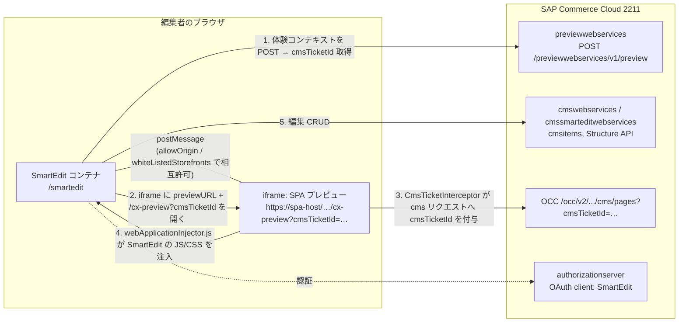

# 26. SPA化した時のSmartEditの設定方法

> 調査ステータス: ⚠️ 一部未確認(SmartEdit 用 OAuth クライアント `smartedit` の ImpEx 定義、独自コンポーネント型を Composable 側で編集可能にする際の FE 側追加作業、CCv2 での `xss.filter.header.*` / `smartedit.response.header.*` プロパティの反映手段は PDF から詳細を特定できず)

## 結論(要約)

- Composable Storefront(Spartacus)を SmartEdit で編集可能にするには、**FE 側**で `@spartacus/smartedit` フィーチャーライブラリを導入し(`ng add @spartacus/smartedit`)、`webApplicationInjector.js` を `assets/` に配置、`SmartEditConfig`(`storefrontPreviewRoute` 既定 `cx-preview`、`allowOrigin` 既定 `localhost:9002`)を環境に合わせて上書きする(Integrations p.126–127)。
- **BE 側**では (1) Backoffice の CMSSite「WCMS Cockpit Preview URL」を SPA の URL(コンテキスト付き。例 `https://<host>/powertools-spa/en/USD` 相当)に設定、(2) SmartEdit の Configuration Editor(`whiteListedStorefronts`)に SPA の正確な URL を登録、の 2 点が必須(Integrations p.127, p.133)。
- SmartEdit は「SmartEdit Contract」(webApplicationInjector.js の読み込み、HTML マークアップ契約 `smartEditComponent` クラス/`data-smartedit-*` 属性、プレビューチケット API `/cx-preview?cmsTicketId=…`、`window.smartedit.renderComponent`)を満たすストアフロントなら何でも編集できる。Spartacus はこの契約を `@spartacus/smartedit` + `DynamicAttributeService` + `CmsTicketInterceptor` でライブラリ側に実装済みで、Accelerator の `smarteditaddon` に相当する(Integrations p.129–132, Commerce8 p.102–106)。
- **SSR は SmartEdit プレビューでは無効化が公式推奨**。`OptimizedSsrEngine` の `defaultRenderingStrategyResolver` が `cx-preview` を含む URL を自動的に `ALWAYS_CSR` にする(Commerce8 p.107–108)。
- クロスオリジン(SPA と SmartEdit が別ドメイン/ポート)の場合、`allowOrigin`(webApplicationInjector 側の許可リスト)、SmartEdit 側の `whiteListedStorefronts`、SmartEdit の CSP `frame-src`、ストアフロント側の CSP `frame-ancestors`(Accelerator では `xss.filter.header.Content-Security-Policy`)、サードパーティ Cookie 許可、SameSite 設定に注意(Commerce8 p.98–102)。
- 独自コンポーネント型は BE の `items.xml` に定義するだけで CMS Structure API に自動登録され、SmartEdit の「Add Component」から追加・汎用エディタで編集できる(Trails p.69–70)。SPA 側では対応する Angular コンポーネントを `CmsConfig` で紐づける([→ 6. custom-components](/topics/custom-components))。
- トラブルシュートの主症状: Perspective ツールバーが出ない(injector 未読込)、`… is not allowed to override this storefront`(`allowOrigin` 不備)、`disallowed storefront is trying to communicate with smarteditcontainer`(`whiteListedStorefronts` 不備)、編集後にページが更新されない(OCC キャッシュ / injector のバージョン不一致)(Integrations p.128–129)。

## 調査内容

### 1. 全体像: SmartEdit と Composable Storefront の接続構造



- SmartEdit フレームワークは (1) 体験コンテキスト(サイト、カタログ、カタログバージョン、言語、日時)を Preview API に POST してプレビューチケット ID を取得、(2) ストアフロントのホームページ URL に `/cx-preview` と `cmsTicketId` パラメータを付けて呼び出し、(3) iframe にページをロードする(Commerce8 p.105)。
- 一度 `/cx-preview?cmsTicketId=…` でホームページが呼ばれたら、以降のディープリンクや直接遷移でも同じ体験コンテキストで提供しなければならない(Commerce8 p.106)。Spartacus の `SmartEditLauncherService` は `cmsTicketId` を `sessionStorage`(キー `smartedit.cmsTicketId`)に保持し、URL からパラメータが落ちた後も SmartEdit 起動中と判定する(二次: `feature-libs/smartedit/root/services/smart-edit-launcher.service.ts`)。
- CMS リクエストに `cmsTicketId` が付くと、レスポンス JSON に `properties.smartedit` グループ(`classes`, `componentType`, `componentId`, `componentUuid`, `catalogVersionUuid`)が含まれ、これを DOM に付与するのが `DynamicAttributeService`(`addAttributesToComponent` / `addAttributesToSlot`)(Integrations p.130–131)。

### 2. 前提条件

| 項目 | 内容 | 出典 |
|---|---|---|
| SAP Commerce Cloud | 2105 以降 + `spartacussampledata` 導入(SPA 用サンプルサイト `electronics-spa` / `powertools-spa` 等) | Integrations p.126 |
| SmartEdit 関連拡張 | `cmsbackoffice`, `cmssmartedit`, `cmssmarteditwebservices`, `cmswebservices`, `permissionswebservices`, `previewwebservices`, `smartedit`, `smarteditaddon`, `smartedittools`, `smarteditwebservices`(+拡張する場合 `ysmarteditmodule`)。手動導入時は `ant updatesystem` でアクセス権を反映 | Trails p.88 |
| CCv2 の Web アプリ | `api` アスペクトの `webapps` に `smartedit`(/smartedit), `cmssmartedit`, `smarteditwebservices`, `cmssmarteditwebservices`, `oauth2`(/authorizationserver), `cmswebservices`, `permissionswebservices`, `previewwebservices` を割り当てる(manifest.json 例) | Commerce8 p.140 付近(4868 行の manifest 例) |
| webApplicationInjector.js | 2211 より古い Commerce を使う場合は、その Commerce に同梱の `webApplicationInjector.js` を使う。SmartEdit 側とストアフロント側で同一バージョンを推奨(不一致だと「The webApplicationInjector files used in storefront and in SmartEdit are different…」ポップアップ) | GettingStarted p.34, p.38, Commerce8 p.104 |
| SmartEdit ユーザー | `admin` と `cmsmanager` はストアフロントサンプルデータで提供。その他のユーザー/グループ(`cmsmanager-powertools`, `cmseditor…` 等)は `smarteditaddon` が提供 | Commerce8 p.4–5 |

### 3. FE 側手順(Composable Storefront)

#### 3-1. `@spartacus/smartedit` の導入

```bash
# 既存アプリに追加(スキーマティクス)。ng add @spartacus/schematics 時に SmartEdit feature を選択してもよい
ng add @spartacus/smartedit
```

- スキーマティクスを使わず手動導入した場合は、`node_modules/@spartacus/smartedit/assets` の `webApplicationInjector.js` を自アプリの `assets/` にコピーするか、`angular.json` の `assets` 配列に次を追加する(Integrations p.126–127)。

```json
{
  "glob": "**/*",
  "input": "node_modules/@spartacus/smartedit/assets",
  "output": "assets/"
}
```

- Spartacus は `index.html` に `<script>` を静的に書くのではなく、`SmartEditRootModule` の `APP_INITIALIZER` から `SmartEditLauncherService.load()` を呼び、URL に `cmsTicketId` がある(= SmartEdit 内で起動された)ときだけ `assets/webApplicationInjector.js` を `<script id="text/smartedit-injector" data-smartedit-allow-origin="<allowOrigin>">` として動的に埋め込む(二次: `feature-libs/smartedit/root/smart-edit-root.module.ts`, `smart-edit-launcher.service.ts`)。通常のエンドユーザー閲覧時には読み込まれない。
- 生成される feature module の例(`smart-edit-feature.module.ts`)。フィーチャー名は `SMART_EDIT_FEATURE = 'smartEdit'`(二次: `feature-libs/smartedit/root/feature-name.ts`)。

```ts
import { NgModule } from '@angular/core';
import { provideConfig } from '@spartacus/core';
import { SmartEditConfig, SmartEditRootModule, SMART_EDIT_FEATURE } from '@spartacus/smartedit/root';

@NgModule({
  imports: [SmartEditRootModule],
  providers: [
    provideConfig({
      featureModules: {
        [SMART_EDIT_FEATURE]: {
          module: () => import('@spartacus/smartedit').then((m) => m.SmartEditModule),
        },
      },
    }),
    provideConfig(<SmartEditConfig>{
      smartEdit: {
        storefrontPreviewRoute: 'cx-preview',   // 既定値
        allowOrigin: 'localhost:9002',           // 既定値。環境ごとに上書き
      },
    }),
  ],
})
export class SmartEditFeatureModule {}
```

#### 3-2. `SmartEditConfig` の設定値

| キー | 既定値 | 意味 | 出典 |
|---|---|---|---|
| `smartEdit.storefrontPreviewRoute` | `cx-preview` | SmartEdit がプレビュー時にストアフロント URI に付加するルート。BE 側 `SmartEditConfiguration.storefrontPreviewRoute` と一致させる | Integrations p.127, p.130 |
| `smartEdit.allowOrigin` | `localhost:9002` | `webApplicationInjector.js` の `data-smartedit-allow-origin` に渡される、SmartEdit(親フレーム)のオリジン許可リスト。カンマ区切りで複数可、**ポート必須**、`*` は 1 サブドメインのみ置換可(例 `*.x.y`) | Integrations p.127–129 |

```ts
// 例: SmartEdit が https://backoffice.example-env.internal:443 で動く場合(値はホスト:ポート、スキームなし)
provideConfig(<SmartEditConfig>{
  smartEdit: {
    storefrontPreviewRoute: 'cx-preview',
    allowOrigin: 'localhost:9002, backoffice.example-env.internal:443',
  },
});
```

- 型定義(二次: `feature-libs/smartedit/root/config/smart-edit-config.ts`)は上記 2 プロパティのみ。それ以外の SmartEdit 挙動(コンテキストメニュー等)は SmartEdit 側の機能であり SPA 側の設定はない。

#### 3-3. SSR との関係

- 「SSR は SmartEdit にとって実質的な利点がなく、問題も多かったため、SmartEdit 向けには SSR を無効化することを推奨」(Commerce8 p.107)。
- `OptimizedSsrEngine` の `defaultRenderingStrategyResolver` は既定で `excludedUrls: ['cx-preview']` を持ち、URL に `cx-preview` を含むリクエストを `RenderingStrategy.ALWAYS_CSR` にする(Commerce8 p.107、二次: `core-libs/setup/ssr/optimized-engine/rendering-strategy-resolver.ts`)。
- 独自の `renderingStrategyResolver` を使う場合も `defaultRenderingStrategyResolver` をフォールバックにするか、少なくとも `cx-preview` を `ALWAYS_CSR` にする(Commerce8 p.107–108)。

```ts
// server.ts 側(抜粋、Commerce8 p.107–108 の例)
import { defaultRenderingStrategyResolver, defaultRenderingStrategyResolverOptions } from '@spartacus/setup/ssr';
const ssrOptions: SsrOptimizationOptions = {
  ...,
  renderingStrategyResolver: defaultRenderingStrategyResolver(defaultRenderingStrategyResolverOptions),
};
```

- `storefrontPreviewRoute` を `cx-preview` 以外に変える場合は、上記 `excludedUrls` も同じ値に合わせないと SSR が走る点に注意(推論。PDF には明記なし)。SSR 全般は [→ 2. ssr-setup](/topics/ssr-setup)。

#### 3-4. ブラウザ専用 API と SmartEdit

- SmartEdit 連携コード(`window.smartedit.renderComponent` の実装、`sessionStorage` 参照)は Spartacus ライブラリ内でブラウザ側でのみ実行される。自作コードで SmartEdit 判定を行う場合は `SmartEditLauncherService.isLaunchedInSmartEdit()` を使い、`window` を直接参照しない(プロジェクト規約)。

### 4. BE 側手順(SAP Commerce Cloud)

#### 4-1. CMSSite の Preview URL を SPA に向ける

- Backoffice → WCMS → Website → 対象サイト → 「WCMS Properties」タブ → 「WCMS Cockpit Preview URL」を Composable Storefront の URL に設定する。SmartEdit はこの URL を iframe で開く(Integrations p.127, Commerce8 p.171–172)。
- **Preview URL は SPA の既定コンテキストと一致させる**。例えば `https://localhost:4200` にアクセスすると `https://localhost:4200/en/USD` にリダイレクトされる構成なら、Preview URL も `https://localhost:4200/en/USD` にする。不一致だと SmartEdit 上でエラーになる(Integrations p.133)。`context.urlParameters` に `baseSite` を含める構成なら `https://<host>/powertools-spa/en/USD` のようになる(GettingStarted p.38 の URL 例より)。
- ImpEx で設定する場合(Commerce8 p.100 の Accelerator 例を SPA 向けに書き換えたもの。`$fullPath…` は環境ごとの変数):

```impex
$fullPathPowertoolsSpa=https://<spa-host>
UPDATE CMSSite;uid[unique=true];previewURL
;powertools-spa;$fullPathPowertoolsSpa/powertools-spa/en/USD
```

- 加えて `CMSSite.defaultPreviewCategory` / `defaultPreviewProduct` / `defaultPreviewCatalog` を設定しておくと、SmartEdit で商品詳細/一覧ページを開いたときにその商品・カテゴリで表示される(Integrations p.132)。

```impex
UPDATE CMSSite;uid[unique=true];defaultPreviewCategory(code,$productCV);defaultPreviewProduct(code,$productCV);defaultPreviewCatalog(id)
;$spaSiteUid;575;2053367;$productCatalog
```

#### 4-2. SmartEdit 側の許可リスト(whiteListedStorefronts)

1. `admin` で SmartEdit にログイン
2. 右上の Settings アイコン → Configuration Editor
3. `whiteListedStorefronts` に SPA の **正確な URL** を追加(例 `["https://localhost:4200"]`)(Integrations p.127)

- SSL 無しで起動する場合は `http://localhost:4200` に読み替える(Integrations p.127)。
- SmartEdit の設定は Configuration Editor / Admin Settings で管理され、環境間でエクスポート/インポート可能(Commerce8 p.108「Exporting and Importing the Configuration of SmartEdit」)。

#### 4-3. storefrontPreviewRoute(必要な場合のみ)

- 既定では SmartEdit はストアフロント URI に `/cx-preview` を付ける。変更する場合は BE 側 `SmartEditConfiguration` を ImpEx で更新し、FE 側 `SmartEditConfig.storefrontPreviewRoute` と揃える(Integrations p.130, Commerce8 p.106)。

```impex
INSERT_UPDATE SmartEditConfiguration;key[unique=true];value
;storefrontPreviewRoute;"""my-custom-preview"""
```

#### 4-4. クロスオリジン設定(SPA と SmartEdit が別ホスト/ポート)

CCv2 では SPA(独自ホスト or JS Storefront サービス)と SmartEdit(`api` アスペクトの `/smartedit`)は通常別オリジンになるため、以下が必要(Commerce8 p.99「Setting Up Support for Cross Origin Domains」)。

| 設定箇所 | 内容 | 出典 |
|---|---|---|
| ストアフロント側(SPA) | `SmartEditConfig.allowOrigin` に SmartEdit のホスト:ポートを列挙(Accelerator の `smarteditaddon.javascript.paths.responsive=…webApplicationInjector.js?allow-origin=*.mydomain.com:9002` に相当。**Accelerator 向けの `allow-origin` 設定は SPA には適用されない**旨の注記あり) | Commerce8 p.100 |
| SmartEdit 側 | `whiteListedStorefronts` に SPA URL(4-2) | Integrations p.127 |
| SmartEdit 側 CSP | `smartedit.response.header.Content-Security-Policy=frame-src 'self' https://your-storefront-domain.com;` を local.properties に追加。`frame-src` 等はデフォルトにマージされる(上書きではない) | Commerce8 p.98–99 |
| ストアフロント側 CSP | 別ドメインの SmartEdit から iframe 埋め込みを許可する `frame-ancestors`。Accelerator では `xss.filter.header.Content-Security-Policy = frame-ancestors 'self' <*.mydomain.com:9002>`。SPA では SPA を配信するサーバー(Node/SSR サーバーや CDN)の応答ヘッダーで同等の設定が必要(SPA 側の具体的手順は PDF 未記載) | Commerce8 p.100 |
| Cookie | クロスオリジン運用ではブラウザがサードパーティ Cookie を受け入れる必要がある。`cookies.SameSite.enabled=true` + `cookies.SameSite=Lax` は別オリジンのログインページを持つ Composable Storefront を壊し得る。必要なら `cookies.null./authorizationserver.JSESSIONID.SameSite=None`(`None` の場合は `Secure` 必須) | Commerce8 p.99, p.102 |
| ローカル検証 | hosts ファイルにカスタムドメインを割り当ててクロスオリジンを再現(Commerce8 p.101)。SPA は `npm start --ssl` で起動すると unsafe scripting 警告を回避できる(Integrations p.127) | |

#### 4-5. 認証・権限

- SmartEdit の認証は OAuth(Commerce の Web サービスと同じプロバイダ、SSO 可)。API 呼び出しで 401 が返った時点でログインモーダルを出す。Commerce の OAuth エントリポイントはクライアント ID のみ必要でシークレット不要(Commerce8 p.115)。
- セッションタイムアウトは Backoffice → System → OAuth → OAuth Clients → 「SmartEdit」クライアントの「OAuth Access Token Validity Seconds」で変更(Commerce8 p.172)。
- 権限はカタログバージョン → 型 → 属性 → 言語の順に検証され、上位が無ければ下位があっても操作はブロックされる(Commerce8 p.5)。B2B(Powertools)には `cmsmanager-powertools`(`basecmsmanagergroup`, `powertools-cmsmanagergroup`)が用意されている(Commerce8 p.4)。
- Personalization(Context-Driven Services)を併用する場合、SPA 側は `@spartacus/tracking` の Personalization 統合、BE 側は `corsfilter.commercewebservices.allowedHeaders/exposedHeaders` に `occ-personalization-id`, `occ-personalization-time` を追加し、Backoffice の Personalization Configuration で SPA サイトを対象に含め「Personalization for Commerce Web Services = True」にする(Integrations p.115–116)。SmartEdit の Personalization モードは標準モード(Preview / Basic Edit / Advanced Edit / Versioning / Personalization)の一つ(Commerce8 p.11 付近)。

### 5. SmartEdit Contract の Spartacus 側実装(仕組みの理解用)

| 契約項目 | Accelerator(smarteditaddon) | Composable Storefront | 出典 |
|---|---|---|---|
| webApplicationInjector.js の読み込み | `master.tag` に `<script>` を静的挿入(`/_ui/addons/smarteditaddon/shared/common/js/webApplicationInjector.js`) | `SmartEditLauncherService` が SmartEdit 起動時のみ動的埋め込み | Trails p.89, Integrations p.126 |
| HTML マークアップ契約(`smartEditComponent` クラス、`data-smartedit-component-type/-id/-uuid`, `data-smartedit-catalog-version-uuid`、body の `smartedit-page-uid-…` クラス) | `<cms:component>` / `<cms:pageSlot>` タグが `<div>` ラッパーを追加 | OCC レスポンスの `properties.smartedit` を `DynamicAttributeService.addAttributesToComponent/Slot` が DOM 属性化。ページの `classes` は `<body>` に付与 | Commerce8 p.104–105, Integrations p.130–131 |
| プレビューチケット API | `/cx-preview?cmsTicketId=` を AddOn が処理 | `CmsTicketInterceptor` が `cms` を含む OCC リクエストに `cmsTicketId` を付与 | Integrations p.130 |
| 再描画 | 静的 HTML は Ajax 再取得 + `reprocessPage` | `window.smartedit.renderComponent(componentId, componentType, parentId)` を実装。`parentId` 無し=スロット→ページ全体再取得、あり=そのコンポーネントのみ | Commerce8 p.106–107, Integrations p.132 |
| Heartbeat | injector が心拍を送る。無いと 10 秒後に「Preview Mode」への切替アラート | 同左(injector が読み込まれていれば同じ) | Commerce8 p.104 |

- 注意: フロントエンド描画のストアフロントでは、コンポーネント生成後に `smartEditComponent` クラスが付く場合、新規コンポーネントを検出できない制限がある(Commerce8 p.106)。独自コンポーネントで `DynamicAttributeService` を呼ばない実装にするとコンテキストメニューが出ない原因になる。

### 6. SmartEdit 上での挙動と制約

- モード: Preview / Basic Edit / Advanced Edit / Versioning / Personalization。ステージドバージョンを編集するには Basic/Advanced Edit 等に切り替える(Commerce8 p.11, p.17 付近)。
- 「Add Component」パネルには CMS Structure API に登録された型が並び、コンポーネント型グループ(`ComponentTypeGroups2ComponentType`、例 `wide`/`narrow`)でスロットに置ける型が決まる(Trails p.68–70)。
- コンポーネント編集は汎用エディタ(Generic Editor)が Structure API を呼んで属性一覧を描画し、標準ウィジェットは Boolean / Date / Number / Short String / Rich Text / CMS item コレクション をサポート(Trails p.89, Commerce8 p.119 付近)。
- 非推奨型(Navigation bar component 等)は SmartEdit で編集不可(追加・移動・削除は可)。Category navigation / Footer navigation / Navigation component は完全サポート(Trails p.90)。
- 「The SmartEdit Slot Contextual Menu is Missing」は Spartacus GitHub issue #845 を参照とされている(Integrations p.129)。詳細は PDF 未記載。
- Component の複製(clone)時は制限・パーソナライズ設定は引き継がれない(Commerce8 p.36 付近)。

### 7. 独自コンポーネント型を SmartEdit で編集可能にする(概要)

```mermaid
flowchart TB
  A[items.xml に独自型を定義<br/>extends=SimpleCMSComponent 等] --> B[CMS Structure API に自動登録<br/>Add Component の一覧に出る]
  B --> C{標準ウィジェットで足りる?}
  C -- はい --> D[ComponentTypeGroups2ComponentType でスロットに許可<br/>+ ローカライズ properties]
  C -- いいえ --> E[CMS Item API 拡張(converter/populator/validator)<br/>Generic Editor カスタムウィジェット(ysmarteditmodule 拡張)]
  D --> F[SPA: CmsConfig で typeCode → Angular コンポーネントを紐づけ]
  E --> F
```

- 手順の骨子(Trails p.69–70「Trail: Creating a Custom Component Type」):
  1. 拡張の `*-items.xml` に型を追加(例 `TrainingComponent extends SimpleCMSComponent`、属性 `customMessage`, `numMessages` 等)。**これだけで CMS Structure API に自動登録**される。
  2. 「Add Component」エディタに出したくない属性は `defaultCmsStructureTypeBlacklistAttributeMap` に `mapMergeDirective` で登録(`*-structuretypes-generic-blacklist-spring.xml`)。
  3. `extensioninfo.xml` に `cms2` 依存を追加、`*-locales_en.properties` に属性名/説明を追加。
  4. スロットで使えるように `ComponentTypeGroups2ComponentType` に ImpEx で追加(`wide`/`narrow` 等)。
  5. `ant clean build` → `ant updatesystem` → SmartEdit で Basic Edit → Add Component で表示を確認。
  6. 属性バリデーションは `cmsIntegerAttributeContentValidator` 等を継承した Validator を `cmsBaseAttributeContentValidatorMap` に登録(Trails p.68)。
  7. 標準の Structure/Item API で足りなければ「Extending the CMS Item API」「Extending the CMS Structure API」、フィールド型が未対応ならカスタムウィジェット(自作 SmartEdit 拡張、`ysmarteditmodule` テンプレート)(Trails p.90, Commerce8 p.169 付近)。
- Accelerator では JSP(`trainingcomponent.jsp`)を作る工程が、SPA では Angular コンポーネント + `CmsConfig.cmsComponents[typeCode]` の登録に置き換わる。SPA 側で `DynamicAttributeService` を呼ぶ標準の `PageSlotComponent`/`ComponentWrapperDirective` 経由で描画されていれば追加の SmartEdit 対応は不要(Integrations p.131 の呼び出し例は Spartacus 内部実装)。詳細は [→ 6. custom-components](/topics/custom-components)、[→ 21. typecode](/topics/typecode)。

### 8. トラブルシュート一覧

| 症状 | 原因 | 対処 | 出典 |
|---|---|---|---|
| Perspective ツールバーが出ない | `webApplicationInjector.js` が読み込まれていない | `assets/webApplicationInjector.js` の配置 / `angular.json` assets を確認 | Integrations p.128 |
| Preview URL がサイト URL と一致しない | Backoffice の Preview URL 不一致(コンテキスト `/en/USD` 等を含めていない) | Preview URL をブラウザで直接開き表示を確認、既定コンテキストと合わせる | Integrations p.128, p.133 |
| 追加/編集/削除してもページが更新されない | OCC 側キャッシュ、または injector のバージョン差 | Network タブで CMS ページ再取得を確認。最新パッチの `webApplicationInjector.js` に差し替え | Integrations p.128 |
| `… is not allowed to override this storefront.` | `allowOrigin` 不正(ポート漏れ、ワイルドカード規則違反) | `SmartEditConfig.allowOrigin` を修正。`*` は 1 サブドメインのみ、`*.x.y` 形式、ポート必須 | Integrations p.128–129 |
| `disallowed storefront is trying to communicate with smarteditcontainer` | SmartEdit の `whiteListedStorefronts` に未登録 | Configuration Editor に正確な URL を追加 | Integrations p.129 |
| injector 不一致ポップアップ | SmartEdit 側とストアフロント側の injector バージョン差 | Commerce 同梱版に統一 | Commerce8 p.104 |
| iframe が表示されない(ブラウザの CSP/X-Frame-Options ブロック) | ストアフロント側 `frame-ancestors`/`X-Frame-Options`、SmartEdit 側 `frame-src` | SPA 配信サーバーで SmartEdit オリジンを `frame-ancestors` に許可、`smartedit.response.header.Content-Security-Policy` に `frame-src` 追加。Commerce の `xss.filter.header.X-Frame-Options=SAMEORIGIN` は Web アプリ側の既定 | Commerce8 p.98–100, PlatformServices4 p.? (`xss.filter.header.X-Frame-Options`) |
| 10 秒後に「Preview Mode」固定になる | Heartbeat が届かない(injector 未読込 / postMessage ブロック) | 上記 allowOrigin / whitelist / CSP を再確認 | Commerce8 p.104 |
| SmartEdit 自体でサイト一覧が空 | SPA 起因ではない(SPA ページを開く前の問題) | SmartEdit コンポーネントとして SNOW チケット | Integrations p.127 |
| SPA のログインが失敗(クロスオリジン) | `cookies.SameSite=Lax` で JSESSIONID がブロック | `cookies.null./authorizationserver.JSESSIONID.SameSite=None`(Secure 必須) | Commerce8 p.102 |

### 9. 設定チェックリスト(手順書)

1. BE: SmartEdit 関連拡張が有効か、`api` アスペクトに `/smartedit` 等の webapp が割り当てられているか確認(CCv2 manifest)。
2. BE: `spartacussampledata` または自社サイト定義で SPA 用 CMSSite(例 `powertools-spa`)が存在する。
3. FE: `ng add @spartacus/smartedit` → `assets/webApplicationInjector.js` の存在確認(ビルド後 `dist/.../browser/assets/`)。
4. FE: `SmartEditConfig.allowOrigin` に SmartEdit のホスト:ポート(dev: `localhost:9002`、CCv2: `api` エンドポイントのホスト:443)を設定。
5. FE: SSR 構成で `defaultRenderingStrategyResolver` を使っている(または `cx-preview` を CSR 化)ことを確認。
6. BE: Backoffice → WCMS → Website → WCMS Properties → Preview URL を SPA の既定コンテキスト URL に設定。
7. BE: SmartEdit → Settings → `whiteListedStorefronts` に SPA URL を追加。
8. BE(クロスオリジン): `smartedit.response.header.Content-Security-Policy=frame-src …` を追加。SPA 配信側で `frame-ancestors` を許可。
9. 検証: SmartEdit にログイン → サイト選択 → Staged → Basic Edit でスロットのコンテキストメニューが出ること、コンポーネント編集後にページが再取得されることを確認。

## 本案件への示唆

- **CCv2 + 商用版ライブラリ**: `@spartacus/smartedit` は標準フィーチャーライブラリなので追加ライセンスの論点はない。`webApplicationInjector.js` は使用する Commerce 2211 パッチに同梱の版に合わせる運用ルール(パッチ適用時に SPA 側 assets も更新)を CI に組み込むべき(GettingStarted p.34, p.38)。
- **SSR 必須方針との両立**: エンドユーザー向けは SSR、SmartEdit プレビュー(`cx-preview`)は CSR という切り分けが公式推奨であり、`defaultRenderingStrategyResolver` を使えば追加実装なしで成立する。独自 resolver を導入する場合はフォールバックを忘れないこと。
- **CCv2 のオリジン構成**: SmartEdit は `api` アスペクト、SPA は JS Storefront サービス(または独自ホスティング)で別オリジンになる想定。`allowOrigin` / `whiteListedStorefronts` / CSP `frame-src` / `frame-ancestors` / SameSite を環境(d1/s1/p1)ごとに管理する。SPA 側の `allowOrigin` は環境別ビルド設定(`environment.*.ts` 等)で切り替える。
- **Accelerator からの移行**: `smarteditaddon` が担っていた契約(injector 挿入、`<div>` ラッパー、`reprocessPage`)は SPA では不要になり、`@spartacus/smartedit` が代替する。Accelerator 側で `master.tag` に手動追加していた SmartEdit スクリプトや、JSP 側の SmartEdit 用マークアップは移植対象外。移植対象は「独自コンポーネント型(items.xml)」と「Structure API/Item API 拡張・カスタムウィジェット(自作 SmartEdit 拡張)」であり、これらは BE 資産としてそのまま活きる(Trails p.88–90)。
- **B2B(Powertools)**: `cmsmanager-powertools` 等のユーザー/グループはサンプルデータ依存。自社サイトでは同等の権限セット(カタログバージョン/型/属性/言語)を ImpEx で整備する必要がある(Commerce8 p.4–5)。
- **独自コンポーネント**: 移行時に「SmartEdit で編集する属性は BE の items.xml/Structure API に、表示は SPA の CmsConfig に」と責務を分けると、SmartEdit 側の作業を BE チーム、表示を FE チームで並行できる。Accelerator の Controller ロジックを SPA コンポーネントに寄せない方針とも整合する。
- **未確認のまま設計に踏み込まないこと**: SPA 配信サーバーの `frame-ancestors` 設定手段、SmartEdit OAuth クライアントの詳細は実機(2211 環境)で確認する。

## 未確認事項・次のアクション

- SmartEdit 用 OAuth クライアント(Backoffice の OAuth Clients に「SmartEdit」がある点は確認済み、Commerce8 p.172)の `OAuthClientDetails` 定義(clientId, scope, authorities)と、SPA 側で別途何か設定が要るか → 実機の `smartedit` 拡張 ImpEx / Backoffice で確認。
- SPA を CCv2 の JS Storefront サービスで配信した場合に `frame-ancestors` / `X-Frame-Options` をどこで設定するか(SSR サーバーのレスポンスヘッダー? CCv2 側設定?)→ PDF 未記載。SSR 用 `server.ts` でのヘッダー付与を検証([→ 2. ssr-setup](/topics/ssr-setup))。
- `storefrontPreviewRoute` を変更した場合の `defaultRenderingStrategyResolver` の `excludedUrls` 追随(既定は `cx-preview` 固定、二次ソースで確認)→ 変更しない運用を推奨。
- 「SmartEdit Slot Contextual Menu is Missing」の Spartacus issue #845 の内容 → 実機で B2B ページ(独自コンポーネント含む)のスロットメニュー表示を確認。
- Personalization モードで SPA プレビューを操作した際の挙動(セグメント切り替えプレビュー)は PDF に SPA 向け記述なし → 実機確認。
- 独自コンポーネント型(items.xml)の SmartEdit 表示に加え、Composable 側で `properties.smartedit` が独自型でも返る(OCC の `cms/pages` レスポンス)ことの確認。
- SmartEdit ↔ webApplicationInjector.js のバージョン整合を CI(パッチ更新)でどう担保するか運用設計。

## 出典

- `docs-composable-storefront/Integrations.pdf` p.126–129 「SmartEdit Integration」(手順、SmartEditConfig、Troubleshooting)、p.129–133 「SmartEdit Contract in Composable Storefront」(Preview Ticket, CmsTicketInterceptor, DynamicAttributeService, renderComponent, Default Preview Category/Product, WCMS Cockpit Preview URL と Context)、p.115–116 「Personalization Integration」
- `docs-composable-storefront/GettingStartedWithComposableStorefrontLibraries.pdf` p.34 「Building the Composable Storefront From Libraries」(2211 未満の injector 注意)、p.38 「Updating the Web Application Injector」、p.9 付近(OAuth レスポンスの `X-Frame-Options: SAMEORIGIN` 例)
- `documents/Commerce8.pdf` p.4–5 「SmartEdit ユーザー/権限」、p.98–99 「Configuring Content Security Policy (CSP)」「Setting Up Support for Cross Origin Domains」、p.100–102 「Setting Up the Preview URL」「Permitting SmartEdit for Your Storefront」「Adding HTTP CSP Frame-Ancestors」「SameSite Cookie Attribute Handler」、p.102–107 「SmartEdit Contract for Storefronts」(Web Application Injector, Heartbeat, HTML Markup Contract, Preview API, storefrontPreviewRoute, Rerendering)、p.107–108 「SmartEdit and SSR」、p.114–115 「認証(oAuth)」、p.171–172 「FAQ: preview URL / セッションタイムアウト」
- `documents/Trails.pdf` p.68–70 「Trail: Creating a Custom Component Type」(Structure API 登録、blacklist、ComponentTypeGroups)、p.83 「Trail: Connecting SmartEdit to a Composable Storefront」、p.88–90 「Trail: Migrating Accelerator Storefront Versions to be Edited by SmartEdit」(拡張一覧、契約、独自コンポーネント評価、CORS)
- 二次(裏取り): `/Users/kazu/e-mint/mendan/sap-angular/spartacus/feature-libs/smartedit/root/config/smart-edit-config.ts`, `default-smart-edit-config.ts`, `smart-edit-root.module.ts`, `services/smart-edit-launcher.service.ts`, `feature-name.ts`; `core-libs/setup/ssr/optimized-engine/rendering-strategy-resolver.ts`
