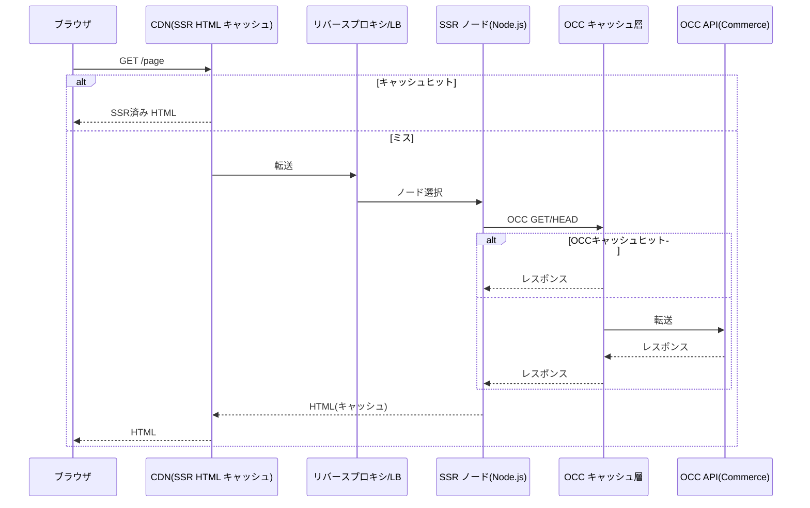
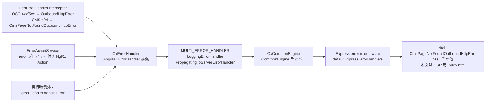

# 2. SSRの設定方法

> 調査ステータス: ⚠️ 一部未確認(CCv2 の js-storefront/manifest.json の全プロパティ、Node.js Pod サイズ設定、SSR ↔ ブラウザで OCC baseUrl を別々に持つ公式手段は PDF から確認できず)

## 結論(要約)

- Composable Storefront の SSR は **`ng add @spartacus/schematics --ssr`(新規)/ `ng g @spartacus/schematics:add-ssr`(後付け)** で導入するのが公式推奨。追加手順は不要と明記されている(StorefrontDevelopmentGuide p.113)。`ng new` は `--ssr=false` で作り、SSR は Spartacus の schematics で入れる(GettingStarted p.36–37)。
- ランタイムは **`@angular/ssr`(CommonEngine)+ Express** で、Spartacus は `@spartacus/setup/ssr` の **`NgExpressEngineDecorator`** で Angular エンジンをラップし、**OptimizedSsrEngine**(キュー・タイムアウト・並列数・CSR フォールバック・インメモリキャッシュ)を有効化する(p.117)。
- 主要オプション既定値: `timeout: 3000` / `concurrency: 10` / `forcedSsrTimeout: 60000` / `maxRenderTime: 300000` / `reuseCurrentRendering: true` / `cache: false` / `cacheSizeMemory: 800MB` / `renderingStrategyResolver: defaultRenderingStrategyResolver({excludedUrls:['checkout','my-account'], excludedParams:['asm']})`(p.117–122)。
- **`timeout` 超過や `concurrency` 超過時は CSR(素の index.html)へフォールバック**し、`Cache-Control: no-store` を付けて返す。SSR 完了分はメモリに保持され次回リクエストで返される(p.117)。SmartEdit(`cx-preview`)は既定で常に CSR(p.122, 124)。
- **SSR エラーハンドリング**(2211.29 以降新規アプリで既定 ON、221121.2 以降は全アプリで標準動作): `CxErrorHandler` → `PropagatingToServerErrorHandler` → `CxCommonEngine` → Express の `defaultExpressErrorHandlers` で **CMS ページ未存在は 404、それ以外は 500** を「CSR フォールバック HTML 付き」で返す(p.131–135)。
- SSR 中の OCC 呼び出しは **既定 20 秒**でタイムアウト(`backend.timeout.server` で変更可)。TransferState により CMS/product の NgRx 状態が HTML に埋め込まれ、ブラウザ側の二重呼び出しを抑止する(p.137, DevGuide p.53)。
- CCv2 では **`js-storefront/manifest.json` の `ssr.enabled: true` と `ssr.path: dist/<app>/server/server.mjs`**、`package.json` の **`build:ssr` スクリプト必須**(欠けると CCv2 ビルドが失敗)、OCC baseUrl は **`<meta name="occ-backend-base-url" content="OCC_BACKEND_BASE_URL_VALUE">` を Pod 起動時に自動置換**する仕組み(Updating p.86, 141; DevGuide p.24–25, 43)。
- 推奨アーキテクチャは「CDN(SSR HTML キャッシュ)→ リバースプロキシ → SSR ノード群 → OCC キャッシュ層 → OCC」。SSR ノードをユーザーに直接晒さない(p.114–115)。
- 追加の防御として **`getOriginValidationMiddleware`(221121.17+)+ `NG_ALLOWED_HOSTS`** による信頼オリジン検証が推奨(p.112–113)。

## 調査内容

### 1. SSR の位置付けと「どのページを SSR するか」

公式は SSR の目的を「応答速度・SEO・初期描画の高速化」とし、以下のページで SSR を推奨している(StorefrontDevelopmentGuide p.113)。

| SSR 推奨 | SSR 非推奨(CSR で良い) |
|---|---|
| クローラー/ボットにインデックスされるページ | パーソナライズされたコンテンツを含むページ |
| 更新頻度の低い静的コンテンツ | チェックアウト・マイアカウント(既定で CSR 除外) |
| 個人化されていないページ | SmartEdit プレビュー(`cx-preview`) |

CMS コンポーネント単位でも SSR を抑止できる(`cmsComponents.<Type>.disableSSR: true`)。「個人化入力が必要」「SSR 出力に不要で性能上外したい」「外部サービス連携でレイテンシが大きい」コンポーネントが対象(p.61 付近「Controlling Server-Side Rendering」)。

```ts
provideConfig({
  cmsComponents: {
    SearchBoxComponent: { disableSSR: true }
  }
});
```

### 2. 導入手順(schematics)

#### 2.1 新規アプリ

```bash
# Angular ワークスペースは SSR 無しで作成(SSR は Spartacus 側で入れる)
ng new my-spartacus-app --style=scss --ssr=false --zoneless=false --file-name-style-guide=201
cd my-spartacus-app
# .npmrc に RBSC の認証を設定したうえで
ng add @spartacus/schematics@221121.17.0 --ssr
```

(GettingStarted p.36–37)。`--ssr` を付けると schematics は「SSR 依存関係の追加」「SSR に必要な追加ファイルの生成」を行う(GettingStarted p.44)。他の schematics オプション(`--base-url`, `--base-site`, `--use-meta-tags`, `--pwa`, `--lazy`, `--theme` 等)と併用可(GettingStarted p.43)。

#### 2.2 既存アプリへの後付け

```bash
ng g @spartacus/schematics:add-ssr
```

(GettingStarted p.44)。

#### 2.3 schematics が生成・変更するもの(二次ソースで補完)

PDF は「必要なファイルを追加する」としか書いていないため、Spartacus 本体の `core-libs/schematics/src/add-ssr/index.ts` を確認した(二次ソース。バージョンにより差異あり)。

```mermaid
flowchart TD
  A[ng add @spartacus/schematics --ssr] --> B[package.json に @spartacus/setup + express 等を追加]
  B --> C[@angular/ssr の ng-add を実行<br/>main.server.ts / app.config.server.ts / server.ts 生成]
  C --> D[新 SSR API 専用の outputMode と app.routes.server.ts を削除]
  D --> E[package.json に build:ssr = ng build を追加<br/>CCv2 ビルドで必須]
  E --> F[app.module.server.ts を生成し provideServer を注入]
  F --> G[app.config.server.ts を provideServerRendering + importProvidersFrom で構成]
  G --> H[index.html に occ-backend-base-url meta を追加]
  H --> I[app.config.ts に provideClientHydration withEventReplay, withNoHttpTransferCache]
  I --> J[server.ts を Spartacus テンプレートで上書き<br/>NgExpressEngineDecorator + defaultExpressErrorHandlers]
  J --> K[angular.json: prerender false / noSsr 構成 / ng serve は noSsr]
```

生成物の役割一覧:

| ファイル | 役割 | 出典 |
|---|---|---|
| `src/server.ts` | Express サーバー。`NgExpressEngineDecorator.get(engine)` で OptimizedSsrEngine を有効化。静的配信、`res.render`、`defaultExpressErrorHandlers` | DevGuide p.117, p.133 / schematics テンプレート |
| `src/main.server.ts` | `bootstrapApplication(AppComponent, config, context)` を default export | Updating p.90 |
| `src/app/app.config.server.ts` | `provideServerRendering()` + `importProvidersFrom(AppServerModule)` を `mergeApplicationConfig(appConfig, …)` | Updating p.89 |
| `src/app/app.module.server.ts` | `provideServer({ serverRequestOrigin: process.env['SERVER_REQUEST_ORIGIN'] })` を提供(SSR エラーハンドリングに必須) | DevGuide p.132, Updating p.90 |
| `src/app/app.config.ts` | `provideClientHydration(withEventReplay(), withNoHttpTransferCache())`(非破壊ハイドレーション) | Updating p.90 |
| `src/index.html` | `<meta name="occ-backend-base-url" content="OCC_BACKEND_BASE_URL_VALUE">` | DevGuide p.24 |
| `angular.json` | `build.options.server: src/main.server.ts`, `ssr.entry: src/server.ts`, `prerender: false`, `noSsr` 構成 | Updating p.145–146 |
| `package.json` | `build:ssr`(CCv2 必須)、`serve:ssr: node dist/<app>/server/server.mjs` | Updating p.86, p.142 |

生成される `server.ts` の骨格(Spartacus schematics テンプレート `add-ssr/files/server.__typescriptExt__` を要約。PDF p.133 のサンプルと整合):

```ts
import { APP_BASE_HREF } from '@angular/common';
import {
  NgExpressEngineDecorator,
  defaultExpressErrorHandlers,
  ngExpressEngine as engine,
} from '@spartacus/setup/ssr';
import express from 'express';
import { readFileSync } from 'node:fs';
import { dirname, join, resolve } from 'node:path';
import { fileURLToPath } from 'node:url';
import bootstrap from './main.server';

const ngExpressEngine = NgExpressEngineDecorator.get(engine);   // ← 第2引数に SsrOptimizationOptions

export function app(): express.Express {
  const server = express();
  const serverDistFolder = dirname(fileURLToPath(import.meta.url));
  const browserDistFolder = resolve(serverDistFolder, '../browser');
  const indexHtml = join(serverDistFolder, 'index.server.html');
  const indexHtmlContent = readFileSync(indexHtml, 'utf-8');

  server.set('trust proxy', 'loopback');
  server.engine('html', ngExpressEngine({ bootstrap }));
  server.set('view engine', 'html');
  server.set('views', browserDistFolder);

  server.get(/.*\..*/, express.static(browserDistFolder, { maxAge: '1y' })); // Express 5 は正規表現
  server.get(/.*/, (req, res) => {
    res.render(indexHtml, { req, providers: [{ provide: APP_BASE_HREF, useValue: req.baseUrl }] });
  });

  server.use(defaultExpressErrorHandlers(indexHtmlContent));   // 404/500 + CSR フォールバック
  return server;
}

function run() {
  const port = process.env['PORT'] || 4000;
  app().listen(port, () => console.log(`Node Express server listening on http://localhost:${port}`));
}
run();
```

`app.config.server.ts` / `app.module.server.ts` / `main.server.ts`(Updating p.89–90):

```ts
// app.config.server.ts
import { ApplicationConfig, importProvidersFrom, mergeApplicationConfig } from '@angular/core';
import { provideServerRendering } from '@angular/ssr';
import { appConfig } from './app.config';
import { AppServerModule } from './app.module.server';
const serverConfig: ApplicationConfig = {
  providers: [provideServerRendering(), importProvidersFrom(AppServerModule)],
};
export const config = mergeApplicationConfig(appConfig, serverConfig);

// app.module.server.ts
import { NgModule } from '@angular/core';
import { provideServer } from '@spartacus/setup/ssr';
@NgModule({
  providers: [...provideServer({ serverRequestOrigin: process.env['SERVER_REQUEST_ORIGIN'] })],
})
export class AppServerModule {}

// main.server.ts
import { BootstrapContext, bootstrapApplication } from '@angular/platform-browser';
import { AppComponent } from './app/app.component';
import { config } from './app/app.config.server';
const bootstrap = (context: BootstrapContext) => bootstrapApplication(AppComponent, config, context);
export default bootstrap;
```

`provideServer()` は `SERVER_REQUEST_ORIGIN` / `SERVER_REQUEST_URL` / SSR 用 `LoggerService`(ExpressLoggerService)/ `MULTI_ERROR_HANDLER`(PropagatingToServerErrorHandler)を提供する(ソース `core-libs/setup/ssr/providers/ssr-providers.ts`)。`serverRequestOrigin` は SSR では Express リクエストから自動解決されるが、**Prerender では必須**(同 `model.ts`、Updating p.142)。

#### 2.4 ローカルでのビルド・起動コマンド

| 目的 | コマンド | 備考 |
|---|---|---|
| SSR ビルド | `npm run build:ssr`(= `ng build`) | CCv2 ビルドが `build:ssr` を要求。Angular の use-application-builder 移行で消えるので再追加(Updating p.86) |
| SSR 起動 | `npm run serve:ssr`(= `node dist/<app>/server/server.mjs`) | Angular 19.2.21 / 21.2.0 のセキュリティパッチ以降、localhost は `NG_ALLOWED_HOSTS=localhost npm run serve:ssr` で許可が必要(DevGuide p.114) |
| SSR watch 開発 | ターミナル1 `npm run watch`、ターミナル2 `npm run serve:ssr:watch`(= `node --watch dist/<app>/server/server.mjs`) | 旧 `dev:ssr` は application builder で廃止(Updating p.142) |
| Prerender | `"prerender": "ng build --prerender=true"` を追加し `SERVER_REQUEST_ORIGIN="https://<本番ドメイン>" npm run prerender` | オリジン未指定だと Canonical URL や自動マルチサイト判定が壊れる(Updating p.142) |
| 自己署名証明書 | `"serve:ssr:dev": "cross-env NODE_TLS_REJECT_UNAUTHORIZED=0 ng run <app>:serve-ssr"` | 本番では絶対に使わない(DevGuide p.121) |

SSR が効いているかの確認は `curl <URL>` で `<app-root>` の中に `<cx-storefront …>` が描画されているか、あるいはブラウザ Network の最初の GET レスポンスを見る(DevGuide p.120)。空なら SSR 失敗。

### 3. 推奨アーキテクチャ(CDN → SSR → OCC キャッシュ)



要点(DevGuide p.114–115):
- CDN は TTL 失効前に再レンダリングを先行要求し、その間は既存キャッシュを返し続けるのが理想。できなければキャッシュウォームアップツールで代替。
- SSR ノードをユーザーに直接公開しない(描画が遅く期待応答時間を満たさない)。
- OCC 側にもキャッシュ層(GET/HEAD)を置く。OCC 処理が SSR 時間の大半を占めるため。
- CSR フォールバック応答は `Cache-Control: no-store` で返るので CDN にキャッシュされない(p.117)。

### 4. OptimizedSsrEngine の全オプション

有効化(DevGuide p.117):

```ts
import { NgExpressEngineDecorator, ngExpressEngine as engine } from '@spartacus/setup/ssr';
const ngExpressEngine = NgExpressEngineDecorator.get(engine, { timeout: 1000 /* … */ });
```

既定値(p.117。ソース `ssr-optimization-options.ts` の `defaultSsrOptimizationOptions` でも同値を確認):

```ts
{
  cache: false,
  cacheSizeMemory: 800_000_000,
  cacheEntrySizeCalculator: new DefaultCacheEntrySizeCalculator(),
  ttl: undefined,
  concurrency: 10,
  timeout: 3_000,
  forcedSsrTimeout: 60_000,
  maxRenderTime: 300_000,
  reuseCurrentRendering: true,
  debug: false,                     // 2211.27 で非推奨(常時ログ出力)
  renderingStrategyResolver: defaultRenderingStrategyResolver(defaultRenderingStrategyResolverOptions),
  logger: new DefaultExpressServerLogger(),
  shouldCacheRenderingResult: ({ entry: { err } }) => !err,
  renderKeyResolver: getDefaultRenderKey,   // = リクエストの完全 URL
  ssrFeatureToggles: {},
}
```

| オプション | 型 / 既定 | 意味・推奨 | 出典 |
|---|---|---|---|
| `timeout` | ms / 3000 | この時間内に描画できなければ CSR の index.html を返す(`Cache-Control: no-store`)。バックグラウンドで描画は継続し、完了品はメモリに置いて次回返す(既定は一度返したら破棄)。`0` で即 CSR | p.117 |
| `cache` | boolean / false | 組み込みインメモリキャッシュ。false でも「CSR フォールバック後に完了した描画を次回1回返す」用途で使われる。CDN があるので **有効化は非推奨** | p.118 |
| `cacheSizeMemory` | bytes / 800MB | キャッシュ上限。CCv2 の最小 Pod 3GB × max-memory-restart 60% = 1.8GB から描画用 1GB を引いた値が根拠。Feature toggle `ssrFeatureToggles.limitCacheByMemory: true` で有効化する時期があった | p.118, Updating p.120 |
| `cacheEntrySizeCalculator` | strategy | HTML は「文字数×2byte」で見積り。エラーは name/message/trace の合計 | p.118 |
| `concurrency` | number / 10 | 同時描画数。超過分は即 CSR。CPU 資源に合わせて調整。`reuseCurrentRendering` 有効時、同一キーの複数要求は 1 スロット | p.118 |
| `ttl` | ms / undefined | キャッシュ済みページを stale とみなす時間。`cache` の有無に関わらず設定推奨 | p.118 |
| `renderKeyResolver` | `(req)=>string` / 完全 URL | 描画キー。ドメインにサイト情報を含む場合(`my.site.au` 等)は既定を推奨 | p.119 |
| `renderingStrategyResolver` | `(req)=>RenderingStrategy` | `ALWAYS_CSR` / `DEFAULT` / `ALWAYS_SSR`(`forcedSsrTimeout` まで待つ)。ボット判定・特定ページのみ SSR に使う | p.119, 122 |
| `forcedSsrTimeout` | ms / 60000 | `ALWAYS_SSR` 時の待機上限。過負荷やエラーページで資源をブロックしないため | p.119 |
| `maxRenderTime` | ms / 300000 | これを超えた描画は並列スロットを解放し警告ログ(資源は解放できない)。`timeout`/`forcedSsrTimeout` より必ず大きくする | p.119 |
| `reuseCurrentRendering` | boolean / true | 同一キーの描画中は CSR に落とさず待つ(各要求は自分の `timeout` を持つ)。RAM は増える | p.119 |
| `debug` | boolean | 2211.27 以降非推奨。受信・応答・描画開始終了・maxRenderTime 超過は無条件でログ | p.119 |
| `logger` | `ExpressServerLogger` / Default | JSON 構造化ログ。カスタムは `DefaultExpressServerLogger` を継承 | p.119–120, 125 |
| `shouldCacheRenderingResult` | `({options, entry})=>boolean` | 描画結果をキャッシュするか。既定はエラー無しのみ(221121.2 以降) | p.136 |
| `ssrFeatureToggles` | object | `avoidCachingErrors`(221121.2 で標準動作化・非推奨)、`limitCacheByMemory` 等 | p.118, Updating p.120 |

`reuseCurrentRendering` の挙動例(p.119): timeout 3 秒・描画 4 秒の場合、1 本目は 3 秒で CSR フォールバック、2 秒遅れで来た 2 本目は待機し 4 秒時点(自分の待ち 2 秒)で SSR HTML を受け取る。

#### 4.1 renderingStrategyResolver の使い方

既定(p.122):

```ts
export const defaultRenderingStrategyResolverOptions: RenderingStrategyResolverOptions = {
  excludedUrls: ['checkout', 'my-account'],
  excludedParams: ['asm'],
};
```

- `excludedUrls` に部分一致する URL、`excludedParams` のクエリを含む要求は `ALWAYS_CSR`。
- SmartEdit の `cx-preview` はオプションに関わらず常に CSR(p.122, 124)。

ボット判定 + 既定へのフォールバック例(p.122):

```ts
import { Request } from 'express';
import {
  defaultRenderingStrategyResolver, defaultRenderingStrategyResolverOptions,
  RenderingStrategy, SsrOptimizationOptions,
} from '@spartacus/setup/ssr';

const ssrOptions: SsrOptimizationOptions = {
  renderingStrategyResolver: (req: Request) =>
    req.get('User-Agent')?.match(/bot|crawl|slurp|spider|mediapartners/)
      ? RenderingStrategy.ALWAYS_SSR
      : defaultRenderingStrategyResolver(defaultRenderingStrategyResolverOptions)(req),
};
```

### 5. CSR フォールバックが起きる条件(まとめ)

| 条件 | 応答 | 出典 |
|---|---|---|
| `timeout` 内に描画が終わらない | CSR index.html(`no-store`)。完了後メモリに保持し次回返す | p.117 |
| `concurrency` 超過(かつ同一キー描画中でない/`reuseCurrentRendering` 無効) | 即 CSR | p.118 |
| `renderingStrategyResolver` が `ALWAYS_CSR`(checkout / my-account / `?asm` / `cx-preview`) | CSR | p.122 |
| `ALWAYS_SSR` で `forcedSsrTimeout` 超過 | CSR | p.119 |
| SSR 中にエラー(HTTP 4xx/5xx、`error` を持つ NgRx アクション、実行時例外) | **404 または 500 + CSR HTML**(エラーハンドリング有効時) | p.133, Updating p.102–103 |
| オリジン検証ミドルウェアで拒否 | 400 Bad Request(`no-store`)、描画せず | p.113 |

### 6. SSR エラーハンドリングと HTTP ステータス

Angular 標準の SSR は非同期エラーを無視し、壊れた HTML を **200** で返す。未知 URL のエラーページも 200 になる。SEO 上致命的なので Spartacus は独自の契約を導入した(DevGuide p.131)。



有効化の経緯(p.132, Updating p.14, 102):
- 2211.29 で導入。新規アプリは既定 ON。旧アプリは Feature toggle `propagateErrorsToServer` / `ssrStrictErrorHandlingForHttpAndNgrx` / `ssrFeatureToggles.avoidCachingErrors` で ON にする。
- **221121.2 でこれらトグルはコードから削除され標準動作**になった。未対応で更新すると「HTTP 500 with CSR fallback」等に遭遇しうる(Updating p.102–103)。
- 必要な構成: `server.ts` に `server.use(defaultExpressErrorHandlers(indexHtmlContent))`、`app.module.server.ts` に `provideServer()`。

カスタマイズポイント:
- 独自 `ErrorHandler` を持つ場合は **`CxErrorHandler` を継承し `super.handleError()`** を呼ぶ(p.125, 132)。
- 独自 HTTP インターセプターは `HttpErrorHandlerInterceptor` の**後**に provide し、catch したエラーは rethrow する(p.135)。
- 特定の OCC エラーを SSR 失敗にしたくない/200 だがエラー payload を失敗にしたい → `HttpErrorHandlerInterceptor` を上書き(p.135)。
- 特定 NgRx エラーを無視 → `ErrorActionService` を上書き。自作の Fail アクションは必ず `error` プロパティを持たせる(`ErrorAction` 実装)(p.135)。
- **`RESPONSE` トークンで `res.status()` を直接触る旧手法は非推奨**。`inject(ErrorHandler).handleError(customError)` を使う(p.135)。
- 独自エラーページ: `defaultExpressErrorHandlers` の前に `ErrorRequestHandler` を挟み、扱わないものは `next(err)`(p.134)。

```ts
export const customCmsPageNotFoundErrorHandler: ErrorRequestHandler = (err, _req, res, next) => {
  if (err instanceof CmsPageNotFoundOutboundHttpError) {
    res.status(HttpResponseStatus.NOT_FOUND).send(errorPage);
  } else {
    next(err);
  }
};
// server.ts
server.use(customCmsPageNotFoundErrorHandler);
server.use(defaultExpressErrorHandlers(indexHtmlContent));
```

### 7. TransferState(サーバー→ブラウザの状態引き継ぎ)

- SSR 中に取得した NgRx の **CMS と product** の一部を HTML に埋め込み、ブラウザ起動時の同一 OCC 呼び出しを省く(DevGuide p.53「SSR Transfer State」、コーディングガイド p.116)。
- 設定(`state.ssrTransfer.keys`)。無効化はキーに `undefined`:

```ts
provideConfig({
  state: {
    ssrTransfer: {
      keys: {
        product: StateTransferType.TRANSFER_STATE,
        cms: StateTransferType.TRANSFER_STATE,
        // product: undefined  ← 無効化
      },
    },
  },
});
```

- サイトコンテキスト(baseSite 判定のための `/basesites` 呼び出し)も SSR で判定して TransferState で渡せる。そのために `NgExpressEngineDecorator` が `SERVER_REQUEST_URL` を提供する(DevGuide p.40)。
- Angular 側は `provideClientHydration(withEventReplay(), withNoHttpTransferCache())` で、Angular の HTTP TransferCache は使わず Spartacus の仕組みに委ねる構成(Updating p.90)。

### 8. SSR 中の外向き HTTP タイムアウト・Cookie/Header

- **外向き HTTP の既定タイムアウトは SSR で 20 秒**(6.0 以降)。ブラウザ側は既定なし(ブラウザ任せ)。個別エンドポイントは `HttpContext` + `HTTP_TIMEOUT_CONFIG`(DevGuide p.137–138)。

```ts
provideConfig({ backend: { timeout: { browser: 60_000, server: 10_000 } } });

const context = new HttpContext().set(HTTP_TIMEOUT_CONFIG, { server: 15_000 });
this.httpClient.get('/some/api', { context });
```

- タイムアウト時ログ: `Request to URL '${url}' exceeded expected time of ${ms}ms and was aborted.`(p.137)。
- リクエスト URL/オリジンは `document.location` ではなく **`WindowRef.location.href / origin`** を使う(プロキシで localhost に書き換わるため)。SSR ではプロキシ配下で `X-Forwarded-Host` を `trust proxy` 設定に応じて採用する(p.116、ソース `express-request-origin.ts`)。生成 `server.ts` の既定は `server.set('trust proxy', 'loopback')`。
- **Cookie/Header の SSR→OCC 伝搬**: PDF に「SSR ノードがブラウザの Cookie/認証ヘッダーを OCC へ転送する」記述は見当たらない(未確認)。CCv2 側の指針として「API クライアントは受け取ったルート Cookie を再送すべき」(AboutSAPCommerceCloud p.64)があり、SSR ノードの HTTP クライアントは Cookie を保持しない前提で設計する必要がある。
- W3C Trace Context: 受信要求に `traceparent` ヘッダーがあれば SSR ログに `traceContext` が自動付与され、Dynatrace/OpenSearch でトレース連携できる(p.127–130)。

### 9. ログ・監視・トラブルシュート

- `DefaultExpressServerLogger` が開発時は複数行 JSON、本番は 1 行 JSON を出力(監視ツール向け)。独自コードは `console` ではなく `LoggerService` を使う。i18next 等サードパーティのロガーも `LoggerService` に寄せる(p.124–127)。
- CCv2 のログは Kibana/OpenSearch Dashboards で確認(p.120, 128)。
- `SSR rendering exceeded timeout, falling back to CSR for …` → timeout 増加で試し、直らなければ「証明書」「API 側 IP 制限(SSR ノード IP を Allow All で試す)」「CDN のレートリミット」を疑う(p.120)。
- `Rendering of ${URL} was not able to complete. This might cause memory leaks!` → maxRenderTime 超過。OCC 遅延や CDN ブロック、コードの `setTimeout`/未解放購読を疑う(p.123)。
- OOM 再起動 → `cacheSizeMemory` 減、`concurrency` 減、Pod サイズ増(p.123)。
- 不正 URL(SQLi 風の長い URL)で SSR がハングする既知事象と workaround(Angular Router private API 使用、p.121)。
- Node.js デバッグは VS Code の "Attach to Process" で `dist/…/server.mjs` に接続(p.138)。
- 負荷試験は **URL を多様化**する(同一 URL は `reuseCurrentRendering` で 1 回しか描画されない)。単一レプリカに `concurrency` 以上の URL を投げると CSR 率が上がるのは仕様(p.124)。

### 10. セキュリティ: 信頼オリジン検証(221121.17+)

`NG_ALLOWED_HOSTS` は Host ヘッダーのみ検証し **`X-Forwarded-Host` を検証しない**ため、キャッシュポイズニング対策として `getOriginValidationMiddleware` を併用する(DevGuide p.112–113)。

```ts
import { getOriginValidationMiddleware } from '@spartacus/setup/ssr';
server.use(getOriginValidationMiddleware({ allowedOrigins: process.env['SSR_ALLOWED_ORIGINS'] }));
// SSR_ALLOWED_ORIGINS="https://my-shop.com,https://*.my-shop.com"
```

- 完全オリジン(スキーム込み・末尾スラッシュ無し)、大小無視、`*` は 1 ラベルのみ・apex は別エントリ。拒否時は 400 + `no-store`。
- 環境変数が使えない環境では `server.ts` にハードコード可(単一ソース多環境では非推奨)。

### 11. CCv2(SAP Commerce Cloud)での SSR 実行

| 項目 | 内容 | 出典 |
|---|---|---|
| ビルド方式 | CCv2 のホスティングサービスが RBSC のライブラリを使って 2211.x をビルド。ローカルビルドした `dist` をコミットして配置する手も可 | GettingStarted p.40 |
| `js-storefront/manifest.json` | `"ssr": { "enabled": true, "path": "dist/<app>/server/server.mjs" }`(旧 `main.js` から変更) | Updating p.141 |
| `package.json` | `build:ssr` スクリプトが無いと CCv2 ビルド(`:buildJsApps`)が失敗 | Updating p.86, DevGuide p.120 |
| OCC baseUrl | `index.html` の `<meta name="occ-backend-base-url" content="OCC_BACKEND_BASE_URL_VALUE">` を **Pod 起動時・アプリ起動前に自動置換**。`provideConfig` の `baseUrl` は meta より優先されるので、動的にしたい場合は `baseUrl` を書かない | DevGuide p.24–25, 43, 121 |
| Node.js メモリ | 最小 Pod 3GB、max-memory-restart 60%(1.8GB)。これが `cacheSizeMemory` 800MB の根拠 | DevGuide p.118 |
| `nodeVersion` | セキュリティガイドの推奨事項一覧に「Manifest - nodeVersion: 最新パッチ」があるが詳細は切れており未確認 | SecurityGuide p.58 |
| ログ | Kibana / OpenSearch Dashboards、トレースは Dynatrace(既定) | DevGuide p.120, 127–128 |
| SSR ノード IP | API 側の IP 制限で SSR ノードがブロックされる事例あり | DevGuide p.120 |
| ルート Cookie | API クライアントは受け取ったルート Cookie を再送すべき(セッションアフィニティ) | AboutSAPCommerceCloud p.64 |

### 12. Prerendering

- `angular.json` は schematics が `prerender: false` に設定(Spartacus は CMS 駆動でルートが動的なため既定 OFF)。必要なら `"prerender": "ng build --prerender=true"` を追加し `SERVER_REQUEST_ORIGIN` を必ず渡す(Updating p.142)。
- 「2211.19 以降: Server prerendering not working」という既知問題が SAP Note として存在(GettingStarted p.40)。
- 描画された HTML と静的アセットは CDN でキャッシュ推奨(DevGuide p.109 付近「Cache static assets and dynamic prerendered routes」)。

### 13. コーディングガイドライン(SSR 安全なコード)

- `window`/`document`/`navigator` を直接触らない → `WindowRef` を注入し `nativeWindow` の存在確認(p.116)。
- `setTimeout` は最小限、`ngOnDestroy` で解除。RxJS の timeout は成功時に stream を閉じる。
- `nativeElement` の直接操作禁止 → `Renderer2`。
- SSR は 1 つの長寿命 Node プロセスが毎リクエスト Angular を bootstrap/destroy する。シングルトンサービスの購読は `ngOnDestroy` で解除しないとメモリリーク(p.116)。
- 遅延読み込み(deferred loading)は SSR では適用されずクローラーには全 DOM が返る(p.101)。
- レイアウトシフト回避のため SSR 後に JS で DOM 構造を変えない(p.105)。

## 本案件への示唆

- **SSR 必須 × CCv2** なので、`ng add --ssr` で生成された `server.ts` をそのまま使わず、`NgExpressEngineDecorator.get(engine, ssrOptions)` に **プロジェクト固有の `SsrOptimizationOptions` を明示的に置く**運用にする(timeout / concurrency / renderingStrategyResolver / logger / origin validation)。Updating に「generated server.ts に SSR 最適化オプションを expose する」修正(CXSPA-1268)があるため、生成版にオプション雛形が含まれるバージョンもある。
- **B2B はログイン必須ページが多く、SSR の恩恵は「公開カタログ・CMS コンテンツページ・SEO」に限定される**。既定の `excludedUrls: ['checkout','my-account']` に加え、B2B の組織管理(`/organization/*`)、見積、承認、Unit-Level Orders など個人化ページを `excludedUrls` に追加し SSR 対象を絞ることを推奨。B2B 固有の機能ページはインデックス不要のものが大半。
- **Accelerator からの移行観点**: Accelerator(JSP)は常にサーバー描画で 404/500 も正しかった。Composable では **SSR エラーハンドリング(221121.2 以降標準)を前提に、CMS ページ未存在=404** が担保されるが、独自 `ErrorHandler`/HTTP インターセプター/NgRx Fail アクションの作法(`error` プロパティ、`CxErrorHandler` 継承、rethrow)を守らないと 200 で壊れた HTML が返る。移植時のレビュー観点に加える。
- **商用版ライブラリ**: `@spartacus/setup/ssr` も RBSC から取得。バージョンは `~` 固定で、SSR まわりは 2211.19(Angular 17 modernize)/ 2211.27(debug 廃止)/ 2211.29(エラーハンドリング)/ 2211.36 / 221121.2(トグル削除)/ 221121.17(origin validation)と変化が激しい。**年 2 回以上の更新時に SSR 関連の手動移行(server.ts, angular.json, manifest.json)が発生する前提**でパイプラインを組む([→ 14. デプロイ](/topics/deployment), [→ 11. CI/CD](/topics/cicd))。
- **OCC baseUrl は環境ごとに meta タグ置換に任せる**(`provideConfig` に `baseUrl` を書かない)。ローカル検証(MSW / PowerTools 端点)で `baseUrl` を書く場合、コミット前に必ず戻す運用ルールが必要(DevGuide p.121 の注意)。SSR とブラウザで異なる baseUrl(例: SSR は内部ネットワーク経由)を持ちたい場合、公式手段は PDF から確認できなかった([→ 3. バックエンド接続](/topics/backend-connection))。
- **CDN/キャッシュ設計は SSR 設計と一体**。CCv2 の SSR ノードを直接晒さず、CDN で SSR HTML をキャッシュし、OCC 側にもキャッシュ層を置く前提でインフラ側と合意する([→ 15. インフラ](/topics/infrastructure), [→ 16. サーバー構成](/topics/server-configuration))。B2B で個人化・価格が絡むページは CDN キャッシュ対象外にする。
- **SmartEdit/プレビューは CSR** が公式方針([→ 26. SmartEdit 設定](/topics/spa-smartedit-settings))。
- **監視**: `LoggerService` への統一、`traceparent` による Dynatrace 連携、`maxRenderTime` 超過ログと OOM 再起動の監視をモニタリング要件に含める([→ 18. モニタリング](/topics/monitoring))。
- ローカル PoC(mystore)は現状 CSR 構成のため、`ng g @spartacus/schematics:add-ssr` で SSR 化し、MSW を SSR(Node)側でも動かす方式(`msw/node`)を別途検討する必要がある。

## 未確認事項・次のアクション

- `js-storefront/manifest.json` の全プロパティ(`nodeVersion`、`enableSsr` 等の正式キー名、Pod サイズ/レプリカ数の指定方法)は PDF に完全な記述がなく未確認。SAP Help「Add Applications to JavaScript Storefronts」「Enable Server-Side Rendering」を参照する必要あり。
- SSR ノードとブラウザで異なる OCC baseUrl を持たせる公式手段(例: サーバー側専用の `provideConfig`)は PDF に記載なし。実機/ソースで `app.config.server.ts` 側に `provideConfig({backend:{occ:{baseUrl}}})` を追加した際の優先順位を検証する。
- SSR 中に受信リクエストの Cookie/Authorization を OCC へ転送する仕組みの有無は未確認(PDF に記述なし)。ログイン後ページを SSR しない前提であれば影響は限定的だが、ASM・early login 構成では要検証。
- CCv2 環境変数(`SSR_ALLOWED_ORIGINS`, `SERVER_REQUEST_ORIGIN`, `PORT`)を Cloud Portal から設定できるか(p.113 の「環境変数を設定できない環境ではハードコード」の記述から、CCv2 で設定できない可能性)。
- 221121.x の schematics が生成する `server.ts` に `SsrOptimizationOptions` の雛形が含まれるか(CXSPA-1268)を実際に `ng add --ssr` して確認する。
- 実機で `curl` による SSR 動作確認、`timeout`/`concurrency` の負荷試験(URL 多様化)、`process.memoryUsage()` によるメモリ計測を PoC 項目に追加する。

## 出典

- `docs__StorefrontDevelopmentGuide.pdf` p.24–25 「Configuring the Base URL」
- `docs__StorefrontDevelopmentGuide.pdf` p.40 「Caching the Site Context with Server-Side Rendering」
- `docs__StorefrontDevelopmentGuide.pdf` p.53 「SSR Transfer State」
- `docs__StorefrontDevelopmentGuide.pdf` p.61 「Controlling Server-Side Rendering」
- `docs__StorefrontDevelopmentGuide.pdf` p.101, 105, 109 「Performance Optimizations(Deferred loading / LCP / layout shift / caching)」
- `docs__StorefrontDevelopmentGuide.pdf` p.112–113 「Validating Trusted Origins in SSR」
- `docs__StorefrontDevelopmentGuide.pdf` p.113–115 「Server-Side Rendering」「Adding SSR Support Using Schematics」「Recommended Setup for Server-Side Rendering」
- `docs__StorefrontDevelopmentGuide.pdf` p.116 「Server-Side Rendering Coding Guidelines」
- `docs__StorefrontDevelopmentGuide.pdf` p.116–124 「Server-Side Rendering Optimization」「Configuring the SSR Optimization Engine」「Troubleshooting」「Using SSR Only for Certain Pages」「Load Testing」「Server-Side Rendering and SmartEdit」
- `docs__StorefrontDevelopmentGuide.pdf` p.124–130 「Standardized SSR Logging」「Trace Context」
- `docs__StorefrontDevelopmentGuide.pdf` p.130–137 「Server-Side Rendering Error Handling」「Cache Management and Error Handling」「Configurable Timeouts for Outgoing HTTP Requests in SSR」
- `docs__StorefrontDevelopmentGuide.pdf` p.138 「Debugging a Server-Side Rendered Storefront」
- `docs__GettingStartedWithComposableStorefrontLibraries.pdf` p.36–37 「Setting Up Your Project Using Schematics(ng new --ssr=false / ng add --ssr)」
- `docs__GettingStartedWithComposableStorefrontLibraries.pdf` p.39–40 「Known Issues」「Using Composable Storefront with SAP Commerce Cloud in the Public Cloud」
- `docs__GettingStartedWithComposableStorefrontLibraries.pdf` p.43–44 「Schematics options」「How Composable Storefront Schematics Work」
- `docs__UpdatingComposableStorefront.pdf` p.14 「Feature Toggles(propagateErrorsToServer / ssrStrictErrorHandlingForHttpAndNgrx / avoidCachingErrors)」
- `docs__UpdatingComposableStorefront.pdf` p.86–90 「build:ssr / Express 5 / Manual Migration for SSR Projects」
- `docs__UpdatingComposableStorefront.pdf` p.102–103 「Troubleshooting for SSR Error Handling(221121.2)」
- `docs__UpdatingComposableStorefront.pdf` p.120 「Activating Limit Cache By Memory」
- `docs__UpdatingComposableStorefront.pdf` p.141–143 「Updating the Manifest for SAP Commerce Cloud」「Running an SSR Dev Server」「Running Server Prerendering」
- `documents__Commerce8.pdf` p.107–108 「SmartEdit and SSR」
- `documents__AboutSAPCommerceCloud.pdf` p.63–64 「Storefronts / JavaScript storefronts」「Route Cookies, Session Cookies, and Sticky Sessions」
- `documents__SAPCommerceCloudSecurityGuide.pdf` p.58 「Manifest - nodeVersion(推奨事項一覧)」
- 二次ソース: Spartacus 本体 `core-libs/schematics/src/add-ssr/`(index.ts, files/server.__typescriptExt__, snapshots)、`core-libs/setup/ssr/optimized-engine/ssr-optimization-options.ts`、`core-libs/setup/ssr/providers/ssr-providers.ts`、`core-libs/setup/ssr/express-utils/express-request-origin.ts`、`core-libs/core/src/occ/config/config-from-meta-tag-factory.ts`
